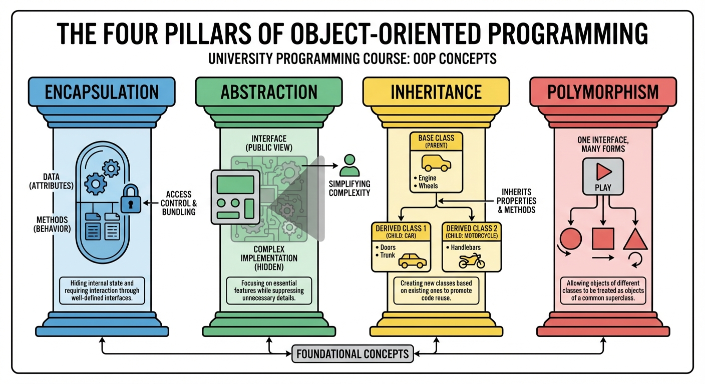
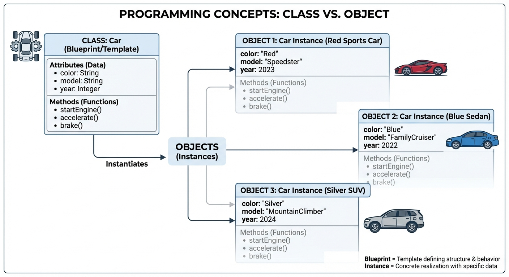
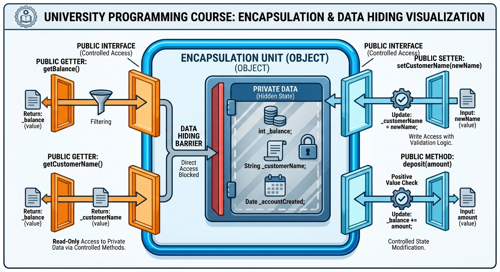

# YZM1022

## Advanced Programming

### Week 1: OOP Fundamentals - Classes, Objects, Encapsulation

**Instructor:** Ekrem Çetinkaya
**Date:** 25.02.2026

---

# Course Content

<div class="two-columns">
<div class="column">

## What Will We Learn?

- **OOP Foundations:** Classes, objects, encapsulation, inheritance, polymorphism
- **Abstraction & Composition:** Abstract classes, interfaces, design relationships
- **Design Patterns:** Creational, structural, behavioral (Observer, Strategy, Command)
- **SOLID Principles:** Clean code, architectural patterns (MVC, MVP, MVVM)
- **Functional Programming:** Higher-order functions, closures, immutability
- **Advanced Topics:** Recursion, dynamic programming, generics, concurrency, parallelism

</div>

<div class="column">

## Textbook

**No single required textbook** — course materials and slides are self-contained.

## Additional Resources

- Robert C. Martin — _Clean Code_ (https://www.oreilly.com/library/view/clean-code-a/9780136083238/)
- Erich Gamma et al. — _Design Patterns: Elements of Reusable Object-Oriented Software_
- Python Documentation (https://docs.python.org/3/)

</div>
</div>

---

# Grading


## Assessment

- **Laboratory Work**: 20% (**Labs start at Week 5**)
- **Project**: 20% (**Will be given next week**)
- **Midterm Exam**: 20%
- **Final Exam**: 40%

## Exam Approach

**All exams are open-book:**

- Internet access allowed
- LLM tools (ChatGPT, Claude, etc.) allowed
- Lecture notes and materials allowed
- **Focus**: Problem-solving ability, not memorization

---

# Course Policies

## Lecture Format


**Pomodoro Lectures:**

- 20-minute sessions + 5-minute breaks
- During breaks: stretch, chat, check your phone — completely **your choice**
- **Why?** We all have the attention span of a goldfish

## Attendance Policy

**Not mandatory** - You are adults making your own educational decisions

- You can leave if the class doesn't suit you
- No explanation required, no penalty
- You should be here **by choice, not by obligation**

---

# Weekly Schedule

## Weeks 1-8: Foundations

| Week | Topic                                                | Key Concepts                              |
| ---- | ---------------------------------------------------- | ----------------------------------------- |
| 1    | OOP Fundamentals: Classes, Objects, Encapsulation    | `self`, constructors, properties, dunders |
| 2    | Inheritance and Polymorphism                         | `super()`, method overriding, MRO         |
| 3    | Abstract Classes, Interfaces, and Composition        | ABC, duck typing, has-a vs is-a           |
| 4    | Design Patterns: Creational Patterns                 | Singleton, Factory, Builder               |
| 5    | Design Patterns: Structural and Behavioral           | Adapter, Decorator, Iterator              |
| 6    | Advanced Design Patterns                             | Observer, Strategy, Command               |
| 7    | SOLID Principles, Clean Code, Architectural Patterns | SRP, OCP, LSP, ISP, DIP, MVC              |
| 8    | Midterm Exam                                         | Weeks 1–7 topics                          |

---

# Weekly Schedule

## Weeks 9-16: Advanced Topics

| Week | Topic                                               | Key Concepts                                 |
| ---- | --------------------------------------------------- | -------------------------------------------- |
| 9    | Functional Programming Fundamentals                 | Pure functions, immutability, map/filter     |
| 10   | Advanced Functional Programming                     | Higher-order functions, closures, decorators |
| 11   | Recursion and Dynamic Programming                   | Base cases, memoization, tabulation          |
| 12   | Generic Programming and Type Systems                | Type hints, generics, protocols              |
| 13   | Concurrent Programming: Threads and Synchronization | Threading, locks, race conditions            |
| 14   | Parallel Programming and Asynchronous Patterns      | Multiprocessing, async/await, futures        |
| 15   | Review and Project Presentations                    | Final projects                               |
| 16   | Final Exam                                          | All topics                                   |

---

# What is a Program?

<div class="two-columns">
<div class="column">

### Procedural View

A program is a sequence of instructions that tells the computer what to do - step by step, top to bottom.

```python
# Step 1: Get input
name = input("Enter name: ")
age = int(input("Enter age: "))

# Step 2: Process
if age >= 18:
    status = "adult"
else:
    status = "minor"

# Step 3: Output
print(f"{name} is an {status}")
```

In the **procedural** paradigm, data and functions are separate entities. The programmer is responsible for passing the right data to the right function at the right time.

</div>
<div class="column">

### OOP View

A program is a collection of **objects** that interact with each other. Each object bundles its own data and the operations that act on that data.

```python
# Create objects
person = Person("Alice", 25)
bank = Bank("MyBank")

# Objects interact
account = bank.open_account(person)
account.deposit(1000)
person.check_balance()
```

Objects have **state** (data stored in attributes) and **behavior** (methods that operate on that state). The key insight is that data and the code that manipulates it live together, making the program easier to reason about as it grows.

</div>
</div>

---

# Other Programming Paradigms

<div class="two-columns">
<div class="column">

### Functional Programming

- Code organized as **pure functions** - no side effects, no mutable state
- Functions are **first-class citizens** (can be passed around, returned, stored)
- Emphasis on **immutability** and **composition**
- Examples: Haskell, Lisp, Erlang (**Python** supports this too)

```python
# Functional approach
numbers = [1, 2, 3, 4, 5]
squared = list(map(lambda x: x**2, numbers))
evens = list(filter(lambda x: x % 2 == 0, squared))
# [4, 16]
```

</div>

<div class="column">

### Declarative Programming

- Describe **what** you want, not **how** to get it
- The system determines the execution strategy
- Examples: SQL, HTML, CSS, Prolog

```sql
-- Declarative: What we want
SELECT name, age
FROM students
WHERE grade > 80
ORDER BY name;

-- We don't specify HOW to search,
-- sort, or iterate — the database
-- engine decides.
```

</div>
</div>

Python is **multi-paradigm** - it lets you mix OOP and functional styles freely.

---

# Why Object-Oriented Programming?

**Object-oriented programming (OOP)** is a way of organizing code around **objects**

- Bundles of data and the operations that work on that data—instead of around separate data and functions.

### The Problems with Procedural Code

When data and functions are separate, the program quickly becomes hard to manage.

<div class="two-columns">

<div class="column">

```python
# Managing student data procedurally
student1_name = "Alice"
student1_age = 20
student1_grades = [85, 92, 78]

student2_name = "Bob"
student2_age = 21
student2_grades = [90, 88, 95]

def calculate_average(grades):
    return sum(grades) / len(grades)
```

</div>

<div class="column">

**Problems with this approach:**

- Data and functions are **separate**, nothing ties a student's name to their grades
- Easy to mix up which data belongs to which student (pass `student1_grades` instead of `student2_grades`)
- As the program grows, the number of loose variables explodes and maintenance becomes a nightmare
- There is **no validation**
  - anyone can set `student1_age = -5` and no code will complain

</div>
</div>

---

# Why Object-Oriented Programming?

### The OOP Solution

<div class="two-columns">

<div class="column">

```python
class Student:
    def __init__(self, name, age):
        self.name = name
        self.age = age
        self.grades = []

    def add_grade(self, grade):
        if 0 <= grade <= 100:  # Validation!
            self.grades.append(grade)

    def calculate_average(self):
        return sum(self.grades) / len(self.grades) if self.grades else 0
```

```python
alice = Student("Alice", 20)
alice.add_grade(85)
alice.add_grade(92)
print(alice.calculate_average())  # 88.5
```

</div>

<div class="column">

Each `Student` object **owns** its data and **controls** how that data is modified.

- The `add_grade` method validates the input before storing it, so it is impossible to end up with an invalid grade.
- This is the essence of **encapsulation**
  - Bundling data with the methods that operate on it and restricting direct access from outside.

</div>

</div>

---

# Benefits of OOP

<div class="two-columns">
<div class="column">

### 1. Modularity

- Code is organized into logical, self-contained units (classes)
- Each class is responsible for one concept
- Easy to understand, test, and maintain in isolation

### 2. Reusability

- Write a class once, instantiate it as many times as needed
- Inheritance allows extending existing classes without modifying them
- Libraries of reusable components

### 3. Maintainability

- Changes to internal implementation are localized inside the class
- External code that uses the class does not need to change
- Bug fixes are confined to one place

</div>

<div class="column">

### 4. Data Protection

- Control access to internal data through properties and methods
- Validate before changing state
- Hide implementation details from users of the class

### 5. Real-World Modeling

- Objects naturally represent real-world entities
- Relationships between objects mirror real relationships (a student _has_ grades, a car _is a_ vehicle)
- Easier to communicate designs with non-programmers

### 6. Scalability

- Large programs become manageable when divided into classes
- Teams can work on different classes in parallel
- Well-defined interfaces between components reduce coupling

</div>
</div>

---

# The Four Pillars of OOP

<div class="two-columns">
<div class="column">

### 1. Encapsulation

- Bundle data and methods together inside a class
- Hide internal implementation details from the outside world
- Control access to data through a well-defined interface
- **"What happens inside, stays inside"**

### 2. Abstraction

- Show only the essential features to the user
- Hide the complex implementation behind simple methods
- Simplify interaction with objects
- **"You don't need to know how the engine works to drive the car"**

</div>

<div class="column">

### 3. Inheritance

- Create new classes from existing ones, reusing and extending their behavior
- Establish hierarchical relationships between types
- **"Is-a" relationship** — a Dog _is an_ Animal
- Avoids code duplication across related classes

### 4. Polymorphism

- Same interface, different implementations
- Objects of different types can be used interchangeably if they share a common interface
- Write flexible and extensible code
- **"Many forms, one interface"**

</div>
</div>

---



<!-- _footer: "Generated by Nano Banana" -->

---

# OOP in the Real World

## Examples of Objects

Everything around us can be modeled as an object with attributes (state) and methods (behavior).

| Real World     | Class         | Attributes (State)          | Methods (Behavior)                |
| -------------- | ------------- | --------------------------- | --------------------------------- |
| Car            | `Car`         | color, speed, fuel          | start(), stop(), accelerate()     |
| Bank Account   | `BankAccount` | balance, owner, number      | deposit(), withdraw(), transfer() |
| Email          | `Email`       | sender, recipient, subject  | send(), reply(), forward()        |
| Game Character | `Player`      | health, position, inventory | move(), attack(), defend()        |

The power of OOP is that these models are not just conceptual, they translate directly into code.

- A `BankAccount` class in your program has the same attributes and behaviors as the real thing, making the code intuitive to read and extend.

---

<!-- _footer: "" -->
<!-- _header: "" -->
<!-- _paginate: false -->

<style scoped>
p { text-align: center}
h1 {text-align: center; font-size: 72px}
</style>

# Classes and Objects

---

# What is a Class?

A **class** is a blueprint or template that defines the **structure** (attributes) and **behavior** (methods) of objects.

- It does not hold any data itself, it only describes what each object created from it will look like and what it can do.
- You define a class once, then create as many **objects** (instances) as you need from that blueprint.

### Class Components

| Component       | Purpose                            |
| --------------- | ---------------------------------- |
| **Attributes**  | Variables that store object state  |
| **Methods**     | Functions that operate on the data |
| **Constructor** | Special method to initialize state |

A class by itself does not hold any data, it only describes the **shape** of the data.

Data lives in **objects** (instances), which we create from the class.

---



<!-- _footer: "Generated by Nano Banana" -->

---

# What is an Object?

An **object** is an **instance** of a class, a concrete entity created from the class blueprint.

- Each object has its own **identity** (unique in memory), **state** (the current values of its attributes), and **behavior** (the methods it can perform).
- When you call `Dog("Buddy")`, you get one object; when you call `Dog("Max")`, you get a different object, even though both come from the **same class**.

<div class="two-columns">
<div class="column">

### Object Characteristics

- **Identity**: Each object is unique in memory
- **State**: The current values of its attributes
- **Behavior**: The methods it can perform

```python
class Dog:
    def __init__(self, name, breed):
        self.name = name
        self.breed = breed

    def bark(self):
        return f"{self.name} says Woof!"
```

</div>
<div class="column">

### Creating and Using Objects

```python
# Creating objects (instantiation)
dog1 = Dog("Buddy", "Golden Retriever")
dog2 = Dog("Max", "German Shepherd")

# Each object has its own state
print(dog1.name)  # Buddy
print(dog2.name)  # Max

# Each object can perform behaviors
print(dog1.bark())  # Buddy says Woof!
print(dog2.bark())  # Max says Woof!

# Objects are distinct even with same values
dog3 = Dog("Buddy", "Golden Retriever")
print(dog1 is dog3)  # False
```

</div>
</div>

---

# Class vs Object

<div class="two-columns">
<div class="column">

### Class (Blueprint)

```python
class Student:
    def __init__(self, name, student_id, gpa):
        self.name = name
        self.student_id = student_id
        self.gpa = gpa

    def is_passing(self):
        return self.gpa >= 2.0

    def display_info(self):
        return f"{self.name} ({self.student_id})"
```

The class defines **what** a Student has and **what** a Student can do.

- It contains no actual data yet, there is only one class definition, which serves as the template for all Student objects.

</div>
<div class="column">

### Objects (Instances)

```python
# Multiple objects from same class
alice = Student("Alice Johnson", "2024001", 3.8)
bob = Student("Bob Smith", "2024002", 2.5)
charlie = Student("Charlie Brown", "2024003", 1.8)

# Each has different state
print(alice.name)            # Alice Johnson
print(bob.gpa)               # 2.5
print(charlie.is_passing())  # False
```

**alice**, **bob**, and **charlie** are three distinct objects created from the same `Student` class.

- They share the same structure (name, student_id, gpa, methods) but each holds its own values. Changing `alice.gpa` has no effect on `bob.gpa`.

</div>
</div>

---

# Creating Your First Class

We start with the **simplest** class to see how Python creates objects.

- Then we add a proper **constructor** so every object is initialized in a consistent way.

### The Simplest Class

```python
class Person:
    pass  # Empty class - does nothing yet

person1 = Person()
person2 = Person()

print(type(person1))  # <class '__main__.Person'>
print(person1)        # <__main__.Person object at 0x...>
```

Even an empty class can be instantiated. Python creates a new object in memory each time you call `Person()`.

---

# Creating Your First Class

### Adding Attributes Dynamically (Not Recommended)

```python
person1.name = "Alice"
person1.age = 25
print(person1.name)  # Alice

# person2 doesn't have these attributes!
print(person2.name)  # AttributeError!
```

Python allows adding attributes to any object at runtime, but this is fragile.

- Different instances end up with different attributes, and there is no validation. The proper approach is to use a **constructor**.

---

# The Constructor: `__init__`

The **constructor** is a special method named `__init__` that Python calls **automatically** when an object is created.

- Its job is to **initialize** the object's state—to set up attributes so that every instance starts with a consistent, valid set of data.
- You never call `__init__` yourself; writing `Person("Alice", 25)` is enough for Python to create the object and then call `__init__` with the arguments you passed.

```python
class Person:
    def __init__(self, name, age):
        """Constructor - initializes the object"""
        self.name = name
        self.age = age
        print(f"Creating a Person: {name}")

# When we create an object, __init__ is called automatically
alice = Person("Alice", 25)  # Output: Creating a Person: Alice
bob = Person("Bob", 30)      # Output: Creating a Person: Bob

# Now all objects have the required attributes
print(alice.name)  # Alice
print(bob.age)     # 30
```

---

# Understanding `self`

<div class="two-columns">
<div class="column">

### What is it?

**`self`** is a reference to the **current instance** of the class—the specific object on which the method was called.

- Inside a method, `self` lets you access that object's attributes and call its other methods.
- Python passes `self` automatically when you write `obj.method()`; you only need to declare it as the first parameter.

* Without `self`, a method could not tell one object's data from another's.

### Why Do We Need It?

When you have multiple objects of the same class, `self` tells Python **which** object's attributes to read or modify. Without it, there would be no way to know whose `count` to increment.

</div>
<div class="column">

### How It Works

`c1.increment()` is syntactic sugar for `Counter.increment(c1)`. Python passes the object before the dot as the `self` argument.

```python
class Counter:
    def __init__(self):
        self.count = 0

    def increment(self):
        self.count += 1

    def get_count(self):
        return self.count

c1 = Counter()
c2 = Counter()

c1.increment()
c1.increment()
c2.increment()

print(c1.get_count())  # 2
print(c2.get_count())  # 1
```

</div>
</div>

---

# `self` Under the Hood

```python
class Dog:
    def __init__(self, name):
        self.name = name

    def bark(self):
        return f"{self.name} says Woof!"

# When you write:
buddy = Dog("Buddy")
print(buddy.bark())

# Python actually does:
buddy = Dog.__new__(Dog)       # Create empty object
Dog.__init__(buddy, "Buddy")   # Initialize with self=buddy
print(Dog.bark(buddy))         # Call method with self=buddy
```

The `obj.method()` syntax is just a convenience, Python translates it to `Class.method(obj)` behind the scenes.

- This is why `self` must always be the first parameter: it receives the object that is calling the method.

### Important Notes

- `self` is a **convention**, not a keyword , you could name it anything, but try to use `self`
- Forgetting `self` is the most common beginner mistake in Python OOP

---

# Instance Attributes vs Local Variables

```python
class Example:
    def __init__(self, value):
        self.value = value      # Instance attribute - persists with the object
        temp = value * 2        # Local variable , disappears after __init__

    def show_value(self):
        return self.value       # Can access instance attribute

    def calculate(self):
        result = self.value * 10  # 'result' is local to this method
        return result
```

| Instance Attribute (`self.x`)             | Local Variable (`x`)                |
| ----------------------------------------- | ----------------------------------- |
| Belongs to the **object**                 | Belongs to the **method call**      |
| Exists as long as the object exists       | Exists only during that method call |
| Accessible from **any** method via `self` | Only accessible in that one method  |
| Stores the object's **state**             | Used for temporary computation      |

---

# Adding Methods


Once a class has a constructor and attributes, the next step is to give it **behavior** through methods.

- Methods are functions defined inside a class that operate on the object's state.
- Some methods **read** data and return a result; others **modify** the object.
- Keeping this distinction clear is important for writing predictable code.

---

# Adding Methods

<div class="two-columns">

<div class="column">

```python
class Rectangle:
    def __init__(self, width, height):
        self.width = width
        self.height = height

    def area(self):
        """Calculate and return the area"""
        return self.width * self.height

    def perimeter(self):
        """Calculate and return the perimeter"""
        return 2 * (self.width + self.height)

    def is_square(self):
        """Check if this rectangle is a square"""
        return self.width == self.height

    def scale(self, factor):
        """Scale the rectangle by a factor"""
        self.width *= factor
        self.height *= factor
```

</div>

<div class="column">

```python
rect = Rectangle(10, 5)
print(rect.area())       # 50
print(rect.perimeter())  # 30
print(rect.is_square())  # False
rect.scale(2)
print(rect.area())       # 200 (20 * 10)
```

</div>
</div>

Notice that `area()` and `perimeter()` **return** values without changing the object, while `scale()` **modifies** the object's state.

- This distinction (query vs command) matters for reasoning about code and will come up again when we discuss **encapsulation**.

---

# Query vs Command Methods

Methods that only return values are safe to call repeatedly with no surprises; methods that modify state need more careful reasoning.

<div class="two-columns">
<div class="column">

### Methods That Return Values (Query Methods)

These methods compute something from the object's state but **do not change it**.

```python
class Circle:
    def __init__(self, radius):
        self.radius = radius

    def area(self):
        import math
        return math.pi * self.radius ** 2

    def diameter(self):
        return self.radius * 2

c = Circle(5)
print(c.area())    # 78.54...
print(c.radius)    # Still 5 — unchanged
```

</div>
<div class="column">

### Methods That Modify State (Command)

These methods change the object's attributes.

```python
class Circle:
    def __init__(self, radius):
        self.radius = radius

    def grow(self, amount):
        """Increases radius"""
        self.radius += amount

    def double(self):
        """Doubles radius"""
        self.radius *= 2

c = Circle(5)
c.grow(3)
print(c.radius)  # 8
c.double()
print(c.radius)  # 16
```

</div>
</div>

---

# Methods with Parameters

Methods often need additional information beyond the object's own state.

- Parameters let you pass data into a method — amounts to deposit, items to add, or even **other objects** to interact with.
- The `BankAccount` class below demonstrates all three: validation, state mutation, and object-to-object interaction.

<div class="two-columns">

<div class="column">

```python
class BankAccount:
    def __init__(self, owner, initial_balance=0):
        self.owner = owner
        self.balance = initial_balance

    def deposit(self, amount):
        """Add money to account"""
        if amount > 0:
            self.balance += amount
            return f"Deposited ${amount}. New balance: ${self.balance}"
        return "Invalid amount"
```

</div>

<div class="column">

```python
    def withdraw(self, amount):
        """Remove money from account"""
        if amount > 0 and amount <= self.balance:
            self.balance -= amount
            return f"Withdrew ${amount}. New balance: ${self.balance}"
        return "Invalid amount or insufficient funds"

    def transfer(self, amount, other_account):
        """Transfer money to another account"""
        if amount > 0 and amount <= self.balance:
            self.balance -= amount
            other_account.balance += amount
            return f"Transferred ${amount} to {other_account.owner}"
        return "Transfer failed"
```

</div>
</div>

The `transfer` takes **another object** as a parameter.

- Objects can interact with each other and this is how we model real-world relationships in OOP.

---

# Using BankAccount

```python
# Create accounts
alice = BankAccount("Alice", 1000)
bob = BankAccount("Bob", 500)

# Deposit
print(alice.deposit(200))         # Deposited $200. New balance: $1200

# Withdraw
print(bob.withdraw(100))          # Withdrew $100. New balance: $400

# Transfer between objects
print(alice.transfer(300, bob))   # Transferred $300 to Bob

# Check balances
print(f"Alice: ${alice.balance}") # Alice: $900
print(f"Bob: ${bob.balance}")     # Bob: $700

# Invalid operations are handled gracefully
print(alice.withdraw(10000))      # Invalid amount or insufficient funds
print(bob.deposit(-50))           # Invalid amount
```

Each account is an independent object with its own balance.

- The `transfer` method coordinates two objects in a single operation

* A pattern you will see often in real applications.

---

# Practice - Create a Book Class

Create a class called `Book` with:

1. **Attributes**: `title`, `author`, `pages`, `current_page` (starts at 0)

2. **Methods**:
   - `read(num_pages)` — advance `current_page` (cannot exceed total pages)
   - `get_progress()` — return percentage read as a string (e.g., "45.5%")
   - `is_finished()` — return `True` if `current_page` equals `pages`

**Think about edge cases**

---

# Solution - Book Class

```python
class Book:
    def __init__(self, title, author, pages):
        self.title = title
        self.author = author
        self.pages = pages
        self.current_page = 0

    def read(self, num_pages):
        """Advance current_page; cannot exceed total pages."""
        if num_pages < 0:
            return
        self.current_page = min(self.current_page + num_pages, self.pages)

    def get_progress(self):
        """Return percentage read as a string (e.g. '45.5%')."""
        if self.pages == 0:
            return "0.0%"
        pct = 100.0 * self.current_page / self.pages
        return f"{pct:.1f}%"

    def is_finished(self):
        """Return True if current_page equals pages."""
        return self.current_page >= self.pages
```

---

# Instance vs Class Attributes

Attributes in Python can live in two places: on **each object** (instance attributes) or on the **class itself** (class attributes).

<div class="two-columns">
<div class="column">

### Instance Attributes

- Belong to **each object** individually
- Different values for each instance
- Defined in `__init__` using `self`

```python
class Car:
    def __init__(self, brand, model):
        self.brand = brand    # Instance
        self.model = model    # Instance
        self.mileage = 0      # Instance

car1 = Car("Toyota", "Camry")
car2 = Car("Honda", "Civic")

car1.mileage = 50000
print(car2.mileage)  # Still 0
```

</div>
<div class="column">

### Class Attributes

- Belong to the **class itself**
- **Shared** by all instances
- Defined outside `__init__`, at class level

```python
class Car:
    total_cars = 0   # Class attribute
    wheels = 4       # Class attribute

    def __init__(self, brand, model):
        self.brand = brand
        self.model = model
        Car.total_cars += 1

car1 = Car("Toyota", "Camry")
car2 = Car("Honda", "Civic")

print(Car.total_cars)   # 2
print(car1.total_cars)  # 2
print(car2.wheels)      # 4
```

</div>
</div>

---

# Default Parameter Values and Mutable Defaults

Constructors (and methods) can give parameters **default values** so callers can omit them.

- This is convenient, but **mutable defaults** (e.g. a default list or dict) are a common source of bugs

* All callers that use the default share the **same** object.

### Default Parameters

```python
class Product:
    def __init__(self, name, price, quantity=0, category="General"):
        self.name = name
        self.price = price
        self.quantity = quantity
        self.category = category

p1 = Product("Laptop", 999.99)                        # quantity=0, category="General"
p2 = Product("Mouse", 29.99, 50)                      # quantity=50, category="General"
p3 = Product("Keyboard", 79.99, 30, "Electronics")    # All specified
p4 = Product("Book", 19.99, category="Education")     # Named argument
```

---

# Default Parameter Values and Mutable Defaults

### Mutable Default Arguments - A Common Pitfall

```python
class Student:
    def __init__(self, name, grades=[]):   # DON'T DO THIS!
        self.name = name
        self.grades = grades

s1 = Student("Alice"); s1.grades.append(90)
s2 = Student("Bob");   print(s2.grades)  # [90] - Bob has Alice's grade!
```

Default arguments are evaluated **once** when the function is defined, not each time it is called.

- All instances that use the default share the **same list object**.

* The fix: use `None` and create a new list inside `__init__`.

```python
def __init__(self, name, grades=None):
    self.grades = grades if grades is not None else []
```

Now that we know how to build classes with attributes, methods, and sensible defaults, the next question is: how do we **protect** that data from being misused?

---

<!-- _footer: "" -->
<!-- _header: "" -->
<!-- _paginate: false -->

<style scoped>
p { text-align: center}
h1 {text-align: center; font-size: 72px}
</style>

# Encapsulation

---

# What is Encapsulation?

**Encapsulation** means bundling data (attributes) and the methods that operate on that data inside a single unit (the class), and **restricting direct access** to some of that data from the outside.

- Instead of letting any code read or write an object's attributes directly, we expose a small set of methods (the **interface**) and keep the rest of the implementation hidden.
- That way we can validate changes, keep the object in a valid state, and change how things work internally without breaking code that uses the class.

<div class="two-columns">
<div class="column">

### Two Key Aspects

1. **Bundling**: Group related data and behavior together inside a class
2. **Information Hiding**: Control who can read or modify internal state

### Analogy

**A TV Remote**: You press buttons (the public interface). You never see or touch the circuits inside (hidden implementation). The remote protects its internals while giving you a clean, simple way to interact with the TV.

</div>
<div class="column">

### Benefits

- **Data Protection**: Prevent objects from entering invalid states
- **Flexibility**: Change internal implementation without breaking external code
- **Maintainability**: Easier to understand and modify when internals are hidden
- **Debugging**: When state changes only through controlled methods, bugs are easier to track

</div>
</div>

---



<!-- _footer: "Generated by Nano Banana" -->

---

# The Problem Without Encapsulation

If all attributes are **public** (no underscores, no getters/setters), any code can read or write them directly.

- That leads to invalid states, no validation, and brittle code when you change how data is stored.

```python
class BankAccount:
    def __init__(self, owner, balance):
        self.owner = owner
        self.balance = balance  # Public — anyone can access directly

account = BankAccount("Alice", 1000)

# Direct access allows invalid operations!
account.balance = -5000         # Negative balance? No validation!
account.balance = "one million" # Wrong type? No protection!
account.owner = ""              # Empty owner? No rules!
```

### Problems

- No **validation** - any value can be assigned, even nonsensical ones
- No **control** over who can read or write
- **Invalid states** are possible and easy to create accidentally
- If you later change how `balance` is stored internally (e.g. in cents instead of dollars), **all external code that touches `account.balance` breaks**

---

# Access Modifiers in Python

Python does not enforce **private** or **protected** access with keywords. Instead, it uses **naming conventions**.

- A single underscore `_name` or double underscore `__name` signals "internal use" to other developers.
- The interpreter does not block access (except that `__name` is name-mangled to avoid clashes in inheritance).

* The philosophy is that developers are trusted to respect the interface.

### Python's Convention

| Prefix   | Meaning   | Access                          |
| -------- | --------- | ------------------------------- |
| `name`   | Public    | Anyone can access freely        |
| `_name`  | Protected | Internal use only               |
| `__name` | Private   | Name mangling applied by Python |

### Philosophy

Python trusts developers to follow conventions. The underscore prefixes are **signals**, not **hard barriers**. This is a deliberate design choice that favors simplicity and flexibility.

---

# Access Modifiers in Python

```python
class Employee:
    def __init__(self, name, salary):
        self.name = name           # Public
        self._department = "HR"    # Protected
        self.__salary = salary     # Private

emp = Employee("John", 50000)

# Public - OK
print(emp.name)          # John

# Protected - works but discouraged
print(emp._department)   # HR

# Private - Error!
print(emp.__salary)      # AttributeError!

# Name mangling - still accessible
print(emp._Employee__salary)  # 50000
```

The double underscore triggers **name mangling**: Python renames `__salary` to `_Employee__salary`. This prevents accidental name clashes in inheritance hierarchies, but it is not meant as a security mechanism.

---

# The Single Underscore `_` Convention

<div class="two-columns">
<div class="column">

A **single underscore** prefix (`_name`, `_method`) is a convention meaning _internal use_

- It is not enforced by Python—you can still access `obj._attr`, but it tells other developers (and tools) that this is not part of the public API.
- Use it for attributes and methods that the class uses internally and that callers should not rely on.

</div>

<div class="column">

```python
class EmailSender:
    def __init__(self, smtp_server):
        self.smtp_server = smtp_server
        self._connection = None      # Internal use only
        self._retry_count = 0        # Internal use only

    def send(self, to, subject, body):
        """Public method — this is the interface"""
        self._connect()
        self._send_email(to, subject, body)
        self._disconnect()

    def _connect(self):
        """Internal method — don't call directly"""
        self._connection = f"Connected to {self.smtp_server}"

    def _send_email(self, to, subject, body):
        """Internal method"""
        print(f"Sending to {to}: {subject}")

    def _disconnect(self):
        """Internal method"""
        self._connection = None
```

</div>

</div>

The single underscore says: **"You CAN access this, but you probably SHOULDN'T."** The public interface is `send()` — it orchestrates the internal methods. External code should only call `send()` and let the class handle the rest.

---

# The Double Underscore `__`

<div class="two-columns">

<div class="column">

A **double underscore** prefix (`__name`) triggers **name mangling**: Python renames the attribute to `_ClassName__name` inside the class.

- This is mainly to avoid **name clashes in inheritance** (e.g. a subclass can define its own `__value` without overwriting the parent's).
- It is not a security feature—the mangled name can still be accessed.

* For most encapsulation needs, a single `_` is enough.

</div>

<div class="column">

```python
class SecretKeeper:
    def __init__(self):
        self.__secret = "Hidden treasure location"
        self._not_so_secret = "Semi-private"

    def reveal_secret(self):
        return self.__secret

keeper = SecretKeeper()

print(keeper._not_so_secret)   # Semi-private — works
print(keeper.__secret)         # AttributeError!

# Python "mangles" the name:
print(keeper._SecretKeeper__secret)  # Hidden treasure location

# See all attributes
print(dir(keeper))
# [..., '_SecretKeeper__secret', '_not_so_secret', ...]
```

</div>
</div>

In practice, you will rarely need `__`

- It is used for library code where inheritance collisions are a real concern.

* For everyday encapsulation, `_` is the right tool.

---

# Getters and Setters


To control access to an attribute (e.g. to validate before storing), many languages use **getter** and **setter** methods: one to read the value, one to write it.

- Callers use `get_celsius()` and `set_celsius(value)` instead of touching the attribute directly.
- This gives you a place to add validation, for example, rejecting temperatures below absolute zero.

---

# Getters and Setters - Traditional Approach

```python
class Temperature:
    def __init__(self, celsius):
        self._celsius = celsius

    def get_celsius(self):
        return self._celsius

    def set_celsius(self, value):
        if value < -273.15:
            raise ValueError("Temperature below absolute zero!")
        self._celsius = value

    def get_fahrenheit(self):
        return (self._celsius * 9/5) + 32
```

```python
temp = Temperature(25)
print(temp.get_celsius())    # 25
temp.set_celsius(30)         # OK
print(temp.get_fahrenheit()) # 86.0
temp.set_celsius(-300)       # Raises ValueError!
```

This pattern works, but the `get_` and `set_` prefix style feels verbose and un-Pythonic.

- Python provides a more elegant mechanism: **properties**.

---

# Getters and Setters - The Pythonic Way

Python's **property** mechanism gives you the same control as getters and setters but with **attribute-style syntax**

- Users write `temp.celsius` and `temp.celsius = 30` instead of `get_celsius()` and `set_celsius(30)`.
- Under the hood, your getter and setter methods still run (including validation) so you get clean syntax without losing encapsulation.

```python
class Temperature:
    def __init__(self, celsius):
        self._celsius = celsius

    @property
    def celsius(self):
        """Getter for celsius"""
        return self._celsius

    @celsius.setter
    def celsius(self, value):
        """Setter with validation"""
        if value < -273.15:
            raise ValueError("Temperature below absolute zero!")
        self._celsius = value

    @property
    def fahrenheit(self):
        """Read-only computed property"""
        return (self._celsius * 9/5) + 32
```

---

# Getters and Setters - The Pythonic Way

```python
temp = Temperature(25)
print(temp.celsius)     # 25    — calls getter
temp.celsius = 30       # OK    — calls setter with validation
print(temp.fahrenheit)  # 86.0  — computed on the fly
temp.celsius = -300     # Raises ValueError!
```

Properties let you access attributes with clean `obj.attr` syntax while still running validation logic behind the scenes. This is the idiomatic Python approach to encapsulation.

---

# How Properties Work

The `@property` decorator turns a method into a **getter** and when someone reads `obj.name`, that method is called.

- The `@name.setter` and `@name.deleter` decorators define what happens on assignment and on `del obj.name`.

* You can add logging, validation, or side effects in any of these, while the caller still uses simple attribute syntax.

<div class="two-columns">
<div class="column">

```python
class Person:
    def __init__(self, name):
        self._name = name

    @property
    def name(self):
        print("Getting name...")
        return self._name

    @name.setter
    def name(self, value):
        print(f"Setting name to {value}...")
        if not value:
            raise ValueError("Name cannot be empty")
        self._name = value

    @name.deleter
    def name(self):
        print("Deleting name...")
        del self._name
```

</div>
<div class="column">

```python
p = Person("Alice")
print(p.name)      # Getting name... \n Alice
p.name = "Bob"     # Setting name to Bob...
del p.name         # Deleting name...
```

</div>
</div>

---

# Read-Only Properties

Sometimes an attribute should be **readable but not writable**

- For example, a circle's area is always derived from its radius and should never be set independently.

- By defining a `@property` without a corresponding `@attr.setter`, you make the attribute **read-only**: any attempt to assign to it raises an `AttributeError`.

<div class="two-columns">
<div class="column">

```python
class Circle:
    def __init__(self, radius):
        self._radius = radius

    @property
    def radius(self):
        return self._radius

    @property
    def area(self):
        """Read-only computed property — no setter defined"""
        import math
        return math.pi * self._radius ** 2

    @property
    def circumference(self):
        """Read-only computed property — no setter defined"""
        import math
        return 2 * math.pi * self._radius
```

</div>
<div class="column">

```python
circle = Circle(5)
print(circle.radius)         # 5
print(circle.area)           # 78.54...
print(circle.circumference)  # 31.42...

circle.area = 100  # AttributeError: can't set attribute
```

</div>
</div>

---

# Why Use Properties?

Properties give you **encapsulation without clutter**

- Callers use `obj.value` and `obj.value = x`, and you keep validation and logic inside the class.
- A major practical advantage is **backward compatibility**
  - You can start with a plain public attribute and later replace it with a property without changing any code that uses the class.

### Benefits

1. **Clean Syntax** - access like attributes: `obj.value`, no `get_`/`set_` clutter

2. **Encapsulation** - validation in setter, computed values in getter

3. **Backward Compatibility** - you can start with a simple public attribute and add a property later **without changing any external code**
   - This is a key advantage of Python's property mechanism as you can add validation, logging, or computation to an attribute **after the fact** without breaking any code that already uses it.

---

# Why Use Properties?

```python
# Version 1: Simple public attribute
class Circle:
    def __init__(self, radius):
        self.radius = radius

# External code:
c = Circle(5)
print(c.radius)  # Works

# Version 2: Need validation now!
class Circle:
    def __init__(self, radius):
        self._radius = radius

    @property
    def radius(self):
        return self._radius

    @radius.setter
    def radius(self, value):
        if value < 0:
            raise ValueError("Radius must be positive")
        self._radius = value

# Same external code still works!
c = Circle(5)
print(c.radius)  # Still works — no change needed
```

---

# Practice - Add Properties to BankAccount

Modify the `BankAccount` class to:

1. Make `balance` a **read-only** property (cannot be set directly - only changed via `deposit`/`withdraw`)
2. Make `owner` a property that validates the name is not empty when set
3. Add a computed property `is_overdrawn` that returns `True` if balance < 0

Think about why read-only properties are useful here

- We want the balance to change only through controlled operations that can enforce business rules (e.g. minimum balance, transaction limits).

---

# Solution - BankAccount with Properties

```python
class BankAccount:
    def __init__(self, owner, initial_balance=0):
        self._owner = owner
        self._balance = initial_balance

    @property
    def owner(self):
        return self._owner

    @owner.setter
    def owner(self, value):
        if not value or not str(value).strip():
            raise ValueError("Owner name cannot be empty")
        self._owner = value

    @property
    def balance(self):
        """Read-only: balance changes only via deposit/withdraw."""
        return self._balance

    @property
    def is_overdrawn(self):
        return self._balance < 0

    def deposit(self, amount):
        if amount > 0:
            self._balance += amount

    def withdraw(self, amount):
        if amount > 0 and amount <= self._balance:
            self._balance -= amount
```

---

<!-- _footer: "" -->
<!-- _header: "" -->
<!-- _paginate: false -->

<style scoped>
p { text-align: center}
h1 {text-align: center; font-size: 72px}
</style>

# Special Methods (Dunder Methods)

---

# What Are Dunder Methods?

**"Dunder"** means **d**ouble **under**score (`__`). **Dunder methods** have names like `__init__`, `__str__`, `__eq__`

- They are special because Python calls them **automatically** in specific situations (e.g. when you create an object, print it, or compare two objects).
- By implementing them, you define how your class behaves with built-in operations and syntax like `len(obj)`, `print(obj)`, or `obj1 == obj2`.
- Dunder methods let your custom classes integrate seamlessly with Python's built-in syntax.

### Common Dunders

| Method     | Called When                |
| ---------- | -------------------------- |
| `__init__` | Creating object            |
| `__str__`  | `print(obj)` or `str(obj)` |
| `__repr__` | `repr(obj)` or in REPL     |
| `__eq__`   | `obj1 == obj2`             |
| `__len__`  | `len(obj)`                 |

---

# What Are Dunder Methods?

### Example

```python
class Point:
    def __init__(self, x, y):
        self.x = x
        self.y = y

    def __str__(self):
        return f"Point({self.x}, {self.y})"

    def __repr__(self):
        return f"Point({self.x!r}, {self.y!r})"

p = Point(3, 4)
print(p)        # Point(3, 4) — calls __str__
print(repr(p))  # Point(3, 4) — calls __repr__
print([p])      # [Point(3, 4)] — uses __repr__
```

Without `__str__`, printing a `Point` would give you something like `<__main__.Point object at 0x7f...>` — not very helpful for debugging or display.

---

# `__str__` vs `__repr__`

Python has two string-representation hooks

- **`__str__`** for human-readable output (e.g. in messages or logs)
- **`__repr__`** for an unambiguous, developer-oriented representation (e.g. in the REPL or inside containers).
- If you implement only one, prefer **`__repr__`**, Python falls back to it when `__str__` is missing.

<div class="two-columns">
<div class="column">

### `__str__` — For Users

- **User-friendly** representation
- Called by `print()` and `str()`
- Should be readable and informative

```python
def __str__(self):
    return f"Bank Account for {self.owner}"
```

</div>
<div class="column">

### `__repr__` — For Developers

- **Developer-friendly** representation
- Called by `repr()`, in the REPL, and inside containers
- Should be unambiguous; ideally `eval(repr(obj)) == obj`

```python
def __repr__(self):
    return f"BankAccount({self.owner!r}, {self.balance})"
```

</div>
</div>

---

# `__str__` vs `__repr__`

```python
account = BankAccount("Alice", 1000)

print(account)       # Bank Account for Alice         — uses __str__
print(repr(account)) # BankAccount('Alice', 1000)     — uses __repr__
print([account])     # [BankAccount('Alice', 1000)]   — containers use __repr__
```

**If you only implement one, implement `__repr__`** — Python uses it as a fallback when `__str__` is not defined.

- A good `__repr__` should contain enough information to reconstruct the object.

---

# The `__eq__` Method

By default, Python's `==` operator checks whether two variables refer to the **same object in memory** (identity), not whether they hold the same values (equality).

- For most custom classes, this is not what you want
  - Two `Point` objects with the same coordinates should be considered equal.
  - Implementing `__eq__` lets you define **value-based equality**.

<div class="two-columns">
<div class="column">

```python
class Point:
    def __init__(self, x, y):
        self.x = x
        self.y = y

# Without __eq__
p1 = Point(3, 4)
p2 = Point(3, 4)
print(p1 == p2)  # False! Compares memory addresses by default
```

To fix this, implement `__eq__`:

</div>
<div class="column">

```python
class Point:
    def __init__(self, x, y):
        self.x = x
        self.y = y

    def __eq__(self, other):
        if not isinstance(other, Point):
            return False
        return self.x == other.x and self.y == other.y

p1 = Point(3, 4)
p2 = Point(3, 4)
p3 = Point(1, 2)

print(p1 == p2)            # True  — same coordinates
print(p1 == p3)            # False — different coordinates
print(p1 == "not a point") # False — isinstance check
```

</div>
</div>

---

# More Special Methods

<div class="two-columns">
<div class="column">

You can make your objects behave like **built-in types** by implementing the right dunder methods

- `__len__` for `len()`
- `__contains__` for `in`
- `__getitem__` for indexing
- `__iter__` for `for` loops.

Users then work with familiar syntax without caring about your internal data structure.

</div>
<div class="column">

```python
class ShoppingCart:
    def __init__(self):
        self.items = []

    def add(self, item):
        self.items.append(item)

    def __len__(self):
        """Called by len()"""
        return len(self.items)

    def __contains__(self, item):
        """Called by 'in' operator"""
        return item in self.items

    def __getitem__(self, index):
        """Called by indexing: cart[0]"""
        return self.items[index]

    def __iter__(self):
        """Called by for loop"""
        return iter(self.items)

cart = ShoppingCart()
cart.add("Apple")
cart.add("Banana")

print(len(cart))         # 2     — __len__
print("Apple" in cart)   # True  — __contains__
print(cart[0])           # Apple — __getitem__
for item in cart:        # Iteration works — __iter__
    print(item)
```

</div>
</div>

---

# Operator Overloading

<div class="two-columns">
<div class="column">

**Operator overloading** means defining what `+`, `-`, `*`, etc. do for your class by implementing methods like `__add__`, `__sub__`, `__mul__`.

- For types that represent numbers or collections (e.g. vectors, matrices, money), this makes code read naturally: `v1 + v2` instead of `v1.add(v2)`.

</div>
<div class="column">

```python
class Vector:
    def __init__(self, x, y):
        self.x = x
        self.y = y

    def __add__(self, other):
        """Vector addition: v1 + v2"""
        return Vector(self.x + other.x, self.y + other.y)

    def __sub__(self, other):
        """Vector subtraction: v1 - v2"""
        return Vector(self.x - other.x, self.y - other.y)

    def __mul__(self, scalar):
        """Scalar multiplication: v * 3"""
        return Vector(self.x * scalar, self.y * scalar)

    def __str__(self):
        return f"Vector({self.x}, {self.y})"

v1 = Vector(2, 3)
v2 = Vector(1, 4)

print(v1 + v2)    # Vector(3, 7)
print(v1 - v2)    # Vector(1, -1)
print(v1 * 3)     # Vector(6, 9)
```

</div>
</div>

---

# Common Operator Methods

Python maps every operator to a corresponding dunder method. Here is a quick reference for the most commonly overloaded ones

- Arithmetic on the left, comparison on the right.

| Operator | Method         | Example  | Operator | Method   | Example  |
| -------- | -------------- | -------- | -------- | -------- | -------- |
| `+`      | `__add__`      | `a + b`  | `<`      | `__lt__` | `a < b`  |
| `-`      | `__sub__`      | `a - b`  | `<=`     | `__le__` | `a <= b` |
| `*`      | `__mul__`      | `a * b`  | `>`      | `__gt__` | `a > b`  |
| `/`      | `__truediv__`  | `a / b`  | `>=`     | `__ge__` | `a >= b` |
| `//`     | `__floordiv__` | `a // b` | `==`     | `__eq__` | `a == b` |
| `%`      | `__mod__`      | `a % b`  | `!=`     | `__ne__` | `a != b` |

When you implement `__lt__`, Python can also derive `__gt__` automatically (and vice versa) if you use the `@functools.total_ordering` decorator.

- Implementing `__eq__` and one comparison method is often enough to get full ordering support.

---

# Practice - Create a Money Class

Create a class called `Money` that:

1. **Attributes**: `amount`, `currency` (default "USD")
2. **Special Methods**:
   - `__str__`: Return formatted string like "$100.00" or "€50.00"
   - `__add__`: Add two Money objects (must be same currency, raise `ValueError` otherwise)
   - `__eq__`: Compare two Money objects by amount and currency
   - `__lt__`: Less than comparison (same currency only)

Think about what should happen when someone tries to add dollars to euros

---

# Solution - Money Class

```python
class Money:
    def __init__(self, amount, currency="USD"):
        self.amount = amount
        self.currency = currency

    def __str__(self):
        symbols = {"USD": "$", "EUR": "€", "GBP": "£"}
        sym = symbols.get(self.currency, self.currency + " ")
        return f"{sym}{self.amount:.2f}"

    def __add__(self, other):
        if not isinstance(other, Money):
            return NotImplemented
        if self.currency != other.currency:
            raise ValueError(f"Cannot add {self.currency} and {other.currency}")
        return Money(self.amount + other.amount, self.currency)

    def __eq__(self, other):
        if not isinstance(other, Money):
            return False
        return self.amount == other.amount and self.currency == other.currency

    def __lt__(self, other):
        if not isinstance(other, Money):
            return NotImplemented
        if self.currency != other.currency:
            raise ValueError(f"Cannot compare {self.currency} and {other.currency}")
        return self.amount < other.amount
```

---

<!-- _footer: "" -->
<!-- _header: "" -->
<!-- _paginate: false -->

<style scoped>
p { text-align: center}
h1 {text-align: center; font-size: 72px}
</style>

# Comprehensive Practice

---

# Building a Complete Class - Student Grade Tracker

We now combine everything from this week into **one complete class**: a student grade tracker.

- It uses instance and class attributes, a constructor, properties with validation, methods that modify state, and several special methods.

## Requirements

| Requirement           | Description                                        |
| --------------------- | -------------------------------------------------- |
| Track student info    | Name, ID, and list of grades                       |
| Calculate GPA         | Convert average grade to 4.0 scale                 |
| Determine status      | Passing if GPA ≥ 2.0                               |
| Validate input        | Grades must be 0–100                               |
| Letter grades         | A/B/C/D/F based on average                         |
| String representation | `__str__` and `__repr__` for display and debugging |
| Comparison            | Compare students by GPA for sorting                |

---

# Student Class - Structure and Properties

```python
class Student:
    """A class to track student grades and performance."""

    PASSING_GPA = 2.0  # Class attribute — same threshold for all students

    def __init__(self, name, student_id):
        self._name = name
        self._student_id = student_id
        self._grades = []

    @property
    def name(self):
        return self._name

    @property
    def student_id(self):
        return self._student_id

    @property
    def grades(self):
        return self._grades.copy()  # Return a copy to prevent external modification
```

---

# Student Class - Grade Management

```python
class Student:
    # ... previous code ...

    def add_grade(self, grade):
        """Add a grade with validation."""
        if not isinstance(grade, (int, float)):
            raise TypeError("Grade must be a number")
        if not 0 <= grade <= 100:
            raise ValueError("Grade must be between 0 and 100")
        self._grades.append(float(grade))

    def add_grades(self, grades):
        """Add multiple grades at once."""
        for grade in grades:
            self.add_grade(grade)  # Reuse single-grade validation

    @property
    def grade_count(self):
        return len(self._grades)

    def clear_grades(self):
        self._grades.clear()
```

---

# Student Class - GPA and Letter Grade

```python
class Student:
    # ... previous code ...

    @property
    def average(self):
        if not self._grades:
            return 0.0
        return sum(self._grades) / len(self._grades)

    @property
    def gpa(self):
        """Convert average to 4.0 scale GPA."""
        avg = self.average
        if avg >= 90: return 4.0
        elif avg >= 80: return 3.0 + (avg - 80) / 10
        elif avg >= 70: return 2.0 + (avg - 70) / 10
        elif avg >= 60: return 1.0 + (avg - 60) / 10
        else: return max(0.0, avg / 60)

    @property
    def is_passing(self):
        return self.gpa >= self.PASSING_GPA

    @property
    def letter_grade(self):
        avg = self.average
        if avg >= 90: return 'A'
        elif avg >= 80: return 'B'
        elif avg >= 70: return 'C'
        elif avg >= 60: return 'D'
        else: return 'F'
```

---

# Student Class - Special Methods

```python
class Student:
    # ... previous code ...

    def __str__(self):
        return f"{self._name} (GPA: {self.gpa:.2f})"

    def __repr__(self):
        return f"Student({self._name!r}, {self._student_id!r})"

    def __eq__(self, other):
        """Compare students by ID — two students with the same ID are the same student."""
        if not isinstance(other, Student):
            return False
        return self._student_id == other._student_id

    def __lt__(self, other):
        """Compare students by GPA (enables sorting)."""
        if not isinstance(other, Student):
            return NotImplemented
        return self.gpa < other.gpa

    def __len__(self):
        """Return number of grades."""
        return len(self._grades)
```

---

# Using the Complete Student Class

```python
# Create students
alice = Student("Alice Johnson", "2024001")
bob = Student("Bob Smith", "2024002")

# Add grades
alice.add_grades([95, 87, 92, 88, 91])
bob.add_grades([72, 68, 75, 70])

# Display
print(alice)       # Alice Johnson (GPA: 3.91)
print(bob)         # Bob Smith (GPA: 2.14)

# Compare
print(alice > bob)  # True (higher GPA)

# Sort by GPA
students = [bob, alice]
students.sort(reverse=True)
for s in students:
    print(f"{s.name}: {s.letter_grade}")
# Alice Johnson: A
# Bob Smith: C

# Validation
alice.add_grade(105)  # ValueError: Grade must be between 0 and 100
```

---

# Encapsulation Best Practices Summary

Encapsulation is not about hiding everything, it is about drawing a **clear boundary** between the public interface (what users of the class call) and the internal implementation (how you store and compute data)

<div class="two-columns">
<div class="column">

### Do ✅

- Use `_` prefix for internal attributes
- Provide properties for controlled access
- Validate data in setters
- Keep the public interface minimal
- Document your public API
- Implement `__str__` and `__repr__`
- Implement `__eq__` when value comparison makes sense
- Return copies of mutable internal data (e.g. lists)

</div>
<div class="column">

### Don't ❌

- Expose internal implementation details unnecessarily
- Create getters/setters for every single attribute (only where needed)
- Use `__` unless you specifically need name mangling for inheritance
- Allow objects to enter invalid states
- Depend on internal attribute names in client code
- Forget `self` in methods!
- Use mutable default arguments in `__init__`

</div>
</div>

> A well-encapsulated class is **easy to use correctly** and **hard to use incorrectly**.

---

# Summary

<div class="two-columns">
<div class="column">

### Classes and Objects

- **Class**: Blueprint/template that defines structure and behavior
- **Object**: Instance of a class with its own state
- **Attributes**: Data stored in the object (state)
- **Methods**: Functions that operate on the object's state (behavior)
- **Constructor**: `__init__` for initialization, called automatically
- **`self`**: Reference to the current instance, required as first parameter

### Attributes

- **Instance attributes**: Unique to each object, defined with `self.`
- **Class attributes**: Shared by all instances, defined at class level
- **Local variables**: Temporary, exist only within one method call

</div>
<div class="column">

### Encapsulation

- **Bundling**: Data + methods together in a class
- **Information hiding**: Control access with `_` and `__` conventions
- **Properties**: `@property` for clean getters/setters with validation
- **Read-only properties**: Getter without setter for computed values

### Special Methods (Dunders)

- `__str__`, `__repr__`: String representations (user vs developer)
- `__eq__`, `__lt__`: Value comparison and ordering
- `__add__`, `__mul__`: Operator overloading
- `__len__`, `__getitem__`, `__iter__`: Container behavior
- `__contains__`: Support for the `in` operator

</div>
</div>

---

<!-- _class: lead -->

# Thank You!

## Contact Information

- **Email:** ekrem.cetinkaya@yildiz.edu.tr
- **Office Hours:** Wednesday 13:30-15:30 - Room C-120
- **Book a slot before coming:** [Booking Link](https://dub.sh/ekrem-office)
- **Course Repository:** [GitHub](https://github.com/ekremcet/yzm1022-advanced-programming)

## Next Week

**Week 2:** Inheritance and Polymorphism
