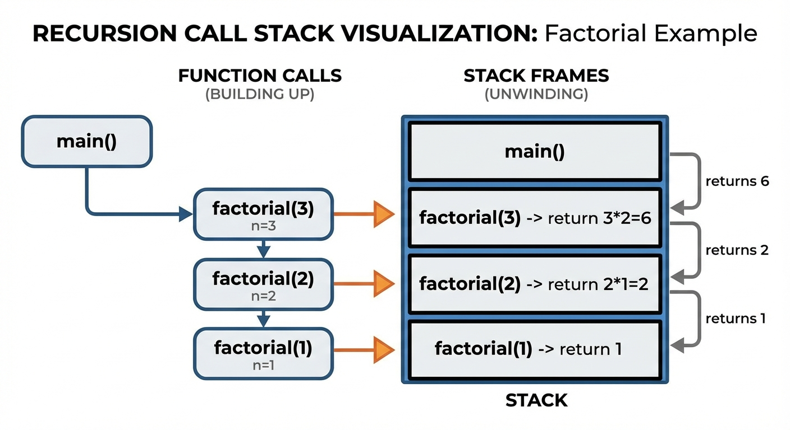
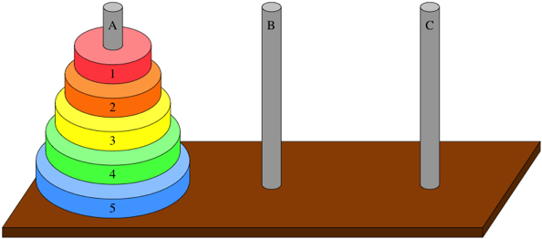
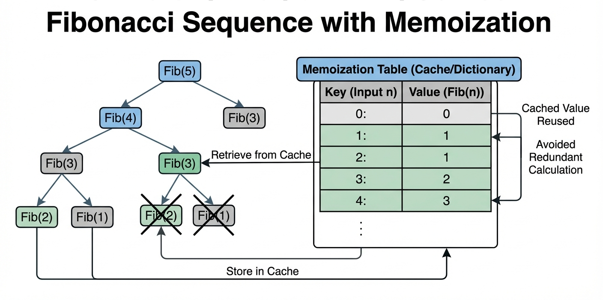
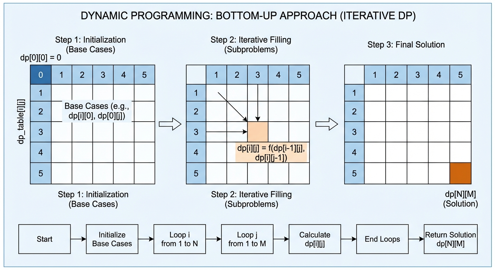
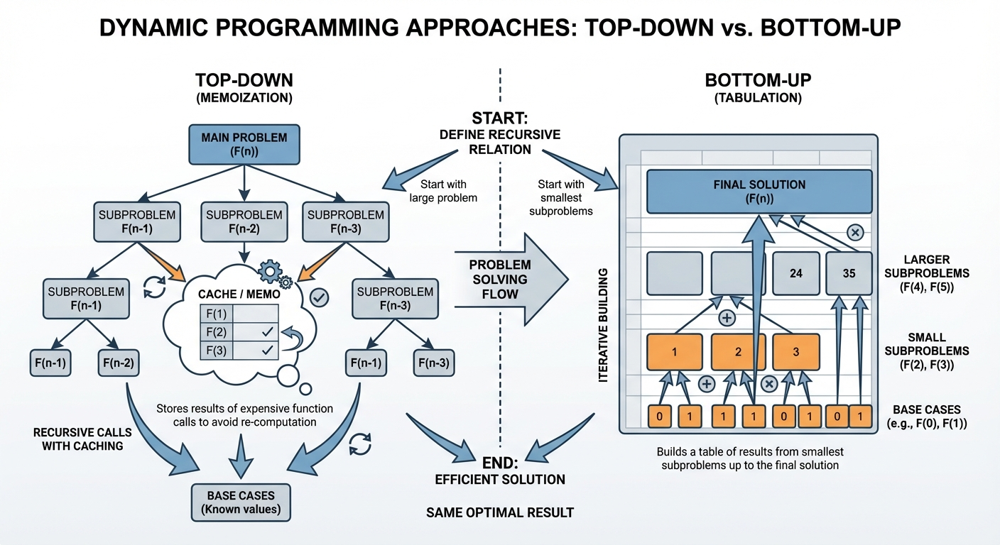

# YZM1022

## Advanced Programming

### Week 11: Recursion and Dynamic Programming

**Instructor:** Ekrem Çetinkaya
**Date:** 06.05.2026

---

# Recap - Advanced Functional Programming

<div class="two-columns">
<div class="column">

**Generators & the Iterator Protocol**
Lazy sequences - produce one value per `next()` call. `yield from` delegates to sub-generators. Coroutines add two-way communication via `send()`.

**Advanced `itertools`**
`compress`, `filterfalse`, `takewhile`, `groupby`, `starmap`, `accumulate` - all lazy, all composable. Chain them for single-pass pipelines.

</div>
<div class="column">

**The `operator` Module**
Built-in operators as first-class functions: `itemgetter`, `attrgetter`, `mul`. Replaces `lambda` for sort keys and `reduce` arguments.

**`functools` Depth**
`partial` fits multi-arg functions into pipelines. `reduce` collapses sequences. `total_ordering` derives six comparisons from two. `lru_cache` memoizes pure functions.

</div>
</div>

---

# Today's Agenda

**Recursion Fundamentals**
Base cases, call stack, 5 core patterns

**Advanced Recursion**
Tower of Hanoi · Sorting (merge sort, quicksort) · Backtracking · Limits & pitfalls

**Dynamic Programming**
Memoization · Tabulation · Classic DP problems

---

<!-- _footer: "" -->
<!-- _header: "" -->
<!-- _paginate: false -->

<style scoped>
p { text-align: center}
h1 {text-align: center; font-size: 72px}
</style>

# Recursion Fundamentals

---

# What is Recursion?

**Recursion** is when a function calls itself to solve a smaller version of the same problem.

```python
def countdown(n):
    if n <= 0:           # Base case: when to stop
        print("Blastoff!")
    else:                # Recursive case: call self with smaller input
        print(n)
        countdown(n - 1)

countdown(5)
# 5
# 4
# 3
# 2
# 1
# Blastoff!
```

**Two essential parts:**

1. **Base case**: Condition to stop recursion
2. **Recursive case**: Call function with simpler input

---

# The Anatomy of Recursion

The mathematical definition maps directly to code: the base case (`n == 0`) terminates the chain, the recursive case expresses `n! = n × (n-1)!`. Every valid recursive function needs both — the base case without the recursive case never reduces, the recursive case without the base case never stops.

```python
def factorial(n):
    """
    Calculate n! = n × (n-1) × (n-2) × ... × 1

    Mathematical definition:
    - 0! = 1              (base case)
    - n! = n × (n-1)!     (recursive case)
    """
    # Base case: simplest version of the problem
    if n == 0:
        return 1

    # Recursive case: solve smaller problem, then combine
    return n * factorial(n - 1)

print(factorial(5))  # 120
```

---

# The Call Stack

Each call suspends at `n * factorial(n-1)`, waiting for the deeper result. The print output reads like a stack being pushed down (calls) then unwound back up (returns)

```python
def factorial(n):
    print(f"factorial({n}) called")
    if n == 0:
        print(f"factorial({n}) returning 1 (base case)")
        return 1
    result = n * factorial(n - 1)
    print(f"factorial({n}) returning {result}")
    return result

factorial(4)
# factorial(4) called
# factorial(3) called
# factorial(2) called
# factorial(1) called
# factorial(0) called
# factorial(0) returning 1 (base case)
# factorial(1) returning 1
# factorial(2) returning 2
# factorial(3) returning 6
# factorial(4) returning 24
```

**Calls stack up, then unwind with results**

---

<!-- _footer: "Each frame waits for the one below it — the multiplication only happens on the way back up" -->



---

# Common Mistake: Missing Base Case

Two failure modes, same root cause: the function never reaches a state that stops recursion. The first has no base case at all. The second has one that's unreachable — the input moves in the wrong direction.

```python
# ❌ BAD: Infinite recursion!
def bad_countdown(n):
    print(n)
    bad_countdown(n - 1)  # Never stops!

bad_countdown(5)
# 5, 4, 3, 2, 1, 0, -1, -2, ...
# RecursionError: maximum recursion depth exceeded

# ❌ BAD: Base case never reached!
def bad_factorial(n):
    if n == 0:
        return 1
    return n * bad_factorial(n + 1)  # Goes UP, not down!

bad_factorial(5)  # RecursionError!

# ✅ GOOD: Proper base case
def good_factorial(n):
    if n <= 0:  # Handles negative numbers too
        return 1
    return n * good_factorial(n - 1)
```

---

# Recursion vs Iteration

<div class="two-columns">
<div class="column">

### Recursive

```python
def sum_recursive(numbers):
    # Base case
    if not numbers:
        return 0
    # Recursive case
    return numbers[0] + sum_recursive(numbers[1:])

print(sum_recursive([1, 2, 3, 4, 5]))
# 15
```

**Pros:**

- Often cleaner, more elegant
- Natural for recursive structures

**Cons:**

- Stack overhead
- Can hit recursion limit

</div>
<div class="column">

### Iterative

```python
def sum_iterative(numbers):
    total = 0
    for num in numbers:
        total += num
    return total

print(sum_iterative([1, 2, 3, 4, 5]))
# 15
```

**Pros:**

- No stack overhead
- Generally faster
- No recursion limit

**Cons:**

- Can be more complex
- Less natural for trees

</div>
</div>

---

# The Fibonacci Example

Two calls per invocation — `fib(n-1)` and `fib(n-2)` — create an exponential tree. `fib(2)` gets recomputed three times for just `fib(5)`. Remember this: it's exactly the problem Dynamic Programming solves later.

```python
# fib(n) = fib(n-1) + fib(n-2), fib(0)=0, fib(1)=1
def fibonacci(n):
    if n <= 0:
        return 0
    if n == 1:
        return 1
    return fibonacci(n - 1) + fibonacci(n - 2)

# Works, but very slow for large n!
print(fibonacci(10))  # 55
print(fibonacci(20))  # 6765
# print(fibonacci(40))  # Takes forever!

# Why? Massive redundant computation!
# fib(5) = fib(4) + fib(3)
#        = (fib(3) + fib(2)) + (fib(2) + fib(1))
#        = ((fib(2) + fib(1)) + (fib(1) + fib(0))) + ((fib(1) + fib(0)) + 1)
# fib(2) computed 3 times! Gets exponentially worse...
```

---

# Recursion Patterns - Linear Recursion

The most common pattern: process the first element, recurse on the rest. The base case is always an empty container — `[]`, `""`, or `None`. The same shape works for any sequence: lists, strings, linked lists.

```python
def sum_list(lst):
    """Process one element, recurse on rest"""
    if not lst:
        return 0
    return lst[0] + sum_list(lst[1:])

def reverse_string(s):
    """Same pattern: process first, recurse on rest"""
    if len(s) <= 1:
        return s
    return reverse_string(s[1:]) + s[0]

print(reverse_string("hello"))  # "olleh"
```

---

# Recursion Patterns - Divide and Conquer

Each call reduces the problem space by half: `O(n)` -> `O(n/2)` -> `O(n/4)`. This gives `O(log n)` depth instead of `O(n)`, making it dramatically faster for large inputs.

```python
def binary_search(arr, target, low=0, high=None):
    """Divide problem in half each step"""
    if high is None:
        high = len(arr) - 1

    if low > high:
        return -1  # Not found

    mid = (low + high) // 2

    if arr[mid] == target:
        return mid
    elif arr[mid] < target:
        return binary_search(arr, target, mid + 1, high)
    else:
        return binary_search(arr, target, low, mid - 1)

numbers = [1, 3, 5, 7, 9, 11, 13, 15]
print(binary_search(numbers, 7))   # 3
print(binary_search(numbers, 10))  # -1
```

---

# Recursion Patterns - Accumulator Pattern

In regular recursion, each frame holds a pending operation (`lst[0] + ...`) until the recursive call returns — work piles up. The accumulator pattern passes a running total as a parameter instead, so the recursive call is the _last_ thing the function does and nothing accumulates on the stack. Python doesn't optimize this automatically, but the intent is clearer and stack depth feels lighter.

```python
# Regular recursion - builds up stack
def sum_list(lst):
    if not lst:
        return 0
    return lst[0] + sum_list(lst[1:])

# Accumulator pattern - passes running total
def sum_list_acc(lst, acc=0):
    if not lst:
        return acc
    return sum_list_acc(lst[1:], acc + lst[0])

# Both give same result, but accumulator is "tail recursive"
print(sum_list([1, 2, 3, 4, 5]))      # 15
print(sum_list_acc([1, 2, 3, 4, 5]))  # 15
```

---

# Recursion Patterns - Multiple Recursion

When each call makes **more than one** recursive call, the result tree fans out exponentially. `power_set` branches two ways per element — include it or skip it — which is exactly why `n` items produce `2ⁿ` subsets. Fibonacci and merge sort are the same shape.

```python
def power_set(items):
    """
    Generate all subsets of a set.
    Multiple recursive calls per invocation.
    """
    if not items:
        return [[]]  # Empty set has one subset: itself

    first = items[0]
    rest = items[1:]
    # Get all subsets without first element
    subsets_without = power_set(rest)
    # Add first element to each of those subsets
    subsets_with = [[first] + subset for subset in subsets_without]

    return subsets_without + subsets_with

print(power_set([1, 2, 3]))
# [[], [3], [2], [2, 3], [1], [1, 3], [1, 2], [1, 2, 3]]
```

---

# Recursion Patterns - Mutual Recursion

Two functions that delegate to each other, each owning one half of the problem. Both must have their own base case or neither ever stops. This pattern appears naturally in recursive-descent parsers, where `parse_expr` calls `parse_term` which may call `parse_expr` again for nested parentheses.

```python
def is_even(n):
    """Check if n is even using mutual recursion"""
    if n == 0:
        return True
    return is_odd(n - 1)

def is_odd(n):
    """Check if n is odd using mutual recursion"""
    if n == 0:
        return False
    return is_even(n - 1)

print(is_even(4))  # True (4 -> 3 -> 2 -> 1 -> 0 -> True)
print(is_odd(5))   # True (5 -> 4 -> 3 -> 2 -> 1 -> 0 -> False -> True)
```

---

<!-- _footer: "" -->
<!-- _header: "" -->
<!-- _paginate: false -->

<style scoped>
p { text-align: center}
h1 {text-align: center; font-size: 72px}
</style>

# Famous Recursion Problems

---

# Tower of Hanoi



The puzzle that made recursion famous. Move all `n` disks from peg A to peg C using B as a helper. One disk at a time, never place a larger disk on a smaller one.

**The key insight:** to move `n` disks to C, you must first move `n-1` disks out of the way to B. That's the whole algorithm.

| Disks | Moves needed               |
| ----- | -------------------------- |
| 1     | 1                          |
| 3     | 7                          |
| 10    | 1,023                      |
| 64    | 18,446,744,073,709,551,615 |

---

# Tower of Hanoi: Solution

Three lines of recursion encode the entire solution. The base case is `n == 0`, do nothing.

- The recursive case is clearing the way, move the bottom disk, restore.

```python
def hanoi(n, source, target, helper):
    if n == 0:
        return
    hanoi(n - 1, source, helper, target)        # Move n-1 to helper
    print(f"Move disk {n}: {source} -> {target}")  # Move bottom disk
    hanoi(n - 1, helper, target, source)        # Move n-1 to target

hanoi(3, 'A', 'C', 'B')
# Move disk 1: A -> C
# Move disk 2: A -> B
# Move disk 1: C -> B
# Move disk 3: A -> C
# Move disk 1: B -> A
# Move disk 2: B -> C
# Move disk 1: A -> C
```

Two recursive calls -> `T(n) = 2T(n-1) + 1` -> exactly `2ⁿ - 1` moves. **Proven optimal.**

---

# Sorting - Merge Sort

Divide the array in half, sort each half recursively, then merge the two sorted halves. Every element is touched once per level of the recursion tree, and there are `log n` levels.

```python
def merge_sort(arr):
    if len(arr) <= 1:
        return arr
    mid = len(arr) // 2
    left  = merge_sort(arr[:mid])
    right = merge_sort(arr[mid:])
    return merge(left, right)

def merge(left, right):
    result, i, j = [], 0, 0
    while i < len(left) and j < len(right):
        if left[i] <= right[j]:
            result.append(left[i]); i += 1
        else:
            result.append(right[j]); j += 1
    return result + left[i:] + right[j:]

print(merge_sort([38, 27, 43, 3, 9, 82, 10]))
# [3, 9, 10, 27, 38, 43, 82]
```

---

# Sorting - Quicksort

Pick a pivot, partition into smaller / equal / larger, recurse on each side. No extra memory for merging. The recursion itself is the sort.

- Average `O(n log n)`, worst case `O(n²)` on already-sorted input with a bad pivot.

```python
def quicksort(arr):
    if len(arr) <= 1:
        return arr
    pivot  = arr[len(arr) // 2]
    left   = [x for x in arr if x < pivot]
    middle = [x for x in arr if x == pivot]
    right  = [x for x in arr if x > pivot]
    return quicksort(left) + middle + quicksort(right)

print(quicksort([38, 27, 43, 3, 9, 82, 10]))
# [3, 9, 10, 27, 38, 43, 82]
```

---

# Backtracking

Try a choice, recurse deeper, and if you reach a dead end , **undo the choice and try the next one**.

- Backtracking prunes the search space by abandoning paths early rather than generating all possibilities first.

```python
def backtrack(state, choices):
    if is_solution(state):
        record(state)
        return
    for choice in choices:
        if is_valid(state, choice):
            make_choice(state, choice)   # commit
            backtrack(state, choices)    # recurse
            undo_choice(state, choice)   # <- backtrack
```

**Where it appears:** N-queens, Sudoku, maze solving, generating permutations/subsets, regex matching, recursive-descent parsing.

The `undo_choice` step is what makes it backtracking rather than just recursion. The state is restored so the next branch starts clean.

---

# Backtracking - N-Queens

Place `n` queens on an `n x n` board so no two attack each other. For each row, try every column.

- If safe, place and recurse.
- If the next row has no safe column, `placed.pop()` removes the last queen and tries the next column.

```python
def solve_n_queens(n):
    solutions = []

    def is_safe(placed, col):
        row = len(placed)
        for r, c in enumerate(placed):
            if c == col or abs(c - col) == abs(r - row):
                return False
        return True

    def backtrack(placed):
        if len(placed) == n:
            solutions.append(placed[:])
            return
        for col in range(n):
            if is_safe(placed, col):
                placed.append(col)
                backtrack(placed)
                placed.pop()          # backtrack

    backtrack([])
    return solutions
```

---

# Python's Recursion Limit

Python caps the call stack at 1000 frames by default.

- Deep recursion raises `RecursionError`. This is intentional as an infinite recursion that silently consumed all memory would be worse.

```python
import sys
print(sys.getrecursionlimit())  # 1000

# You can raise it — but this treats the symptom, not the cause
sys.setrecursionlimit(10000)
```

**When to convert recursion to iteration:**

- Input can be arbitrarily deep (file trees, network graphs)
- Stack depth exceeds a few hundred frames
- You need predictable memory usage

---

# From Recursion to Dynamic Programming

<div class="two-columns">
<div class="column">

## Recursion is powerful but it has a flaw

Hanoi, merge sort, quicksort, backtracking all efficient because each subproblem is **unique**. No work is repeated.

But some recursive problems **recompute the same subproblem** thousands of times:

```
fib(5) calls fib(3) twice
fib(5) calls fib(2) three times
fib(5) calls fib(1) five times

-> O(2ⁿ) total work for O(n) unique subproblems
```

</div>
<div class="column">

## The fix: Remember what you've solved

Dynamic Programming = recursion + a cache.

- **Memoization (top-down):** add a dict, look up before computing
- **Tabulation (bottom-up):** fill a table from smallest subproblems up

The recursive structure tells you _what_ the subproblems are.
DP ensures each is solved _exactly once_.

> Pure recursion thinks. DP remembers.

</div>
</div>

---

<!-- _footer: "" -->
<!-- _header: "" -->
<!-- _paginate: false -->

<style scoped>
p { text-align: center}
h1 {text-align: center; font-size: 72px}
</style>

# Dynamic Programming

---

# The Problem with Naive Recursion

```python
import time

def fibonacci(n):
    if n <= 1:
        return n
    return fibonacci(n - 1) + fibonacci(n - 2)

# Time it
for n in [10, 20, 30, 35]:
    start = time.time()
    result = fibonacci(n)
    elapsed = time.time() - start
    print(f"fib({n}) = {result} in {elapsed:.4f}s")

# fib(10) = 55 in 0.0000s
# fib(20) = 6765 in 0.0019s
# fib(30) = 832040 in 0.2341s
# fib(35) = 9227465 in 2.5847s

# fib(40) takes ~30 seconds!
# fib(50) would take hours!

# Problem: Exponential time O(2^n) due to redundant computation
```

---

# Visualizing the Problem

```
fib(5) calls:
                    fib(5)
                   /      \
              fib(4)      fib(3)
             /    \       /    \
         fib(3)  fib(2) fib(2) fib(1)
         /   \    /  \   /  \
     fib(2) fib(1) fib(1) fib(0) fib(1) fib(0)
     /   \
fib(1) fib(0)

fib(2) computed 3 times!
fib(3) computed 2 times!

For fib(n): approximately 2^n function calls!
```

**Solution: Remember what we already computed!**

---

# Dynamic Programming

**Dynamic Programming (DP)** solves problems by breaking them into overlapping subproblems, solving each once, and storing results.

## Two Approaches

| Top-Down (Memoization)  | Bottom-Up (Tabulation)          |
| ----------------------- | ------------------------------- |
| Start from main problem | Start from smallest subproblems |
| Recursion + cache       | Iteration + table               |
| Lazy: compute as needed | Eager: compute all              |
| Natural translation     | Requires more thought           |
| Stack overhead          | No stack overhead               |

---

# Memoization (Top-Down DP)

Cache every result the first time it is computed. When the same subproblem recurs, return the stored value in `O(1)` instead of recomputing. This converts exponential `O(2ⁿ)` recursion into linear `O(n)` work, each subproblem solved exactly once.

```python
def fibonacci_memo(n, memo=None):
    """Fibonacci with memoization"""
    if memo is None:
        memo = {}

    # Check if already computed
    if n in memo:
        return memo[n]

    # Base cases
    if n <= 1:
        return n

    # Compute and store
    memo[n] = fibonacci_memo(n - 1, memo) + fibonacci_memo(n - 2, memo)
    return memo[n]
```

---

# Memoization (Top-Down DP)



---

# Using @lru_cache

`@lru_cache` is the standard library's memoization decorator. It wraps any pure function and caches its return values keyed by arguments. `cache_info()` reports hits and misses; `cache_clear()` resets it. Python 3.9 added `@cache` as an alias for `@lru_cache(maxsize=None)`.

```python
from functools import lru_cache

@lru_cache(maxsize=None)  # Unlimited cache
def fibonacci(n):
    """Fibonacci with automatic memoization"""
    if n <= 1:
        return n
    return fibonacci(n - 1) + fibonacci(n - 2)

# Same code as before, but now fast!
print(fibonacci(100))  # 354224848179261915075

# View cache stats
print(fibonacci.cache_info())
# CacheInfo(hits=98, misses=101, maxsize=None, currsize=101)

# Clear cache if needed
fibonacci.cache_clear()
```

---

# Using @lru_cache

`@lru_cache` is the standard library's memoization decorator. It wraps any pure function and caches its return values keyed by arguments. `cache_info()` reports hits and misses; `cache_clear()` resets it. Python 3.9 added `@cache` as an alias for `@lru_cache(maxsize=None)`.

```python
# Python 3.9+: @cache is simpler
from functools import cache

@cache
def fibonacci(n):
    if n <= 1:
        return n
    return fibonacci(n - 1) + fibonacci(n - 2)
```

---

# Tabulation (Bottom-Up DP)

Instead of recursing down and caching on the way back up, tabulation builds the answer from the smallest subproblems upward. No recursion stack, no memoization overhead just a table filled left-to-right.

```python
def fibonacci_tab(n):
    """Fibonacci with tabulation (bottom-up)"""
    if n <= 1:
        return n

    # Table to store results
    dp = [0] * (n + 1)
    dp[0] = 0
    dp[1] = 1

    # Build up from smallest subproblems
    for i in range(2, n + 1):
        dp[i] = dp[i - 1] + dp[i - 2]

    return dp[n]

print(fibonacci_tab(100))
# 354224848179261915075
```

---

# Tabulation (Bottom-Up DP)



---

# Memoization vs Tabulation

<div class="two-columns">
<div class="column">

## Memoization (Top-Down)

```python
@lru_cache
def fib(n):
    if n <= 1:
        return n
    return fib(n-1) + fib(n-2)
```

**Characteristics:**

- Start with original problem
- Recursive structure
- Only computes needed values
- Has recursion overhead
- More intuitive

</div>
<div class="column">

## Tabulation (Bottom-Up)

```python
def fib(n):
    dp = [0, 1] + [0] * (n-1)
    for i in range(2, n + 1):
        dp[i] = dp[i-1] + dp[i-2]
    return dp[n]
```

**Characteristics:**

- Start with smallest subproblems
- Iterative structure
- Computes all values
- No recursion overhead
- Often more efficient

</div>
</div>

---

# Dynamic Programming



---

# Classic DP - Climbing Stairs

Problem: You're climbing stairs. Each step you can climb 1 or 2 stairs.

- How many distinct ways can you climb n stairs?

```python
# Memoization
@lru_cache
def climb_stairs_memo(n):
    if n <= 2:
        return n
    return climb_stairs_memo(n - 1) + climb_stairs_memo(n - 2)

# Tabulation
def climb_stairs_tab(n):
    if n <= 2:
        return n
    dp = [0] * (n + 1)
    dp[1], dp[2] = 1, 2
    for i in range(3, n + 1):
        dp[i] = dp[i - 1] + dp[i - 2]
    return dp[n]

print(climb_stairs_memo(10))  # 89
print(climb_stairs_tab(10))   # 89

# Notice: This is just Fibonacci with different base cases
```

---

# Classic DP - Coin Change

At each remaining amount, try every coin and pick the option that uses fewest coins. Subproblems overlap heavily - `dp(25)` is called thousands of times in the naive version. Memoization ensures each is computed once.

```python
from functools import lru_cache

def coin_change(coins, amount):
    @lru_cache(maxsize=None)
    def dp(remaining):
        if remaining == 0: return 0
        if remaining < 0: return float('inf')
        return min(dp(remaining - c) + 1 for c in coins)

    result = dp(amount)
    return result if result != float('inf') else -1

# coins must be a tuple for lru_cache (hashable)
coins = (1, 5, 10, 25)
print(coin_change(coins, 30))  # 2  (25 + 5)
print(coin_change(coins, 11))  # 2  (10 + 1)
print(coin_change(coins, 3))   # 3  (1 + 1 + 1)
```

---

# Coin Change - Bottom-Up

`dp[i]` stores the minimum coins for amount `i`. For each amount, we try every coin - if it fits, check whether `dp[i - coin] + 1` beats the current best. The trace shows how each cell is derived from earlier cells.

```python
def coin_change_tab(coins, amount):
    """Bottom-up solution"""
    # dp[i] = minimum coins needed for amount i
    dp = [float('inf')] * (amount + 1)
    dp[0] = 0  # 0 coins needed for amount 0

    for i in range(1, amount + 1):
        for coin in coins:
            if coin <= i:
                dp[i] = min(dp[i], dp[i - coin] + 1)

    return dp[amount] if dp[amount] != float('inf') else -1

# Trace for amount=6, coins=[1, 3, 4]:
# dp[0] = 0
# dp[1] = dp[0] + 1 = 1  (use coin 1)
# dp[2] = dp[1] + 1 = 2  (use coin 1)
# dp[3] = min(dp[2]+1, dp[0]+1) = 1  (use coin 3)
# dp[4] = min(dp[3]+1, dp[1]+1, dp[0]+1) = 1  (use coin 4)
# dp[5] = min(dp[4]+1, dp[2]+1) = 2  (use coin 4 + coin 1)
# dp[6] = min(dp[5]+1, dp[3]+1, dp[2]+1) = 2  (use two coin 3s)

print(coin_change_tab([1, 3, 4], 6))  # 2
```

---

# Classic DP - Longest Common Subsequence

At each position `(i, j)`, two characters either match (extend the LCS) or don't (skip one character from either string and take the best). The memoized version converts `O(3ⁿ)` naive recursion to `O(m×n)`, one result per pair of positions.

```python
@lru_cache(maxsize=None)
def lcs(s1, s2, i=0, j=0):
    if i >= len(s1) or j >= len(s2): return 0
    if s1[i] == s2[j]:
        return 1 + lcs(s1, s2, i + 1, j + 1)
    return max(lcs(s1, s2, i + 1, j), lcs(s1, s2, i, j + 1))

print(lcs("ABCDGH", "AEDFHR"))  # 3 (ADH)
print(lcs("AGGTAB", "GXTXAYB"))  # 4 (GTAB)
```

---

# LCS - Bottom-Up Table Building

Build a 2D table where `dp[i][j]` = length of LCS of `s1[:i]` and `s2[:j]`. Fill left-to-right, top-to-bottom. Each cell depends only on the cell above, to the left, and diagonally above-left.

```python
def lcs_with_path(s1, s2):
    """Bottom-up with actual LCS string"""
    m, n = len(s1), len(s2)
    dp = [[0] * (n + 1) for _ in range(m + 1)]

    # Fill the DP table
    for i in range(1, m + 1):
        for j in range(1, n + 1):
            if s1[i - 1] == s2[j - 1]:
                dp[i][j] = dp[i - 1][j - 1] + 1
            else:
                dp[i][j] = max(dp[i - 1][j], dp[i][j - 1])

    return dp, m, n
```

---

# LCS - Path Recovery (Backtracking)

The table stores lengths, not the actual LCS characters. To recover the string, start at `dp[m][n]` and walk backward: when characters matched, include them; otherwise move toward whichever neighbor was larger.

```python
def recover_lcs(dp, s1, s2, m, n):
    """Backtrack to find actual LCS string"""
    lcs_str = []
    i, j = m, n
    while i > 0 and j > 0:
        if s1[i - 1] == s2[j - 1]:
            lcs_str.append(s1[i - 1])
            i -= 1
            j -= 1
        elif dp[i - 1][j] > dp[i][j - 1]:
            i -= 1
        else:
            j -= 1

    return ''.join(reversed(lcs_str))

# Usage
dp, m, n = lcs_with_path("ABCDGH", "AEDFHR")
print(f"LCS length: {dp[m][n]}")  # 3
print(f"LCS string: {recover_lcs(dp, 'ABCDGH', 'AEDFHR', m, n)}")  # ADH
```

---

# DP Problem-Solving Framework

## Step 1: Identify Subproblems

> What decisions do we make? What state do we need to track?

## Step 2: Define Recurrence

> How does the solution depend on smaller subproblems?

## Step 3: Identify Base Cases

> What are the trivial cases we can solve directly?

## Step 4: Implement (Top-Down or Bottom-Up)

> Add memoization or build a DP table

## Step 5: Optimize Space (if needed)

> Can we reduce the table to fewer dimensions?

---

# When to Use DP

## Characteristics of DP Problems

1. **Optimal Substructure**: Optimal solution contains optimal solutions to subproblems
2. **Overlapping Subproblems**: Same subproblems solved multiple times

## Common DP Problem Types

- Counting (ways to do something)
- Optimization (min/max)
- Yes/No decisions
- Sequence problems (LCS, edit distance)
- Grid problems (paths, islands)
- Subset/knapsack problems

---

<!-- _class: lead -->

# Thank You!

## Contact Information

- **Email:** ekrem.cetinkaya@yildiz.edu.tr
- **Office Hours:** Wednesday 13:30-15:30 - Room C-120
- **Book a slot before coming:** [Booking Link](https://dub.sh/ekrem-office)
- **Course Repository:** [GitHub](https://github.com/ekremcet/yzm1022-advanced-programming)

## Next Week

- **Week 12:** Generic Programming and Type Systems
