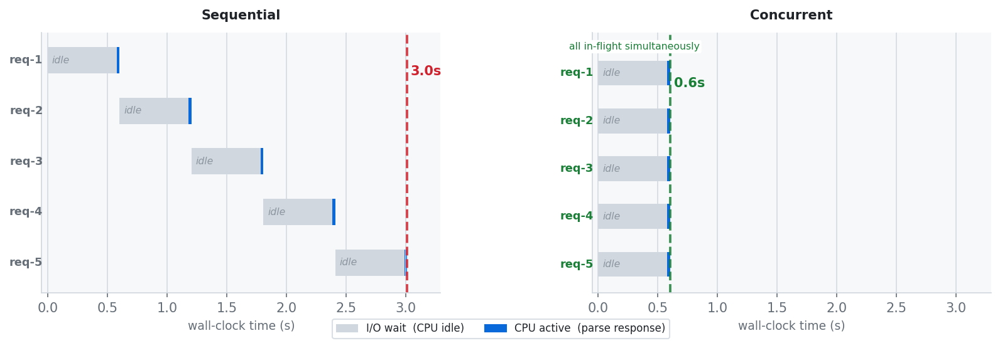
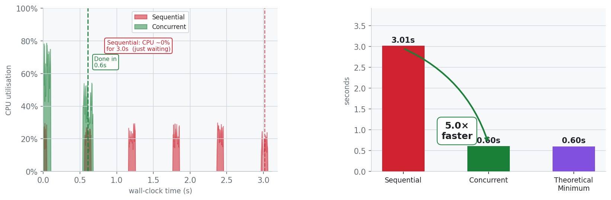
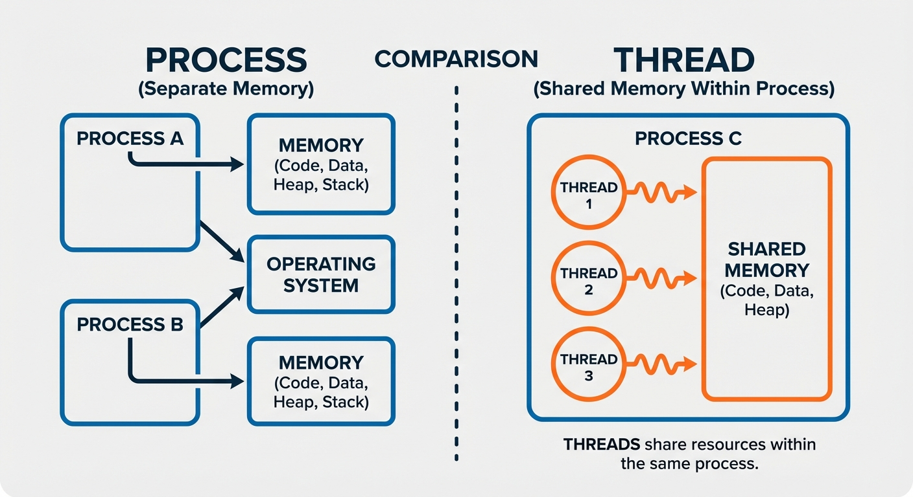
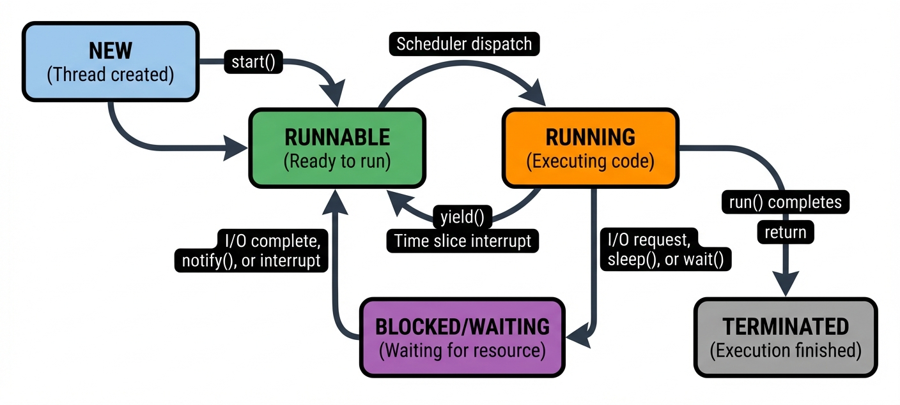
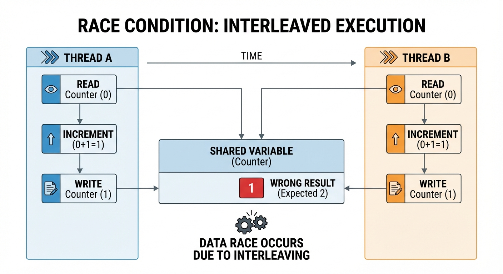
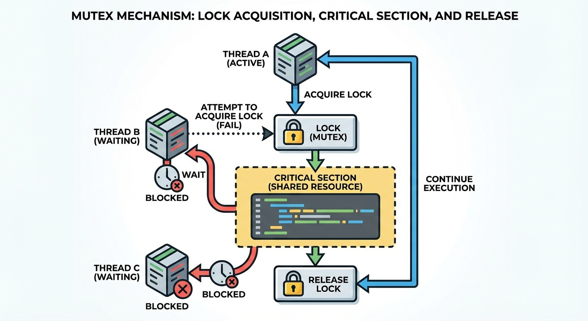
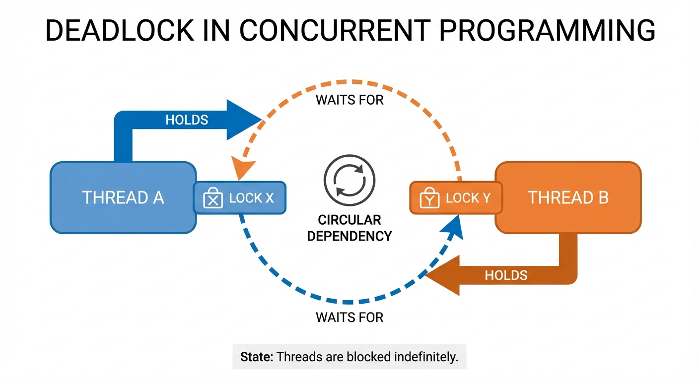

# YZM1022

## Advanced Programming

### Week 13: Concurrent Programming

**Instructor:** Ekrem Çetinkaya
**Date:** 20.05.2026

---

# Recap - Week 12

## Generic Programming and Type Systems

- **Type hints**: Self-documenting, IDE-friendly code
- **TypeVar**: Create reusable type parameters
- **Generic classes**: Type-safe containers and data structures
- **mypy**: Static type checking before runtime

---

# Today's Focus

### Threads, Locks, and Synchronization

**Part 1: Threading Basics**

- What is concurrency?
- Creating and managing threads
- Thread lifecycle

**Part 2: Synchronization**

- Race conditions
- Locks and deadlocks
- Semaphores and conditions

**Part 3: Thread Safety**

- Thread-safe data structures
- Atomic operations
- Common patterns

---

# The Problem - Your Program Is Sleeping on the Job

Imagine you are writing a program that checks the weather for 5 cities. You make a network request for Istanbul, wait 300ms, get the answer.

- Then you make a request for Ankara, wait another 300ms. Then Izmir. Then Bursa. Then Antalya...
- Total time: **1.5 seconds - and your CPU did absolutely nothing for 1.4 of those seconds.** It was just waiting.

```python
import time

def get_weather(city):
    time.sleep(0.3)
    return f"{city}: 22°C"

cities = ["Istanbul", "Ankara", "Izmir", "Bursa", "Antalya"]

start = time.time()
for city in cities:
    print(get_weather(city))  # each call block the next one
print(f"Total: {time.time() - start:.1f}s")   # 1.5s
```

---

# The Problem - Your Program Is Sleeping on the Job

This can be a problem with every app that touches a network, a file, or a database.

- A web server handling 100 users at once.
- A data pipeline fetching rows from a remote database.
- A Slack bot calling 3 different APIs per message.

In all of these cases, your program is spending the vast majority of its runtime _waiting_ - not computing.

Concurrency is the solution:

- Instead of waiting for one thing to finish before starting the next, you start all of them, let them wait in parallel, and collect the results when they are ready.

---

# Concurrency

<div class="two-columns">
<div class="column">

### Tasks

**I/O-Bound Tasks**

- Network requests
- File operations
- Database queries
- User input handling

**Responsive UIs**

- Background processing
- Progress indicators
- Non-blocking interfaces

**Server Applications**

- Handle multiple clients
- Process concurrent requests

</div>
<div class="column">

### Benefits

- **Better resource utilization**
  - CPU works while waiting for I/O
- **Improved responsiveness**
  - UI doesn't freeze
- **Higher throughput**
  - Process more requests

### Challenges

- **Complexity**
  - Harder to reason about
- **Race conditions**
  - Unpredictable bugs
- **Debugging difficulty**
  - Non-deterministic behavior

</div>
</div>

---

# Concurrency

Let's imagine we are building a stock price dashboard. It fetches live prices for four companies, and each request takes about 300ms.

The fix is to launch all four requests simultaneously and let them wait in parallel and the total time drops to ~300ms, **the slowest single request**, not the sum of all four.

```python
import time, urllib.request

urls = ["https://python.org", "https://github.com",
        "https://google.com", "https://pypi.org"]

# Sequential - waits for each before starting the next
start = time.time()
for url in urls:
    urllib.request.urlopen(url, timeout=5)
print(f"Sequential: {time.time() - start:.1f}s")  # ~4–6s

# Concurrent - all requests in-flight simultaneously
import threading
start = time.time()
threads = [threading.Thread(target=urllib.request.urlopen,
                            args=(url,)) for url in urls]
for t in threads: t.start()
for t in threads: t.join()
print(f"Threaded:   {time.time() - start:.1f}s")  # ~1–2s
```

---

<!-- _footer: "" -->
<!-- _header: "" -->
<!-- _paginate: false -->



---

<!-- _footer: "" -->
<!-- _header: "" -->
<!-- _paginate: false -->



---

<!-- _footer: "" -->
<!-- _header: "" -->
<!-- _paginate: false -->

<style scoped>
p { text-align: center}
h1 {text-align: center; font-size: 72px}
</style>

# Threading Basics

---

# What is Concurrency?

**Concurrency** is the ability of a program to deal with multiple tasks at the same time, not necessarily doing them simultaneously, but making progress on several things within the same time window.

- A single-threaded program executes one instruction, then the next, then the next; tasks are strictly sequential and each must finish before the next begins.
- A concurrent program can start a task, pause it while it waits for something (a network response, a file read, user input), and begin working on a different task in that gap.

Concurrency is about how you organize work, not how many CPU cores are executing it.

---

# Concurrency vs Parallelism

These two terms are often used interchangeably but they mean different things.

- **Concurrency** is a design property.
  - A program is structured to handle multiple tasks at once, even on a single core, by switching between them.
- **Parallelism** is a runtime property.
  - Tasks are physically executing at the same moment on multiple CPU cores.

Concurrency is about _structure_; parallelism is about _execution_. A concurrent program may or may not be parallel depending on the hardware it runs on.

---

# Concurrency vs Parallelism

<div class="two-columns">
<div class="column">

### Concurrency

- **Dealing with** many things at once
- Tasks **interleave** execution
- Can run on **single CPU**
- About **structure**

```
Time ->
CPU: [A1][B1][A2][B2][A3][B3]

Tasks switch rapidly
(time-slicing)
```

**Example**: A chef switching between multiple dishes

</div>
<div class="column">

### Parallelism

- **Doing** many things at once
- Tasks run **simultaneously**
- Requires **multiple CPUs**
- About **execution**

```
Time ->
CPU1: [A1][A2][A3]
CPU2: [B1][B2][B3]

Tasks run truly simultaneously
```

**Example**: Multiple chefs cooking different dishes

</div>
</div>

---

# Thread vs Process



---

# Python's Threading Module

Python's `threading` module provides the foundational API for creating and managing threads inside a single OS process.

- A thread is a separate line of execution. It has its own call stack, local variables, and instruction pointer, but shares the process's heap memory (all objects, global variables, and module-level state) with every other thread running in the same process.

This shared memory model makes threads lightweight compared to processes.

- Creating a thread takes microseconds and virtually no memory, whereas spawning a new process copies the entire memory space.

The trade-off is that this shared state must be carefully coordinated as any data that two threads both read and write requires synchronization to prevent corruption.

- `start()` requests that the OS schedule the thread for execution and returns immediately
- `join()` blocks the calling thread until the target thread finishes, which is the essential pattern for collecting results before the main program continues.

---

# Python's Threading Module

```python
import threading

def worker(name: str, count: int) -> None:
    for i in range(count):
        print(f"{name}: iteration {i}")

thread = threading.Thread(target=worker, args=("Worker-1", 3))
thread.start()
thread.join()
print("Main thread continues...")
```

```
Worker-1: iteration 0
Worker-1: iteration 1
Worker-1: iteration 2
Main thread continues...
```

---

# Creating Threads

<div class="two-columns">
<div class="column">

### Method 1: Function Target

```python
import threading

def worker(message: str) -> None:
    print(f"Working: {message}")

# Create with target function
t = threading.Thread(
    target=worker,
    args=("Hello",)  # tuple!
)
t.start()
t.join()
```

**When to use:**

- Simple, one-off tasks
- Quick concurrent operations

</div>
<div class="column">

### Method 2: Subclass Thread

```python
import threading

class WorkerThread(threading.Thread):
    def __init__(self, message: str):
        super().__init__()
        self.message = message

    def run(self) -> None:
        """Override run method"""
        print(f"Working: {self.message}")

# Create and start
t = WorkerThread("Hello")
t.start()
t.join()
```

**When to use:**

- Complex thread logic
- Need thread state/methods

</div>
</div>

---

# Thread Lifecycle

A newly created `Thread` object is in the "**new**" state it exists in Python memory but has not yet requested any OS resources or begun executing.

Calling `start()` transitions it to the "**runnable**" state: the OS allocates a stack and begins scheduling it alongside all other threads.

The thread runs until its target function returns normally, raises an unhandled exception (which terminates only that thread, not the program), or is explicitly stopped at which point it becomes "**dead**".

- `is_alive()` returns `True` while a thread is runnable or running and `False` once it is dead, and `join()` blocks the caller until the thread reaches the dead state, ensuring all work is complete before results are read.

---

# Thread Lifecycle

```python
import threading
import time

def task():
    print("Task running...")
    time.sleep(2)
    print("Task done!")

t = threading.Thread(target=task)
print(t.is_alive())  # False
t.start()
print(t.is_alive())  # True
t.join()
print(t.is_alive())  # False
```

```
  New ──start()──> Running ──complete──> Dead
```

---

# Thread Lifecycle



---

# Managing Multiple Threads

Launching multiple threads concurrently requires understanding the non-blocking nature of `start()`:

- It submits a request to the OS to schedule the thread and returns immediately. The thread may not have executed even a single line by the time `start()` returns.
- This means you can call `start()` in a loop and all threads will be queued for execution before any of them actually begin running, which is exactly what enables them to run concurrently rather than sequentially.

The separate join loop is also important:

- Iterating and calling `join()` on each thread ensures the main thread does not proceed past this point until every worker has completed.
- Without the join loop, the `print("All downloads complete!")` line could print before any download has finished. If the main thread exits, all non-daemon threads are killed, discarding any partial work.

---

# Managing Multiple Threads

```python
import threading
import time

def download(url: str) -> None:
    print(f"Starting: {url}")
    time.sleep(2)
    print(f"Done: {url}")

urls = ["https://example.com/file1", "https://example.com/file2",
        "https://example.com/file3"]

threads = []
for url in urls:
    t = threading.Thread(target=download, args=(url,))
    threads.append(t)
    t.start()

for t in threads:
    t.join()

print("All downloads complete!")
```

---

# Thread Names and Identification

In a system running dozens or hundreds of threads simultaneously, anonymous threads make debugging nearly impossible.

- A traceback that says "_Thread-3 raised an exception_" tells you nothing about what that thread was supposed to be doing.

Assigning meaningful names like "DatabaseWorker", "RequestHandler-7", or "BackgroundIndexer" is useful in this case.

- `threading.current_thread()` returns the thread object for the currently executing thread, allowing functions to identify themselves in logs without being explicitly passed a name.
- `threading.active_count()` returns the number of currently alive threads and is particularly useful for detecting thread leaks where threads are created and started but never joined, gradually accumulating until the process runs out of resources.

```python
import threading

def worker():
    t = threading.current_thread()
    print(f"Name: {t.name}, ID: {t.ident}")

t1 = threading.Thread(target=worker)
t1.start()

t2 = threading.Thread(target=worker, name="MyWorker")
t2.start()

print(f"Main: {threading.main_thread().name}")
print(f"Active: {threading.active_count()}")
```

---

# Daemon Threads

By default Python waits for all threads to finish before the process exits.

- Setting `daemon=True` opts a thread out of this wait.
- Daemon threads are killed automatically when the last non-daemon thread finishes.

Use daemon threads for continuous background services (heartbeat monitors, log forwarders)
Use non-daemon threads for anything with lasting side effects like database writes.

```python
import threading
import time

def background_task():
    while True:
        print("Background working...")
        time.sleep(1)

# Regular thread - program waits
t1 = threading.Thread(target=background_task)
t1.start()
# Never exits

# Daemon - auto-killed when main exits
t2 = threading.Thread(target=background_task, daemon=True)
t2.start()
```

---

# Thread Local Storage

Thread-local storage gives each thread its own private state without passing that state explicitly through every function call in the call chain.

- A classic example is a web server where each request is handled by a separate thread.
  - The current authenticated user, the active database connection, and the request context all belong to a specific thread, yet they need to be accessible from deeply nested helper functions.
- `threading.local()` creates an object that behaves like a regular namespace (`obj.name`, `obj.counter`) but where each thread's reads and writes are completely isolated from all others:
  - Thread A setting `local_data.user = "Alice"` has no effect on what Thread B sees when it reads `local_data.user`.
  - This isolation is achieved with zero locking overhead because, by definition, no two threads ever contend for the same data. Each thread's values live in a separate dictionary keyed by thread identity.

---

# Thread Local Storage

```python
import threading

local_data = threading.local()

def worker(name: str) -> None:
    local_data.name = name
    local_data.counter = 0
    for i in range(3):
        local_data.counter += 1
        print(f"{local_data.name}: {local_data.counter}")

threads = [
    threading.Thread(target=worker, args=("Alice",)),
    threading.Thread(target=worker, args=("Bob",)),
]
for t in threads: t.start()
for t in threads: t.join()
```

**Output:** Each thread's state is independent, no synchronization needed

---

# Threading Does Not Always Speed Things Up

You have just learned threads. You write a new script, it processes a million records and takes 40 seconds.

- You split the work across 4 threads on your 4-core laptop, rerun it, and wait for the 10-second result. It takes 41 seconds.
- This seems impossible: 4 cores, 4 threads, the math should work.

What you have just hit is the Global Interpreter Lock (GIL)

- A mutex deep inside Python's interpreter that ensures only one thread can execute Python bytecode at any given moment.
- The GIL makes Python's memory management safe and single-threaded performance fast but it means threading is the wrong tool for CPU-heavy work.

The right tool is `multiprocessing`, which we will see next week.

---

<!-- _class: warning -->

# The Global Interpreter Lock (GIL)

Python uses a GIL, only one thread executes Python bytecode at a time. This means:

- CPU-bound tasks don't benefit from threading
- I/O-bound tasks do benefit (GIL released during I/O)

<div class="two-columns">
<div class="column">

### GIL Released During:

- File I/O
- Network I/O
- time.sleep()
- Many C extensions

</div>
<div class="column">

### GIL Held During:

- Pure Python computation
- CPU-intensive code
- Memory operations

</div>
</div>

---

# The Race Condition

Imagine your bank's backend processes ATM withdrawals in parallel using one thread per request.

1. Two customers hit different ATMs at the same millisecond, both withdrawing $800 from the same $1,000 account.
2. Thread A reads the balance: $1,000. Thread B reads the balance: $1,000.
   - The same value, because Thread A has not written anything yet. Both threads check "_is $1,000 ≥ $800?_" and answer yes.
3. Thread A writes $200. Thread B writes $200. The account is now $200.
4. Two $800 withdrawals were approved against a $1,000 balance, and the bank lost $600.

This is a **race condition**.

- A bug that depends on exact millisecond timing, never shows up in single-threaded tests, and only becomes visible under real production load when two requests arrive at precisely the wrong moment.

Every concurrency primitive that follows (locks, conditions, semaphores) exists to prevent exactly this class of problem.

---

# Shared State

```python
balance = 1000

def withdraw(amount):
    global balance
    if balance >= amount:      # ← Thread A checks: 1000 >= 800
        # Thread B also checks: 1000 >= 800 (same value)
        balance -= amount      # ← Thread A writes: 1000 - 800 = 200
                               # ← Thread B writes: 1000 - 800 = 200
                               #    Final balance: 200 (should be -600)

t1 = threading.Thread(target=withdraw, args=(800,))
t2 = threading.Thread(target=withdraw, args=(800,))
t1.start(); t2.start()
t1.join(); t2.join()
print(balance)  # Could be 200, not the expected 200 after one or error
```

---

<!-- _footer: "" -->
<!-- _header: "" -->
<!-- _paginate: false -->

<style scoped>
p { text-align: center}
h1 {text-align: center; font-size: 72px}
</style>

# Synchronization

---

<!-- _class: sync -->

# Race Conditions



### The Core Problem

```python
import threading

counter = 0

def increment():
    global counter
    for _ in range(100000):
        counter += 1  # not atomic

threads = [threading.Thread(target=increment) for _ in range(5)]
for t in threads: t.start()
for t in threads: t.join()
print(f"Expected: 500000, Got: {counter}")
```

**Why?** `counter += 1` is three steps: _read -> add -> write_. The scheduler can interrupt between any two and both threads read the same value and overwrite each other.

---

# Why Race Conditions Are So Hard to Find

Race conditions hide during testing as the window of vulnerability is microseconds wide and almost never hit at low concurrency, but hit constantly under real traffic.

```python
import threading, time

counter = 0

def increment():
    global counter
    for _ in range(100_000):
        counter += 1

# 1 thread: always correct
t = threading.Thread(target=increment)
t.start(); t.join(); print(counter)  # 100,000

# 5 threads: unpredictable
counter = 0
threads = [threading.Thread(target=increment) for _ in range(5)]
for t in threads: t.start()
for t in threads: t.join()
print(counter)  # Anything from ~200,000 to 499,999

```

---

# Forcing the Race - Reproducing It Reliably

Race conditions depend on timing, so they're hard to reproduce. A `Barrier` forces all threads to start the critical section at exactly the same millisecond; maximizing contention so the bug surfaces on every run, not just occasionally.

```python
import threading

counter = 0
THREADS, ITERS = 500, 100
barrier = threading.Barrier(THREADS)

def increment():
    global counter
    barrier.wait()           # all 500 released simultaneously
    for _ in range(ITERS):
        counter += 1         # ← maximum contention

threads = [threading.Thread(target=increment)
           for _ in range(THREADS)]
for t in threads: t.start()
for t in threads: t.join()

print(f"Expected: {THREADS * ITERS:,}")  # 50,000
print(f"Got:      {counter:,}")           # e.g. 31,847 ❌
```

---

# Locks (Mutex)



A lock (mutex) ensures only one thread executes a **critical section** at a time.

- When `lock.acquire()` is called and the lock is held, the calling thread suspends until `lock.release()` is called.

```python
import threading

counter = 0
lock = threading.Lock()

def increment():
    global counter
    for _ in range(100000):
        lock.acquire()
        try:
            counter += 1
        finally:
            lock.release()

threads = [threading.Thread(target=increment)
           for _ in range(5)]
for t in threads: t.start()
for t in threads: t.join()

print(f"Got: {counter}")  # Always 500000
```

---

# Lock Context Manager

The manual `acquire()/try/finally/release()` pattern is technically correct but difficult to trace.

- If the developer forgets the `try/finally` block, any exception raised inside the critical section leaves the lock permanently held and no other thread can ever acquire it, leading to _deadlocks_.

The `with lock:` context manager eliminates this risk by guaranteeing that the lock is released when the block exits, regardless of whether the exit is normal, via a `return` statement, or due to an exception.

```python
import threading

counter = 0
lock = threading.Lock()

def increment():
    global counter
    for _ in range(100000):
        with lock:
            counter += 1

# Using 'with' prevents deadlock from forgotten release
# Equivalent to acquire/try/finally but cleaner
```

---

# RLock - Reentrant Lock

A regular `Lock` has a strict ownership rule:

- Only one thread may hold it at a time, and if that thread tries to acquire it a second time, it _deadlocks_.
- The second acquire blocks waiting for the lock to be released, but since the same thread holds it, the release will never come.

This problem appears more often than expected:

- A public method acquires the lock and calls a private helper that also needs the lock, or a recursive method that needs the lock at each level of recursion.

`RLock` (reentrant lock) solves this by tracking both which thread owns it and how many times that thread has acquired it.

- The owning thread can call `acquire()` as many times as it likes without blocking, and the lock is only freed for other threads when the acquisition count returns to zero (every acquire matched by a release).
- The cost is slightly higher overhead than a plain `Lock`.

---

# RLock - Reentrant Lock

```python
import threading

lock = threading.Lock()
rlock = threading.RLock()

def outer():
    with lock:
        inner()  # DEADLOCK!

def inner():
    with lock:  # Waits for itself forever
        pass

def outer_reentrant():
    with rlock:
        inner_reentrant()  # Works!

def inner_reentrant():
    with rlock:  # Same thread acquires again
        pass
```

---

# Deadlock

Imagine two drivers approaching a one-lane bridge from opposite ends. Driver A refuses to reverse until Driver B moves. Driver B refuses to reverse until Driver A moves. Neither crashes and they simply wait forever, each holding their position while expecting the other to yield first.

**The same pattern in threads:**

- Thread 1 holds **Lock A**, waits for **Lock B**
- Thread 2 holds **Lock B**, waits for **Lock A**
- Neither releases -> neither advances -> program hangs silently

A deadlock doesn't throw an exception or print an error. The program appears alive; threads exist, memory is allocated, but makes zero progress. In production this looks like "_the server stopped responding_" with no obvious cause.

---

# Deadlock



Thread 1 holds lock A and immediately tries for lock B. Thread 2 holds lock B and immediately tries for lock A. Neither will ever release what it holds. The program is frozen but not crashed, silently making zero progress forever.

```python
import threading

lock_a, lock_b = threading.Lock(), threading.Lock()

def thread_1():
    with lock_a:         # 1 gets A
        with lock_b:     # 2 waits for B - never comes
            pass

def thread_2():
    with lock_b:         # 1 gets B
        with lock_a:     # 2 waits for A - never comes
            pass

# Each thread holds what the other needs -> frozen forever
```

---

# Avoiding Deadlocks

Deadlocks are prevented by design, not detected at runtime. The root cause is always the same, circular wait:

- Thread A holds what Thread B needs, and Thread B holds what Thread A needs.

<div class="two-columns">
<div class="column">

### Strategy 1: Lock Ordering

```python
# Always acquire locks in the same order
def thread_1():
    with lock_a:
        with lock_b:
            # work

def thread_2():
    with lock_a:  # same order - no deadlock
        with lock_b:
            # work
```

</div>
<div class="column">

### Strategy 2: Timeout

```python
def safe_acquire():
    if lock_a.acquire(timeout=1):
        try:
            if lock_b.acquire(timeout=1):
                try:
                    # work
                finally:
                    lock_b.release()
        finally:
            lock_a.release()
```

</div>
</div>

---

# Avoiding Deadlocks (2/2)

Strategies 3 and 4 take a more aggressive approach.

- Try-lock (`blocking=False`) never waits. If the lock isn't free it backs off immediately, trading a deadlock risk for a retry loop.
- Strategy 4 is the most radical: if two resources are always accessed together, one lock is enough, and the two-lock deadlock problem simply vanishes.

<div class="two-columns">
<div class="column">

### Strategy 3: Try-Lock (Non-blocking)

```python
def try_work():
    acquired_a = lock_a.acquire(blocking=False)
    if acquired_a:
        acquired_b = lock_b.acquire(blocking=False)
        if acquired_b:
            try:
                # work
            finally:
                lock_b.release()
        lock_a.release()
```

</div>
<div class="column">

### Strategy 4: Single Lock

```python
# Combine related resources under one lock
combined_lock = threading.Lock()

def access_both():
    with combined_lock:
        # Access A and B safely
```

**Rule of thumb:** if two resources are always accessed together, protect them with one lock, not two.

</div>
</div>

---

# Semaphores

`Semaphore(N)` allows up to N threads into a protected region simultaneously

- N permits distributed on `acquire()` and reclaimed on `release()`.

We can use it to cap concurrent access to finite resources: a `Semaphore(3)` on a connection pool lets exactly 3 threads work at once while the rest queue up.

```python
import threading, time

semaphore = threading.Semaphore(3)

def limited_resource(name: str) -> None:
    print(f"{name}: waiting")
    with semaphore:
        print(f"{name}: working...")
        time.sleep(2)
        print(f"{name}: done")

threads = [
    threading.Thread(target=limited_resource,
                     args=(f"Worker-{i}",))
    for i in range(10)
]

for t in threads: t.start()
for t in threads: t.join()
```

---

# BoundedSemaphore

`BoundedSemaphore` raises `ValueError` if `release()` is called more times than `acquire()`; preventing silent over-release bugs.

- For any semaphore guarding a finite resource pool, `BoundedSemaphore` should be the default choice.

```python
import threading

# Regular: can over-release
sem = threading.Semaphore(2)
sem.release()  # Now has 3

# Bounded: catches errors
bounded = threading.BoundedSemaphore(2)
bounded.release()  # ValueError

# Example: Connection pool
class ConnectionPool:
    def __init__(self, max_conn: int):
        self._sem = threading.BoundedSemaphore(max_conn)

    def get_connection(self):
        self._sem.acquire()
        return self._create_connection()

    def release_connection(self, conn):
        self._sem.release()
```

---

# Condition Variables

A condition variable lets a thread pause until shared state changes.

- `wait()` atomically releases the lock and suspends
- `notify()` wakes one waiting thread to reacquire and continue.

Try to use `while not condition: cv.wait()`, not `if`, because another thread may consume the data between `notify()` and the lock being reacquired.

---

# Condition Variables

```python
import threading

buffer: list[int] = []
condition = threading.Condition()

def producer():
    for i in range(10):
        with condition:
            while len(buffer) >= 5:
                condition.wait()
            buffer.append(i)
            condition.notify()

def consumer():
    for _ in range(10):
        with condition:
            while not buffer:
                condition.wait()
            item = buffer.pop(0)
            condition.notify()

threading.Thread(target=producer).start()
threading.Thread(target=consumer).start()
```

---

# Condition Methods

We can use `notify()` to wake one thread, `notify_all()` to wake all (each reacquires sequentially), or `wait_for(predicate)` as shorthand for the `while not ready: cv.wait()` loop.

```python
import threading

condition = threading.Condition()
shared_data = None

def waiter():
    with condition:
        condition.wait()
        print(f"Got: {shared_data}")

def notifier():
    global shared_data
    with condition:
        shared_data = "Hello!"
        condition.notify()

def smart_waiter():
    with condition:
        condition.wait_for(
            lambda: shared_data is not None
        )
        print(f"Got: {shared_data}")
```

---

# Events

An `Event` is a thread-safe boolean flag.

- `wait()` blocks until `set()` is called, which releases **all** waiting threads simultaneously.
- Once set it **latches** - later `wait()` calls return immediately

Events are ideal for startup gates (hold workers until init completes) and shutdown signals.

---

# Events

```python
import threading, time

event = threading.Event()

def worker(name: str) -> None:
    print(f"{name}: waiting...")
    event.wait()
    print(f"{name}: got signal!")

def controller():
    print("Controller: preparing...")
    time.sleep(2)
    print("Controller: signaling!")
    event.set()

for i in range(3):
    threading.Thread(
        target=worker, args=(f"Worker-{i}",)
    ).start()

threading.Thread(target=controller).start()
```

---

# Barrier

`Barrier(N)` holds all threads at a synchronization point until all N have arrived then releases them simultaneously.

- This enforces a "_nobody moves until everyone is ready_" contract, useful in phased parallel algorithms where each phase depends on all threads completing the previous one.

```python
import threading, time, random

barrier = threading.Barrier(3)

def worker(name: str) -> None:
    work_time = random.uniform(0.5, 2)
    time.sleep(work_time)            # phase 1: independent work
    print(f"{name}: at barrier")
    barrier.wait()                   # hold until all 3 arrive
    print(f"{name}: continuing!")    # phase 2: everyone proceeds

threads = [threading.Thread(target=worker, args=(f"Worker-{i}",))
           for i in range(3)]
for t in threads: t.start()
for t in threads: t.join()
```

---

# Timer Threads

A `Timer` thread fires a function after a delay and can be cancelled with `cancel()` before it fires.

- We can use it for timeout patterns: start the timer when a request begins, cancel it if the response arrives, and let it fire if the deadline passes.

```python
import threading

def delayed_task(msg: str) -> None:
    print(f"Message: {msg}")

timer = threading.Timer(3.0, delayed_task,
                        args=("Hello!",))
timer.start()

timer.cancel()  # Cancel before it runs
```

---

<!-- _footer: "" -->
<!-- _header: "" -->
<!-- _paginate: false -->

<style scoped>
p { text-align: center}
h1 {text-align: center; font-size: 72px}
</style>

# Thread Safety

---

# What is Thread Safety?

Code is **thread-safe** when it behaves correctly under concurrent access - no races, no corruption, no deadlocks.

### Thread-Safe Code

- Behaves correctly with multiple threads
- No data corruption
- No race conditions
- No deadlocks

### Making Code Thread-Safe

1. **Synchronization**: Locks, semaphores
2. **Immutability**: Read-only data
3. **Thread-local**: Each thread has copy
4. **Atomic operations**: Indivisible actions

---

# Queue

`queue.Queue` is thread-safe by design.

- `put()`, `get()`, and `qsize()` need no external locking.
- `put()` blocks when the queue is full (flow control)
- `get()` blocks when empty (no busy-waiting)
- `task_done()`/`join()` let the main thread wait until every item has been fully processed.

```python
from queue import Queue, Empty
import threading, time

q: Queue[str] = Queue(maxsize=10)
def producer():
    for i in range(5): q.put(f"item-{i}")

def consumer():
    while True:
        try:
            item = q.get(timeout=2); q.task_done()
        except Empty:
            break

threading.Thread(target=producer).start()
threading.Thread(target=consumer).start()
q.join()  # blocks until all task_done() called
```

---

# Queue Variants

All three queues share the same API, switching between them only changes the constructor.

- `Queue` is FIFO (order preserved)
- `LifoQueue` is LIFO (newest first - good when older work becomes stale)
- `PriorityQueue` delivers the lowest-priority-number item first regardless of insertion order.

```python
from queue import Queue, LifoQueue, PriorityQueue

# FIFO
fifo = Queue()
fifo.put(1); fifo.put(2); fifo.put(3)
print(fifo.get())  # 1

# LIFO
lifo = LifoQueue()
lifo.put(1); lifo.put(2); lifo.put(3)
print(lifo.get())  # 3

# Priority (lowest first)
pq = PriorityQueue()
pq.put((3, "low")); pq.put((1, "high"))
pq.put((2, "med"))
print(pq.get())  # (1, "high")

```

---

# Thread-Safe Counter Patterns

A thread-safe counter wraps a plain integer with a `Lock`, making both the increment and the read atomic. Without the lock on `value`, a reader could observe an integer mid-update while another thread is still writing.

```python
import threading

class LockedCounter:
    def __init__(self):
        self._count = 0
        self._lock = threading.Lock()

    def increment(self) -> int:
        with self._lock:
            self._count += 1
            return self._count

    @property
    def value(self) -> int:
        with self._lock:
            return self._count
```

---

# Creating Atomic Operations with Locks

Even `counter += 1` compiles to three separate bytecode instructions (LOAD, ADD, STORE) any of which can be interrupted by the OS scheduler, allowing another thread to run between them and corrupt the value.

An **atomic operation** in concurrent programming means the operation appears instantaneous to all other threads: it either hasn't started or has completely finished, with no observable intermediate state.

---

# Creating Atomic Operations with Locks

`compare_and_set` is a good example here.

- It reads the current value, checks it against an expected value, and only writes the new value if they match.
- All under the lock which is the foundation for lock-free algorithms and optimistic concurrency control used in databases and distributed systems.

```python
from threading import Lock

class AtomicInteger:
    def __init__(self, val: int = 0):
        self._value = val
        self._lock = Lock()

    def increment_and_get(self) -> int:
        with self._lock:
            self._value += 1
            return self._value

    def compare_and_set(self, expected: int,
                        new_val: int) -> bool:
        with self._lock:
            if self._value == expected:
                self._value = new_val
                return True
            return False
```

---

# Thread-Safe Singleton

A naive `if cls._instance is None` singleton has a race condition:

- Two threads can both pass the check before either creates the instance.
- Double-checked locking fixes this
  - The inner check inside the lock handles the case where both threads raced through the outer check simultaneously. Both checks are required.

```python
import threading

class Singleton:
    _instance = None
    _lock = threading.Lock()

    def __new__(cls):
        if cls._instance is None:           # fast path - no lock cost
            with cls._lock:
                if cls._instance is None:   # recheck: another thread may
                    cls._instance = super().__new__(cls)  # have won the race
        return cls._instance
```

---

# Read-Write Lock Pattern

A standard `Lock` serializes reads unnecessarily as two reads could always run in parallel since reading doesn't modify state.

A read-write lock allows unlimited concurrent readers but requires exclusive write access; the first reader acquires the write lock (blocking writers) and the last reader releases it.

```python
import threading

class ReadWriteLock:
    def __init__(self):
        self._readers = 0
        self._lock = threading.Lock()
        self._write_lock = threading.Lock()
    def acquire_read(self):
        with self._lock:
            self._readers += 1
            if self._readers == 1:   # first reader blocks writers
                self._write_lock.acquire()

    def release_read(self):
        with self._lock:
            self._readers -= 1
            if self._readers == 0:   # last reader unblocks writers
                self._write_lock.release()

    def acquire_write(self): self._write_lock.acquire()
    def release_write(self): self._write_lock.release()
```

---

# Thread-Safe Collections

Python's `list` is not thread-safe for compound operations.

- Read-then-write steps can be interrupted between them.
- Wrapping it with `RLock` makes every method atomic.
  - `__iter__` must return an iterator over a **copy** to prevent `RuntimeError: list changed size during iteration` under concurrent modification.

```python
import threading

class ThreadSafeList:
    def __init__(self):
        self._list: list = []
        self._lock = threading.RLock()

    def append(self, item) -> None:
        with self._lock:
            self._list.append(item)

    def pop(self, idx: int = -1):
        with self._lock:
            return self._list.pop(idx)

    def __iter__(self):
        with self._lock:
            return iter(self._list.copy())  # iterate snapshot, not live list
```

---

# ThreadPoolExecutor

`ThreadPoolExecutor` maintains a pool of reusable worker threads.

- `submit()` returns a `Future` immediately so the caller can continue working
- `as_completed()` yields results in finish order (not submission order) so fast tasks don't wait for slow ones.

```python
from concurrent.futures import ThreadPoolExecutor, as_completed
import time

def process_item(item: int) -> int:
    time.sleep(0.5)
    return item * 2

# Submit with futures
with ThreadPoolExecutor(max_workers=4) as exe:
    futures = [exe.submit(process_item, i)
               for i in range(10)]
    for fut in as_completed(futures):
        print(f"Result: {fut.result()}")

# Or use map for ordered
with ThreadPoolExecutor(max_workers=4) as exe:
    results = exe.map(process_item, range(10))
    for r in results:
        print(f"Result: {r}")
```

---

# Future Objects

A `Future` is a placeholder for a result that's being computed in the background

- You can submit a task, get the future immediately, and retrieve the result later.
- `done()` checks non-blocking
- `result(timeout=5)` blocks until ready and raises `TimeoutError` if the task hangs.

```python
from concurrent.futures import ThreadPoolExecutor, Future
import time

def long_task(dur: float) -> str:
    time.sleep(dur)
    return f"Done in {dur}s"

with ThreadPoolExecutor() as executor:
    future: Future[str] = executor.submit(
        long_task, 2
    )

    print(f"Done? {future.done()}")
    print("Other work...")

    result = future.result(timeout=5)
    print(f"Result: {result}")
```

---

# Future - Exception Handling

Exceptions in pool threads are captured inside the `Future` and re-raised when you call `result()` so a `try/except` around `result()` catches background errors as if they were local.

- Use `exception()` to retrieve the error without raising it, useful when you want to log all failures instead of stopping on the first.

```python
with ThreadPoolExecutor() as executor:
    future = executor.submit(lambda: 1/0)

    try:
        future.result()
    except ZeroDivisionError as e:
        print(f"Task raised: {e}")

    # Or check without raising
    if future.exception() is not None:
        print(f"Failed: {future.exception()}")
```

---

# Example - Web Scraper

Web scraping is a nice threading use case.

- Each URL fetch waits on a remote server, so all can be in-flight simultaneously. T
- The `{future: url}` dictionary maps futures back to inputs since `as_completed()` yields in completion order, not submission order.

```python
from concurrent.futures import ThreadPoolExecutor, as_completed
import urllib.request, time

def fetch_url(url: str) -> tuple[str, int]:
    try:
        return url, urllib.request.urlopen(
            url, timeout=5).status
    except Exception:
        return url, -1

urls = ["https://python.org", "https://github.com",
        "https://google.com", "https://stackoverflow.com"]

start = time.time()
with ThreadPoolExecutor(max_workers=5) as executor:
    futures = {executor.submit(fetch_url, u): u
               for u in urls}
    for fut in as_completed(futures):
        print(f"{fut.result()}")

print(f"Time: {time.time() - start:.2f}s")
```

---

# Worker Pool Pattern

Fixed pool of N workers pull tasks from a shared queue reuses threads instead of creating one per task.

```python
from queue import Queue
import threading

def worker(q: Queue):
    while True:
        task = q.get()
        if task is None: break   # sentinel = shutdown signal
        process(task)
        q.task_done()

q = Queue()
threads = [threading.Thread(target=worker, args=(q,))
           for _ in range(4)]
for t in threads: t.start()

for task in tasks: q.put(task)  # enqueue work
q.join()                         # wait for all tasks

for _ in threads: q.put(None)   # send shutdown sentinels
```

---

# Pipeline Pattern

Each stage reads from one queue and writes to the next, data flows through independent worker threads in sequence.

```python
from queue import Queue
import threading

def stage(in_q, out_q, transform):
    while True:
        data = in_q.get()
        if data is None:
            out_q.put(None); break   # propagate shutdown
        out_q.put(transform(data))

q1, q2, q3 = Queue(), Queue(), Queue()

threading.Thread(target=stage,
    args=(q1, q2, transform1)).start()
threading.Thread(target=stage,
    args=(q2, q3, transform2)).start()

for item in source: q1.put(item)
q1.put(None)  # kick off shutdown cascade
```

---

# Thread Safety

<div class="two-columns">
<div class="column">

### Synchronization Primitives

| Primitive | Purpose                 |
| --------- | ----------------------- |
| Lock      | Mutual exclusion        |
| RLock     | Reentrant locking       |
| Semaphore | Limit concurrent access |
| Condition | Wait for condition      |
| Event     | Signal between threads  |
| Barrier   | Synchronize N threads   |

</div>
<div class="column">

### Best Practices

1. **Minimize shared state**
2. **Use thread-safe collections**
3. **Prefer `with` for locks**
4. **Avoid nested locks**
5. **Use ThreadPoolExecutor**
6. **Document thread safety**
7. **Test under load**

### Warning Signs

- Inconsistent results
- Occasional crashes
- Performance degradation

</div>
</div>

---

<!-- _class: lead -->

# Thank You!

## Contact Information

- **Email:** ekrem.cetinkaya@yildiz.edu.tr
- **Office Hours:** Wednesday 13:30-15:30 - Room C-120
- **Book a slot before coming:** [Booking Link](https://dub.sh/ekrem-office)
- **Course Repository:** [GitHub](https://github.com/ekremcet/yzm1022-advanced-programming)

## Next Week

- **Week 14:** Parallel Programming and Async
