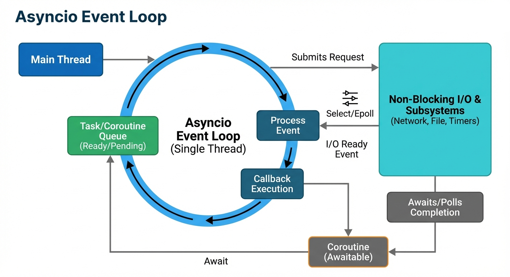
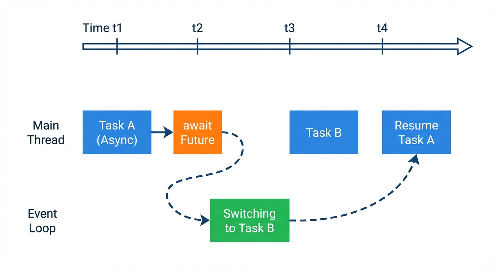

# YZM1022

## Advanced Programming

### Week 14: Parallel Programming and Async Patterns

**Instructor:** Ekrem Çetinkaya
**Date:** 03.06.2026

---

# Recap - Week 13

## Concurrent Programming

- **Threads**: Concurrent execution within a process
- **Race conditions**: Shared state + multiple threads = bugs
- **Synchronization**: Locks, semaphores, conditions, events
- **GIL**: Python's threading limitation for CPU-bound work
- **ThreadPoolExecutor**: High-level thread management

---

# Today's Focus

**Multiprocessing**

- Creating processes
- Inter-process communication
- ProcessPoolExecutor

**asyncio**

- Event loops
- async/await syntax
- Tasks, TaskGroup, coroutines
- Context variables (ContextVar)

**Choosing the Right Tool**

- Comparison and benchmarks
- When to use what
- Real-world examples

---

<!-- _footer: "" -->
<!-- _header: "" -->
<!-- _paginate: false -->

<style scoped>
p { text-align: center}
h1 {text-align: center; font-size: 72px}
</style>

# multiprocessing

---

# Process vs Thread

Threads = shared memory, lightweight, but capped by the GIL for CPU work.

Processes are the heavier alternative: each gets its own Python interpreter and its own GIL, enabling true parallelism at the cost of higher startup overhead and explicit IPC.

<div class="two-columns">
<div class="column">

### Threads

- Share memory space
- Lightweight creation
- Fast communication
- **GIL limits parallelism**
- Risk of race conditions

```
Process
├── Thread 1 ─┐
├── Thread 2 ─┼─ Shared Memory
└── Thread 3 ─┘
```

</div>
<div class="column">

### Processes

- Separate memory space
- Heavier creation
- IPC overhead
- **True parallelism**
- Isolated by default

```
Process 1 ── Memory 1
Process 2 ── Memory 2
Process 3 ── Memory 3
```

</div>
</div>

---

# Creating Processes

Creating a process is syntactically similar to threading, but each process gets its own memory space and Python interpreter.

- The `if __name__ == "__main__":` guard is mandatory on Windows to prevent infinite process spawning.

```python
import multiprocessing, os

def worker(name: str) -> None:
    print(f"Worker {name}, PID: {os.getpid()}")

if __name__ == "__main__":
    # spawn 4 workers, then wait for all to finish
    processes = [
        multiprocessing.Process(target=worker, args=(f"Worker-{i}",))
        for i in range(4)
    ]
    for p in processes: p.start()
    for p in processes: p.join()
    print("All done")
```

---

# Process Properties

Processes have a lifecycle

- Before `start()`, the PID is None and the process is not alive.
- After `start()`, the PID is assigned and the process is running.

You can inspect status with `is_alive()`, `terminate()` forcefully, or `join()` with a timeout to wait for completion.

```python
import multiprocessing
import os
import time

def long_task():
    print(f"Process {os.getpid()} starting")
    time.sleep(3)
    print(f"Process {os.getpid()} done")

if __name__ == "__main__":
    p = multiprocessing.Process(target=long_task, name="LongWorker")
    print(f"Name: {p.name}, PID before start: {p.pid}")
    p.start()
    print(f"PID after start: {p.pid}, Alive: {p.is_alive()}")
    p.join(timeout=1)
    if p.is_alive():
        p.terminate()
        p.join()
```

---

# CPU-Bound - Threads vs Processes

Remember, GIL caps threads at one CPU core for pure Python work.

- Two threads on a 10-million-item sum: still 14 seconds because of this and no improvement.
- Two processes: 7 seconds, near-linear scaling.

```python
import time, threading, multiprocessing

def cpu_task(n: int) -> int:
    return sum(i * i for i in range(n))

N = 10_000_000

def benchmark(label, targets):
    start = time.time()
    for t in targets: t.start()
    for t in targets: t.join()
    print(f"{label}: {time.time() - start:.2f}s")

if __name__ == "__main__":
    cpu_task(N)  # Sequential: ~14s (single call)

    benchmark("Threads",   [threading.Thread(target=cpu_task, args=(N,)) for _ in range(2)])
    benchmark("Processes", [multiprocessing.Process(target=cpu_task, args=(N,)) for _ in range(2)])
    # Threads: ~14s (GIL forces turn-taking)
    # Processes: ~7s  (true parallelism)
```

---

# Sharing Data - Value and Array

`multiprocessing.Value` and `multiprocessing.Array` provide low-level shared memory primitives typed by C-style codes ('i' for int, 'd' for double, etc.).

- Access requires a lock to prevent race conditions, and these are efficient for simple numeric data structures.

```python
import multiprocessing

def increment(shared_value, shared_array, lock):
    for _ in range(10000):
        with lock:
            shared_value.value += 1
            shared_array[0] += 1

if __name__ == "__main__":
    value = multiprocessing.Value('i', 0)
    array = multiprocessing.Array('d', [0.0, 0.0, 0.0])
    lock = multiprocessing.Lock()
    processes = [
        multiprocessing.Process(target=increment, args=(value, array, lock))
        for _ in range(4)
    ]
    for p in processes: p.start()
    for p in processes: p.join()

    print(f"Value: {value.value}, Array[0]: {array[0]}")
```

---

# Sharing Data - Manager

`multiprocessing.Manager()` spawns a server process that broker access to complex Python objects (dicts, lists, locks, semaphores) across process boundaries.

- More flexible than Value/Array but with IPC overhead. Use when you need shared containers or synchronization primitives.

```python
import multiprocessing

def worker(shared_dict, shared_list, name):
    shared_dict[name] = f"processed by {name}"
    shared_list.append(name)

if __name__ == "__main__":
    with multiprocessing.Manager() as manager:
        shared_dict = manager.dict()
        shared_list = manager.list()

        processes = [
            multiprocessing.Process(target=worker,
                args=(shared_dict, shared_list, f"Worker-{i}"))
            for i in range(4)
        ]
        for p in processes: p.start()
        for p in processes: p.join()

        print(f"Dict: {dict(shared_dict)}")
        print(f"List: {list(shared_list)}")
```

---

# Inter-Process Communication - Queue

`multiprocessing.Queue` is a thread-safe, process-safe queue for passing messages between processes.

- A producer puts items into the queue; consumers block on `get()` until an item is available.

```python
import multiprocessing

def producer(queue, items):
    for item in items:
        queue.put(item)
    queue.put(None)  # sentinel: signals consumer to stop

def consumer(queue):
    while True:
        item = queue.get()
        if item is None:
            break
        print(f"Consuming: {item}")

if __name__ == "__main__":
    queue = multiprocessing.Queue()
    p1 = multiprocessing.Process(target=producer, args=(queue, range(5)))
    p2 = multiprocessing.Process(target=consumer, args=(queue,))
    p1.start(); p2.start()
    p1.join(); p2.join()
```

---

# Inter-Process Communication - Pipe

`multiprocessing.Pipe()` returns a pair of connected endpoints for two-way communication between exactly two processes.

- Pipes are faster than queues because they're limited to bidirectional point-to-point communication rather than many-to-many work distribution.

```python
import multiprocessing

def sender(conn):
    for msg in ["Hello", "World", None]:  # None = sentinel
        conn.send(msg)

def receiver(conn):
    while (msg := conn.recv()) is not None:
        print(f"Received: {msg}")

if __name__ == "__main__":
    parent_conn, child_conn = multiprocessing.Pipe()
    p1 = multiprocessing.Process(target=sender, args=(parent_conn,))
    p2 = multiprocessing.Process(target=receiver, args=(child_conn,))
    p1.start(); p2.start()
    p1.join(); p2.join()
```

---

# ProcessPoolExecutor

`ProcessPoolExecutor` provides the familiar `submit()`/`map()` interface from threading's executor, but spawns worker processes instead of threads.

- This makes it easy to parallelize CPU-bound workloads with minimal code changes.
- Choose between ordered `map()` results and fine-grained `submit()`/`as_completed()` control.

```python
from concurrent.futures import ProcessPoolExecutor, as_completed
import time

def process_item(item: int) -> int:
    time.sleep(0.5)
    return item ** 2

if __name__ == "__main__":
    items = list(range(20))

    with ProcessPoolExecutor() as executor:
        results = list(executor.map(process_item, items))
        print(f"Results: {results}")

    with ProcessPoolExecutor(max_workers=4) as executor:
        futures = {executor.submit(process_item, i): i for i in items}
        for future in as_completed(futures):
            result = future.result()
            print(f"Item -> {result}")
```

---

# Pool - Classic API

The classic `multiprocessing.Pool` API offers three ways to map work

1. `map()` blocks until all results are ready
2. `map_async()` returns immediately (poll with `.get()`)
3. `imap()` lazily yields results one at a time for memory efficiency.

```python
import multiprocessing

def square(x: int) -> int:
    return x ** 2

if __name__ == "__main__":
    with multiprocessing.Pool(processes=4) as pool:
        results = pool.map(square, range(10))
        print(f"map: {results}")

        async_result = pool.map_async(square, range(10))
        print(f"map_async: {async_result.get()}")

        for result in pool.imap(square, range(10)):
            print(result, end=" ")
```

---

# Pool - Additional Methods

- `starmap()` unpacks tuples as function arguments (for multi-argument functions)
- `apply()` executes a single function call (blocking)
- `apply_async()` does the same non-blocking, returning a future.

```python
if __name__ == "__main__":
    with multiprocessing.Pool(4) as pool:
        pairs = [(1, 2), (3, 4), (5, 6)]
        results = pool.starmap(lambda a, b: a + b, pairs)
        print(f"starmap: {results}")

        result = pool.apply(square, (5,))
        future = pool.apply_async(square, (5,))
        print(future.get())
```

---

# Practical Example - Parallel Image Processing

Real-world image processing is CPU-bound and suitable for parallelization as each image can be processed independently.

- `ProcessPoolExecutor.map()` distributes work across all cores and collects results in the original order, yielding significant speedup.

```python
from concurrent.futures import ProcessPoolExecutor
import time

def process_image(path: str) -> tuple[str, str]:
    time.sleep(0.5)
    return path, "processed"

images = [f"image_{i}.jpg" for i in range(20)]

start = time.time()
for img in images:
    process_image(img)
print(f"Sequential: {time.time() - start:.2f}s")

start = time.time()
with ProcessPoolExecutor(max_workers=4) as executor:
    results = list(executor.map(process_image, images))
print(f"Parallel: {time.time() - start:.2f}s")
print(f"Processed {len(results)} images")
```

---

# multiprocessing Best Practices

<div class="two-columns">
<div class="column">

## Do ✅

```python
# Always guard main
if __name__ == "__main__":
    main()

# Use context managers
with Pool() as pool:
    results = pool.map(func, data)

# Prefer immutable data
def worker(data: tuple) -> result:
    pass

# Use ProcessPoolExecutor
# for simple parallel tasks
```

</div>
<div class="column">

## Don't ❌

```python
# Don't share mutable state
shared_list = []  # Race condition!

# Don't pass large objects
def worker(huge_data):  # Slow!
    pass

# Don't forget cleanup
pool = Pool()
# ... forgot pool.close()

# Don't use for I/O-bound
# threading is better
```

</div>
</div>

---

# The Scaling Problem - When Threads and Processes Both Fail

A chat server handling 10,000 simultaneous connections processes at ~50MB each require 500GB of RAM, threads at ~8MB still demand 80GB and thrash the OS scheduler.

- Neither scales because both allocate a full OS-level resource per connection, even when that connection is sitting idle, waiting for the next message.

This is where asyncio is useful as _most_ connections are doing nothing at any given moment.

- Instead of dedicating a thread or process to each, a single event loop parks thousands of tasks, waking each one only when its I/O actually completes. Memory stays under 100MB regardless of connection count.

---

<!-- _footer: "" -->
<!-- _header: "" -->
<!-- _paginate: false -->

<style scoped>
p { text-align: center}
h1 {text-align: center; font-size: 72px}
</style>

# asyncio

---

# What is Async?

<div class="two-columns">
<div class="column">

## Synchronous (Blocking)

```python
import time

def fetch_data(url):
    time.sleep(2)  # Blocks!
    return f"Data from {url}"

# Sequential - 6 seconds total
result1 = fetch_data("url1")
result2 = fetch_data("url2")
result3 = fetch_data("url3")
```

- Each call **waits** for completion
- Single thread does nothing while waiting
- Simple but slow

</div>
<div class="column">

## Asynchronous (Non-Blocking)

```python
import asyncio

async def fetch_data(url):
    await asyncio.sleep(2)  # Yields!
    return f"Data from {url}"

# Concurrent - 2 seconds total
async def main():
    results = await asyncio.gather(
        fetch_data("url1"),
        fetch_data("url2"),
        fetch_data("url3"),
    )
```

- Tasks **yield** while waiting
- Single thread handles many tasks
- Complex but fast for I/O

</div>
</div>

---

# The Event Loop

The event loop is the heart of asyncio: it runs coroutines, keeps a queue of tasks, watches for I/O events, and resumes waiting coroutines when their I/O completes.

- When a coroutine hits `await`, it yields control back to the event loop, which can then advance other tasks.

```python
import asyncio

async def say_hello():
    print("Hello...")
    await asyncio.sleep(1)
    print("...World!")

asyncio.run(say_hello())
```

---

# The Event Loop



---

# async/await Basics

`async def` defines a coroutine function, calling it returns a coroutine object (not the result).

- You must `await` it inside another coroutine or use `asyncio.run()` to execute it.

Forgetting `await` is a common error resulting with the coroutine is being created but never runs.

```python
import asyncio

async def greet(name: str) -> str:
    print(f"Hello, {name}!")
    await asyncio.sleep(1)
    return f"Goodbye, {name}!"

async def main():
    result = await greet("Bob")
    print(result)

asyncio.run(main())
```

---

# async/await Basics



---

# Running Multiple Coroutines

Sequential `await` runs tasks one after another.

- `asyncio.gather()` starts all coroutines concurrently and waits for all to complete, returning results in order.

Use `return_exceptions=True` to collect exceptions instead of raising them.

```python
import asyncio

async def task(name: str, delay: float) -> str:
    print(f"{name}: starting")
    await asyncio.sleep(delay)
    return f"{name} done"

async def main():
    result1 = await task("A", 1)
    result2 = await task("B", 2)
    print("Sequential: 3 seconds")

    results = await asyncio.gather(
        task("C", 1),
        task("D", 2),
        task("E", 1.5),
    )
    print("Concurrent: 2 seconds (max delay)")
    print(f"Results: {results}")

asyncio.run(main())
```

---

# Creating Tasks

`asyncio.create_task()` immediately schedules a coroutine for execution in the event loop (without blocking), unlike `await` which blocks until the coroutine finishes.

- This lets you start background work and continue with other code, then collect the result later.

```python
import asyncio

async def background_work(name: str) -> str:
    print(f"{name}: working...")
    await asyncio.sleep(2)
    return f"{name} completed"

async def main():
    task = asyncio.create_task(background_work("Worker"))

    print("Main: doing other work...")
    await asyncio.sleep(1)

    result = await task
    print(f"Task result: {result}")

asyncio.run(main())
```

---

# Task Management

`asyncio.wait_for()` enforces a timeout on a coroutine, raising `TimeoutError` if it doesn't complete in time.

- Call `task.cancel()` to stop a running task, which raises `CancelledError` inside it.
- Query `task.done()` and `task.cancelled()` to check task state.

```python
import asyncio

async def long_task():
    try:
        await asyncio.sleep(10)
    except asyncio.CancelledError:
        print("Task: cleaning up before cancel")
        raise  # must re-raise so asyncio knows it's cancelled

async def main():
    task = asyncio.create_task(long_task())

    try:
        await asyncio.wait_for(task, timeout=2)
    except asyncio.TimeoutError:
        print("Timed out — cancelling")
        await task  # awaiting a cancelled task raises CancelledError
```

---

# asyncio.wait() for Fine Control

`asyncio.wait()` gives fine-grained control over task completion.

- Use `FIRST_COMPLETED` to start processing as soon as any task finishes, `FIRST_EXCEPTION` to handle errors early, or `ALL_COMPLETED` (default) to wait for everything.

```python
import asyncio

async def task(name: str, delay: float):
    await asyncio.sleep(delay)
    return f"{name} done"

async def main():
    tasks = [
        asyncio.create_task(task("A", 2)),
        asyncio.create_task(task("B", 1)),
        asyncio.create_task(task("C", 3)),
    ]

    done, pending = await asyncio.wait(
        tasks,
        return_when=asyncio.FIRST_COMPLETED
    )
    print(f"First done: {len(done)}, pending: {len(pending)}")

    done, pending = await asyncio.wait(pending)
    print(f"All done: {len(done)}")
```

---

<!-- _class: asyncio -->

# asyncio.TaskGroup

`asyncio.TaskGroup` (Python 3.11+) is the structured concurrency alternative to `gather()`.

- If any task in the group raises an exception, all siblings are **automatically cancelled**.

```python
import asyncio

async def fetch(url: str) -> str:
    await asyncio.sleep(1)
    return f"Data from {url}"

async def main():
    async with asyncio.TaskGroup() as tg:
        t1 = tg.create_task(fetch("url1"))
        t2 = tg.create_task(fetch("url2"))
        t3 = tg.create_task(fetch("url3"))
    # reaches here only when ALL tasks complete (or all are cancelled)
    results = [t1.result(), t2.result(), t3.result()]
```

---

# TaskGroup vs gather - Error Handling

`gather(return_exceptions=True)` mixes failures silently into the results list.

- We must check every item manually, and sibling tasks keep running regardless.

`TaskGroup` cancels siblings on first failure and collects all errors in an `ExceptionGroup`.

```python
# gather: errors are values in the list — easy to miss
results = await asyncio.gather(*tasks, return_exceptions=True)
errors = [r for r in results if isinstance(r, Exception)]
# other tasks ran to completion even after one failed

# TaskGroup: one failure -> siblings cancelled -> ExceptionGroup raised
try:
    async with asyncio.TaskGroup() as tg:
        tasks = [tg.create_task(risky(url)) for url in urls]
except* ValueError as eg:
    for exc in eg.exceptions:
        print(f"Failed: {exc}")
# all tasks cleaned up — nothing left dangling
```

---

# Async Context Managers

`async with` uses `__aenter__` and `__aexit__` (instead of `__enter__` and `__exit__`) to manage resources that require async setup/teardown

- These are useful for acquiring database connections, file handles, or other I/O resources that block.

```python
import asyncio

class AsyncResource:
    async def __aenter__(self):
        print("Acquiring...")
        await asyncio.sleep(0.5)
        return self

    async def __aexit__(self, exc_type, exc_val, exc_tb):
        print("Releasing...")
        await asyncio.sleep(0.5)

    async def use(self):
        print("Using resource")

async def main():
    async with AsyncResource() as resource:
        await resource.use()

asyncio.run(main())
```

---

# Async Iterators

`async for` uses `__aiter__` and `__anext__` (instead of `__iter__` and `__next__`) to iterate over asynchronous sequences.

- Each fetch from the iterator is an `await` point, making it useful for lazy-loading streams of data.

```python
import asyncio

class AsyncCounter:
    def __init__(self, limit: int):
        self.limit = limit
        self.count = 0

    def __aiter__(self):
        return self

    async def __anext__(self):
        if self.count >= self.limit:
            raise StopAsyncIteration
        self.count += 1
        await asyncio.sleep(0.5)
        return self.count

async def main():
    async for number in AsyncCounter(5):
        print(f"Got: {number}")
```

---

# Async Generators

Async generators use `async def` and `yield` to produce values asynchronously.

- Each yield point can `await`, making them ideal for streaming data from async sources (APIs, files, databases) without loading everything into memory.

```python
import asyncio

async def async_range(start: int, end: int):
    for i in range(start, end):
        await asyncio.sleep(0.2)
        yield i

async def fetch_pages(urls: list[str]):
    for url in urls:
        await asyncio.sleep(0.5)
        yield f"Data from {url}"

async def main():
    async for num in async_range(0, 5):
        print(f"Number: {num}")

    async for page in fetch_pages(["p1", "p2"]):
        print(page)
```

---

# Semaphores in asyncio

`asyncio.Semaphore(N)` caps concurrent coroutines at N.

- Any coroutine that tries to `async with` the semaphore beyond that limit suspends until another releases, preventing resource exhaustion when handling many concurrent operations (e.g., rate-limited API calls).

```python
import asyncio

async def fetch_url(url: str, sem: asyncio.Semaphore) -> str:
    async with sem:
        print(f"Fetching {url}")
        await asyncio.sleep(1)
        return f"Data from {url}"

async def main():
    sem = asyncio.Semaphore(3)
    urls = [f"url_{i}" for i in range(10)]

    tasks = [
        asyncio.create_task(fetch_url(url, sem))
        for url in urls
    ]

    results = await asyncio.gather(*tasks)
    print(f"Fetched {len(results)} URLs")

asyncio.run(main())
```

---

# Locks in asyncio

`asyncio.Lock()` ensures only one coroutine can hold it at a time.

- `async with lock:` blocks other coroutines from entering until the current one releases.
- Use locks to protect shared mutable state from race conditions in async code.

```python
import asyncio

class AsyncCounter:
    def __init__(self):
        self._count = 0
        self._lock = asyncio.Lock()

    async def increment(self):
        async with self._lock:
            current = self._count
            await asyncio.sleep(0.01)  # yield point — other tasks run here
            self._count = current + 1  # safe: lock held throughout

async def main():
    counter = AsyncCounter()
    await asyncio.gather(
        *[counter.increment() for _ in range(100)]
    )
    print(f"Count: {counter._count}")  # always 100
```

---

# Queue in asyncio

`asyncio.Queue` is a coroutine-aware queue for coordinating work between producers and consumers.

- `await queue.put(item)` blocks if the queue is full
- `await queue.get()` blocks if empty. Ideal for async producer-consumer patterns.

```python
import asyncio

async def producer(queue: asyncio.Queue):
    for i in range(6):
        await asyncio.sleep(0.1)
        await queue.put(i)           # blocks if maxsize reached

async def consumer(queue: asyncio.Queue, name: str):
    for _ in range(3):
        item = await queue.get()     # blocks until item available
        print(f"{name}: got {item}")

async def main():
    queue = asyncio.Queue(maxsize=2)
    await asyncio.gather(
        producer(queue),
        consumer(queue, "C1"),
        consumer(queue, "C2"),
    )
```

---

# Context Variables

`ContextVar` gives each async task its own private state which is the async equivalent of `threading.local()`.

- When a task is spawned, it inherits a **copy** of the current context, so writes in one task never leak into siblings.

```python
import asyncio
from contextvars import ContextVar

request_id: ContextVar[str] = ContextVar('request_id', default='none')

async def handle(req_id: str):
    token = request_id.set(req_id)   # set for this task only
    await process()
    request_id.reset(token)          # restore on exit

async def process():
    print(f"Request: {request_id.get()}")

async def main():
    await asyncio.gather(
        handle("REQ-001"),
        handle("REQ-002"),
    )
    # each task sees only its own request_id — no cross-task contamination
```

---

# ContextVar - Request Tracing

The most common use of request tracing is distributed tracing.

- We can set a `trace_id` once at the request boundary and read it from anywhere in the call chain
- No need to thread it through every function signature.

```python
from contextvars import ContextVar
import logging

trace_id: ContextVar[str] = ContextVar('trace_id', default='-')

class TraceFilter(logging.Filter):
    def filter(self, record):
        record.trace_id = trace_id.get()
        return True

async def handle_request(request):
    trace_id.set(request.headers['X-Trace-ID'])
    await do_work()          # trace_id accessible anywhere in this task

async def do_work():
    logging.info("Working")  # every log record carries the trace_id
```

`threading.local()` works per-thread and `ContextVar` works per-task.

---

# Real-World - Async HTTP Client

`aiohttp.ClientSession` is an async HTTP client that integrates with asyncio.

- All network operations are non-blocking. Multiple requests to different URLs run concurrently, bounded only by connection limits and server resources.

```python
import asyncio, aiohttp

async def fetch(session: aiohttp.ClientSession, url: str) -> dict:
    async with session.get(url) as resp:
        return {"url": url, "status": resp.status}

async def main():
    urls = [
        "https://python.org",
        "https://github.com",
        "https://docs.python.org",
    ]
    async with aiohttp.ClientSession() as session:
        results = await asyncio.gather(
            *[fetch(session, url) for url in urls]
        )
    for r in results:
        print(f"{r['status']}  {r['url']}")
```

---

# From Tools to Trade-offs

<div class="two-columns">
<div class="column">

## What We've Covered

- **Threading**: Concurrent I/O within one process
- **multiprocessing**: Parallel CPU work, true parallelism
- **asyncio**: Concurrent I/O via event loop, lightweight

</div>
<div class="column">

## The Real Question

Each has trade-offs: threading is simple but bottlenecked by the GIL; processes are powerful but have IPC overhead; asyncio is efficient but requires async all the way down.

**Next:** Comparative analysis and guidance on choosing the right tool for different workloads.

</div>
</div>

---

# Picking the Wrong Tool Is an Expensive Mistake

Imagine we are building a price aggregator (e.g., akakce.com) fetching 500 websites

- 500 threads exhaust file descriptors and spike memory to 4GB.
- Multiprocessing adds startup overhead with no benefit as fetching HTML is I/O, not computation.
- asyncio handles all 500 connections from a single thread, memory under 100MB, finishes in the time of the slowest single request.

The same story plays out in reverse: teams that chose asyncio for CPU-heavy ML inference and wondered why it felt slower than sequential.

- The tools are not interchangeable, each exists to eliminate a _specific_ bottleneck.

- **Threads / asyncio** -> I/O bound (network, disk, DB)
- **Processes** -> CPU bound (number crunching, transforms)
- **Wrong choice** -> the bottleneck you added is larger than the one you removed

---

<!-- _footer: "" -->
<!-- _header: "" -->
<!-- _paginate: false -->

<style scoped>
p { text-align: center}
h1 {text-align: center; font-size: 72px}
</style>

# Choosing the Right Tool

---

# Threading vs multiprocessing vs asyncio

| Feature         | Threading     | multiprocessing | asyncio                     |
| --------------- | ------------- | --------------- | --------------------------- |
| **Best for**    | I/O-bound     | CPU-bound       | I/O-bound, many connections |
| **Parallelism** | Limited (GIL) | True            | None (concurrency)          |
| **Memory**      | Shared        | Separate        | Shared                      |
| **Overhead**    | Low           | High            | Very low                    |
| **Complexity**  | Medium        | Medium          | High                        |
| **Debugging**   | Hard          | Medium          | Hard                        |
| **Max scale**   | ~100s threads | ~10s processes  | ~10000s tasks               |

---

# When to Use What?

The right choice depends on _what_ is slow

- Is it the CPU doing computation, or the program waiting on I/O.

These are different bottlenecks with different solutions.

---

# When to Use What?

<div class="two-columns">
<div class="column">

## Use Threading When:

- I/O-bound tasks
- Moderate concurrency
- Need shared memory
- Legacy code integration
- **Example**: File processing, simple scrapers

## Use multiprocessing When:

- CPU-bound tasks
- Need true parallelism
- Independent tasks
- Memory isolation OK
- **Example**: Image processing, data analysis

</div>
<div class="column">

## Use asyncio When:

- High-volume I/O
- Network servers
- Many concurrent connections
- Modern async libraries available
- **Example**: Web servers, chat apps

## Combine When Needed:

- CPU work in separate process
- I/O with threading or asyncio
- **Example**: ML inference (CPU) + API serving (async)

</div>
</div>

---

# Performance Comparison

Sequential I/O is slow, 100 blocking 0.1s calls take 10 seconds.

- Threading and asyncio run them concurrently, yielding 100-fold speedup.
- For I/O-bound work, both are comparable but asyncio uses fewer resources.

```python
import time, threading, asyncio

N = 100
def io_task():      time.sleep(0.1)
async def io_async(): await asyncio.sleep(0.1)

# Sequential: 10.0s — each call blocks until done
for _ in range(N): io_task()

# Threading: ~0.1s — all tasks sleep concurrently
ts = [threading.Thread(target=io_task) for _ in range(N)]
for t in ts: t.start()
for t in ts: t.join()

# asyncio: ~0.1s — same speedup, ~100x less memory than threads
async def main():
    await asyncio.gather(*[io_async() for _ in range(N)])
asyncio.run(main())
```

---

# Mixing Approaches

`loop.run_in_executor()` bridges async and blocking code

- We can pass a ProcessPoolExecutor for CPU work, or ThreadPoolExecutor for blocking I/O operations.
- The main async loop continues while the executor runs in the background.

```python
import asyncio
from concurrent.futures import ProcessPoolExecutor, ThreadPoolExecutor

def cpu_heavy(n: int) -> int:   # blocking — runs in a process
    return sum(i * i for i in range(n))

def blocking_read(path: str) -> str:  # blocking — runs in a thread
    return open(path).read()

async def main():
    loop = asyncio.get_event_loop()

    # CPU work -> process pool (bypasses GIL)
    with ProcessPoolExecutor() as pool:
        result = await loop.run_in_executor(pool, cpu_heavy, 1_000_000)

    # Blocking I/O -> thread pool (simpler than rewriting to async)
    with ThreadPoolExecutor() as pool:
        text = await loop.run_in_executor(pool, blocking_read, "/etc/hosts")
```

---

# Real-World Architecture - Data Pipeline

A typical data pipeline fetches from multiple sources (async I/O), processes each result (CPU-bound in a process pool), and logs results. Mixing asyncio and multiprocessing lets each handle what it's best at.

```python
import asyncio, aiohttp
from concurrent.futures import ProcessPoolExecutor

pool = ProcessPoolExecutor(max_workers=4)

async def fetch(session, url: str) -> bytes:
    async with session.get(url) as resp:
        return await resp.read()          # async I/O — non-blocking

def crunch(data: bytes) -> dict:
    return {"size": len(data), "hash": hash(data)}  # CPU — in process pool

async def pipeline(urls: list[str]):
    loop = asyncio.get_event_loop()
    async with aiohttp.ClientSession() as session:
        pages = await asyncio.gather(*[fetch(session, u) for u in urls])
    results = await asyncio.gather(
        *[loop.run_in_executor(pool, crunch, p) for p in pages]
    )
    return results
```

---

# Common Patterns - Fan-Out/Fan-In

Fan-out/fan-in spawns many parallel tasks (fan-out), then waits for all results (fan-in).

- A semaphore bounds concurrency to prevent resource exhaustion; each task runs in a process pool for CPU work.

```python
import asyncio
from concurrent.futures import ProcessPoolExecutor

async def fan_out_fan_in(items: list, process_fn,
                         max_concurrent: int = 10):
    semaphore = asyncio.Semaphore(max_concurrent)

    async def bounded_process(item):
        async with semaphore:
            loop = asyncio.get_event_loop()
            with ProcessPoolExecutor() as pool:
                return await loop.run_in_executor(
                    pool, process_fn, item)

    tasks = [asyncio.create_task(bounded_process(item))
             for item in items]
    results = await asyncio.gather(*tasks,
                                   return_exceptions=True)
    return [r for r in results
            if not isinstance(r, Exception)]
```

---

# Error Handling in Async Code

Async errors can hide errors as exceptions in tasks not awaited become warnings, not errors.

- Use try/except around awaits, `return_exceptions=True` in `gather()`, or add done callbacks to catch all exceptions reliably.

```python
import asyncio

async def risky_operation():
    raise ValueError("Something went wrong!")

async def main():
    # Pattern 1: try/except around a single await
    try:
        await risky_operation()
    except ValueError as e:
        print(f"Caught: {e}")

    # Pattern 2: gather with return_exceptions=True
    results = await asyncio.gather(
        risky_operation(),
        asyncio.sleep(1),
        return_exceptions=True
    )
    for r in results:
        if isinstance(r, Exception):
            print(f"Task failed: {r}")
```

---

# Debugging Async Code

Enable `debug=True` in `asyncio.run()` or set `PYTHONASYNCIODEBUG=1` to debug slow callbacks, resource leaks, and detailed tracebacks.

- Use `asyncio.current_task()` and `asyncio.all_tasks()` to inspect running tasks, and `logging` for detailed event loop diagnostics.

```python
import asyncio
import logging

asyncio.run(main(), debug=True)

async def debug_example():
    task = asyncio.current_task()
    print(f"Current: {task.get_name()}")

    all_tasks = asyncio.all_tasks()
    print(f"All tasks: {len(all_tasks)}")

    for t in all_tasks:
        t.print_stack()

logging.basicConfig(level=logging.DEBUG)
```

---

# Summary

<div class="two-columns">
<div class="column">

## multiprocessing

- True parallelism, bypasses GIL
- Best for CPU-bound work
- IPC overhead
- `ProcessPoolExecutor`

## asyncio

- Single-threaded concurrency
- Best for I/O-bound work
- `TaskGroup` for structured concurrency
- `ContextVar` for per-task state

</div>
<div class="column">

## Key Takeaways

1. **Know your workload**
   - I/O-bound -> threading/asyncio
   - CPU-bound -> multiprocessing (for now)

2. **Structure async code well**
   - `TaskGroup` > `gather` for error handling
   - `ContextVar` for per-task state

3. **Combine when needed**
   - `run_in_executor` bridges worlds

</div>
</div>

---

<!-- _class: lead -->

# Thank You!

## Contact Information

- **Email:** ekrem.cetinkaya@yildiz.edu.tr
- **Office Hours:** Wednesday 13:30-15:30 - Room C-120
- **Book a slot before coming:** [Booking Link](https://dub.sh/ekrem-office)
- **Course Repository:** [GitHub](https://github.com/ekremcet/yzm1022-advanced-programming)

## Next Week

- **Week 15:** Project Presentations
