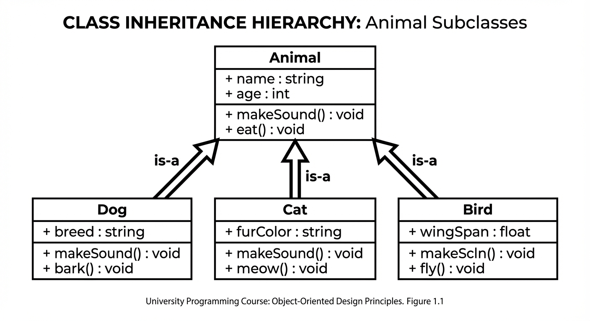
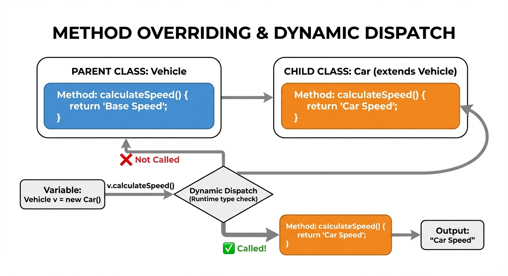
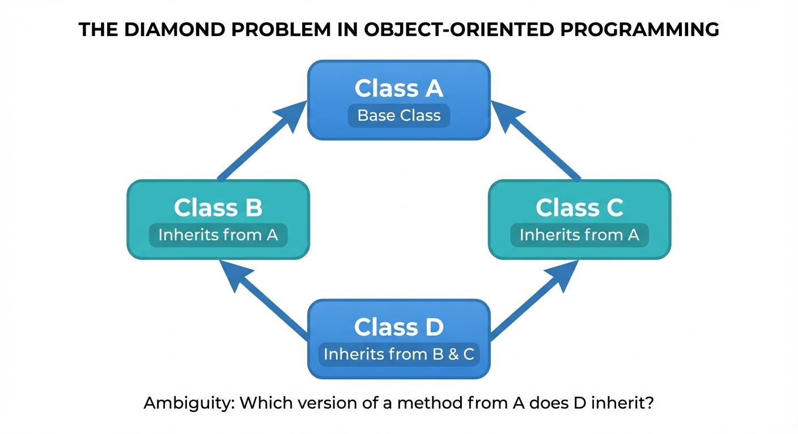
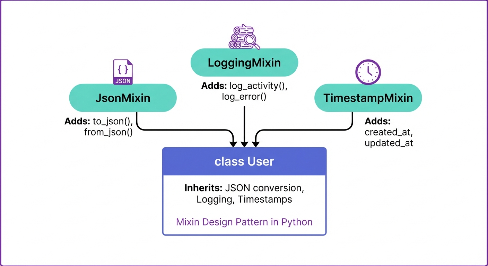
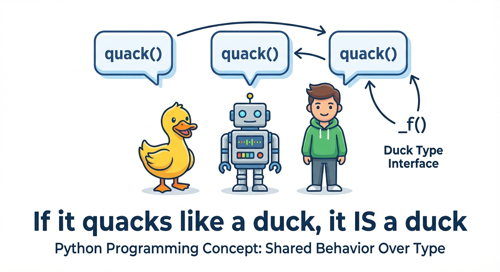

# YZM1022

## Advanced Programming

### Week 2: Inheritance and Polymorphism

**Instructor:** Ekrem Çetinkaya
**Date:** 04.03.2026

---

# Today's Focus

<div class="two-columns">
<div class="column">

## Inheritance

- **What is inheritance** and why it matters for code reuse
- **Creating class hierarchies** - parent and child classes
- **The `super()` function** - calling parent methods correctly
- **Method overriding** - customizing inherited behavior
- **Multiple inheritance** - inheriting from multiple classes
- **Mixins** - reusable functionality modules

</div>
<div class="column">

## Polymorphism

- **What is polymorphism** - same interface, different behavior
- **Duck typing** - Python's approach to polymorphism
- **Method Resolution Order (MRO)** - how Python resolves method calls
- **Operator overloading** - making custom classes work with `+`, `*`, etc.
- **Composition vs Inheritance** - when to use which

</div>
</div>

---

<!-- _footer: "" -->
<!-- _header: "" -->
<!-- _paginate: false -->

<style scoped>
p { text-align: center}
h1 {text-align: center; font-size: 72px}
</style>

# Inheritance

---



<!-- _footer: "Generated by Nano Banana" -->

---

# What is Inheritance?

**Inheritance** is one of the four pillars of OOP and arguably the most powerful mechanism for code reuse.

- It allows a new class (the **child** or **derived** class) to automatically acquire all the attributes and methods of an existing class (the **parent** or **base** class), and then extend or customize them.

### The "Is-A" Relationship

- A **Dog** is an **Animal**
- A **Car** is a **Vehicle**
- A **Manager** is an **Employee**
- A **Square** is a **Shape**

### Benefits

- **Code Reuse**: Don't repeat yourself
- **Hierarchical Organization**: Logical structure
- **Extensibility**: Easy to add new types
- **Maintainability**: Change in one place

---

# Why Use Inheritance?

Consider what happens without the inheritance.

- If you have multiple related classes that share common behavior, you end up **duplicating code** across every class

* A direct violation of the **DRY** (Don't Repeat Yourself) principle.

## Without Inheritance

```python
class Dog:
    def __init__(self, name, age):
        self.name = name
        self.age = age
    def eat(self):
        return f"{self.name} is eating"
    def bark(self):
        return "Woof!"

class Cat:
    def __init__(self, name, age):  # Duplicate!
        self.name = name
        self.age = age
    def eat(self):  # Duplicate!
        return f"{self.name} is eating"
    def meow(self):
        return "Meow!"
```

---

# With Inheritance

With inheritance, we extract the shared behavior into a **parent class** and let each specialized class inherit from it.

- Now `eat()` and `sleep()` are defined once and shared by all animals.

* Each child class adds only what makes it **unique**.

```python
class Animal:
    def __init__(self, name, age):
        self.name = name
        self.age = age
    def eat(self):
        return f"{self.name} is eating"
    def sleep(self):
        return f"{self.name} is sleeping"

class Dog(Animal):
    def bark(self):
        return "Woof!"

class Cat(Animal):
    def meow(self):
        return "Meow!"
```

---

# Basic Inheritance Syntax

<div class="two-columns">
<div class="column">

## Parent Class (Base Class)

```python
class Animal:
    def __init__(self, name, age):
        self.name = name
        self.age = age

    def speak(self):
        return "Some sound"

    def describe(self):
        return f"{self.name} is {self.age} years old"
```

</div>
<div class="column">

## Child Class (Derived Class)

```python
class Dog(Animal):  # Inherits from Animal
    def __init__(self, name, age, breed):
        super().__init__(name, age)  # Call parent constructor
        self.breed = breed

    def speak(self):  # Override parent method
        return "Woof!"

    def fetch(self):  # New method specific to Dog
        return f"{self.name} is fetching the ball!"
```

</div>
</div>

```python
# Usage
dog = Dog("Buddy", 3, "Golden Retriever")
print(dog.describe())  # Inherited: Buddy is 3 years old
print(dog.speak())     # Overridden: Woof!
print(dog.fetch())     # New: Buddy is fetching the ball!
```

---

# What Gets Inherited?

<div class="two-columns">
<div class="column">

## Inherited by Child Class

- ✅ All public attributes
- ✅ All public methods
- ✅ All protected attributes (`_name`)
- ✅ All protected methods (`_method()`)
- ✅ Properties
- ✅ Class attributes

</div>
<div class="column">

## Not Directly Accessible

- ❌ Private attributes (`__name`) - name mangled
- ❌ Private methods (`__method()`) - name mangled

```python
class Parent:
    def __init__(self):
        self.public = "accessible"
        self._protected = "accessible"
        self.__private = "mangled"

class Child(Parent):
    def test(self):
        print(self.public)      # Works
        print(self._protected)  # Works
        # print(self.__private)  # AttributeError
        print(self._Parent__private)  # Works (mangled name)
```

</div>
</div>

---

# The Universal Base Class: `object`

Every class in Python implicitly inherits from `object`, even if you do not write it explicitly.

- This is why even a completely empty class already has methods like `__str__()`, `__repr__()`, and `__eq__()`
  - They are inherited from `object`.

```python
class MyClass:  # Implicitly: class MyClass(object)
    pass

# Check inheritance
print(MyClass.__bases__)  # (<class 'object'>,)
print(isinstance(MyClass(), object))  # True

# Object provides default implementations of:
# - __init__()
# - __str__()
# - __repr__()
# - __eq__()
# - __hash__()
# And many more special methods
```

---

# The `super()` Function

<div class="two-columns">
<div class="column">

### What is `super()`?

- Returns a proxy object that delegates method calls to parent class
- Used to call parent class methods from child class
- Essential for proper initialization in inheritance

### When to Use

- In `__init__` to initialize parent attributes
- When extending (not replacing) parent method behavior
- To avoid hardcoding parent class name

</div>
<div class="column">

## Example

```python
class Employee:
    def __init__(self, name, salary):
        self.name = name
        self.salary = salary

    def get_info(self):
        return f"{self.name}: ${self.salary}"

class Manager(Employee):
    def __init__(self, name, salary, department):
        super().__init__(name, salary)  # Call parent __init__
        self.department = department

    def get_info(self):
        # Extend parent method
        base_info = super().get_info()
        return f"{base_info}, Dept: {self.department}"

mgr = Manager("Alice", 75000, "Engineering")
print(mgr.get_info())
# Alice: $75000, Dept: Engineering
```

</div>
</div>

---

# Why Use `super()` Instead of Direct Parent Call?

<div class="two-columns">
<div class="column">

### Without `super()`

```python
class Animal:
    def __init__(self, name):
        self.name = name

class Dog(Animal):
    def __init__(self, name, breed):
        Animal.__init__(self, name)  # Hardcoded
        self.breed = breed
```

**Problems:**

- Hardcoded parent class name
- Breaks with multiple inheritance
- Must change if parent changes

</div>
<div class="column">

### With `super()`

```python
class Animal:
    def __init__(self, name):
        self.name = name

class Dog(Animal):
    def __init__(self, name, breed):
        super().__init__(name)  # Flexible
        self.breed = breed
```

**Benefits:**

- No hardcoded class names
- Supports multiple inheritance
- Easier refactoring

</div>
</div>

---

# `super()` Without Arguments

In Python, `super()` without arguments works inside methods:

```python
class Parent:
    def greet(self):
        return "Hello from Parent"

class Child(Parent):
    def greet(self):
        # super() automatically knows the class and instance
        return super().greet() + " and Child"

# These are equivalent:
super()                    # Python style
super(Child, self)         # Explicit form
super(__class__, self)     # Using __class__ magic variable
```

**Note:** `super()` without arguments only works inside a class method!

---



<!-- _footer: "Generated by Nano Banana" -->

---

# Method Overriding

**Method overriding** occurs when a child class provides its own implementation of a method that is already defined in the parent class.

- When the method is called on a child instance, Python uses the child's version and the parent's version is _overridden_

```python
class Shape:
    def __init__(self, color):
        self.color = color

    def area(self):
        raise NotImplementedError("Subclasses must implement area()")

    def describe(self):
        return f"A {self.color} shape"

class Rectangle(Shape):
    def __init__(self, color, width, height):
        super().__init__(color)
        self.width = width
        self.height = height

    def area(self):  # Override: provide specific implementation
        return self.width * self.height

    def describe(self):  # Override: customize description
        return f"A {self.color} rectangle ({self.width}x{self.height})"
```

---

# Method Overriding vs Method Overloading

<div class="two-columns">
<div class="column">

### Method Overriding

**Same method name and parameters in parent and child class**

```python
class Animal:
    def speak(self):
        return "Some sound"

class Dog(Animal):
    def speak(self):  # Override
        return "Woof!"

class Cat(Animal):
    def speak(self):  # Override
        return "Meow!"
```

- Happens at **runtime** (dynamic)
- Requires inheritance
- Python fully supports this

</div>
<div class="column">

### Method Overloading

**Same method name, different parameters**

```python
# Traditional overloading
# def add(a, b): ...
# def add(a, b, c): ...  # Would replace first!

# Python alternative: Default arguments
def add(a, b, c=0):
    return a + b + c

add(1, 2)      # 3
add(1, 2, 3)   # 6

# Or use *args
def add(*args):
    return sum(args)
```

- Python doesn't support traditional overloading
- Use default arguments or `*args` instead

</div>
</div>

---

# When to Override vs Extend

When you inherit a method from a parent class, you have two main choices when modifying its behavior

- You can **completely replace (override)** it
- You can **build upon (extend)** it by keeping the original behavior and adding new functionality.

<div class="two-columns">
<div class="column">

### Override (Replace)

Use when child behavior is **completely different**

```python
class Bird:
    def move(self):
        return "Flying through the air"

class Penguin(Bird):
    def move(self):  # Complete replacement
        return "Swimming in the water"
```

</div>
<div class="column">

### Extend (Add to)

Use when child adds to parent behavior

```python
class Logger:
    def log(self, message):
        print(f"[LOG] {message}")

class TimestampLogger(Logger):
    def log(self, message):
        from datetime import datetime
        timestamp = datetime.now().isoformat()
        # Extend: add timestamp, then call parent
        super().log(f"{timestamp} - {message}")

logger = TimestampLogger()
logger.log("User logged in")
# [LOG] 2026-02-24T10:30:00 - User logged in
```

</div>
</div>

---

# Inheritance Hierarchy Example

<div class="two-columns">

<div class="column">

```python
class Vehicle:
    def __init__(self, brand, model, year):
        self.brand = brand
        self.model = model
        self.year = year

    def start(self):
        return "Vehicle starting..."

    def __str__(self):
        return f"{self.year} {self.brand} {self.model}"

class Car(Vehicle):
    def __init__(self, brand, model, year, num_doors):
        super().__init__(brand, model, year)
        self.num_doors = num_doors

    def start(self):
        return "Car engine starting... Vroom!"
```

</div>

<div class="column">

```python
class ElectricCar(Car):
    def __init__(self, brand, model, year, num_doors, battery_capacity):
        super().__init__(brand, model, year, num_doors)
        self.battery_capacity = battery_capacity

    def start(self):
        return "Electric motor humming silently..."

    def charge(self):
        return f"Charging {self.battery_capacity}kWh battery..."

```

</div>
</div>

---

# Using the Inheritance Hierarchy

```python
# Create instances
vehicle = Vehicle("Generic", "Transport", 2020)
car = Car("Toyota", "Camry", 2023, 4)
tesla = ElectricCar("Tesla", "Model 3", 2024, 4, 75)

# Inherited methods work
print(vehicle)        # 2020 Generic Transport
print(car)            # 2023 Toyota Camry
print(tesla)          # 2024 Tesla Model 3

# Overridden methods have different behavior
print(vehicle.start())  # Vehicle starting...
print(car.start())      # Car engine starting... Vroom!
print(tesla.start())    # Electric motor humming silently...

# Child-specific methods
print(tesla.charge())   # Charging 75kWh battery...

# Check inheritance
print(isinstance(tesla, Car))      # True
print(isinstance(tesla, Vehicle))  # True
print(isinstance(car, ElectricCar))  # False
```

---

# `isinstance()` and `issubclass()`

<div class="two-columns">
<div class="column">

### `isinstance(obj, class)`

Check if an object is an instance of a class

```python
class Animal: pass
class Dog(Animal): pass

dog = Dog()

isinstance(dog, Dog)     # True
isinstance(dog, Animal)  # True
isinstance(dog, object)  # True (all classes inherit from object)

# Can check multiple types
isinstance(dog, (Dog, Cat))  # True if either
```

</div>
<div class="column">

### `issubclass(cls, parent)`

Check if a class is a subclass of another

```python
class Animal: pass
class Dog(Animal): pass
class Cat(Animal): pass

issubclass(Dog, Animal)   # True
issubclass(Cat, Animal)   # True
issubclass(Dog, Cat)      # False
issubclass(Animal, object)  # True

# Every class is subclass of itself
issubclass(Dog, Dog)      # True
```

</div>
</div>

---

# When to Use `isinstance()` vs `type()`

<div class="two-columns">
<div class="column">

### `type()` - Exact Type Check

```python
class Animal: pass
class Dog(Animal): pass

dog = Dog()

type(dog) == Dog      # True
type(dog) == Animal   # False (exact match only)
type(dog) == object   # False
```

Use when you need the **exact** type, not considering inheritance.

</div>
<div class="column">

### `isinstance()` - Type Hierarchy Check

```python
class Animal: pass
class Dog(Animal): pass

dog = Dog()

isinstance(dog, Dog)     # True
isinstance(dog, Animal)  # True
isinstance(dog, object)  # True
```

Use when you want to check if object **is a kind of** that type.

</div>
</div>

---

# Practice - Animal Kingdom Hierarchy

Create a class hierarchy for animals:

<div class="two-columns">

<div class="column">

1. **Base class `Animal`**:
   - Attributes: `name`, `age`, `species`
   - Methods: `eat()` → returns "{name} is eating"
   - Methods: `sleep()` → returns "{name} is sleeping"
   - Methods: `__str__()` → returns "{name} the {species}"

2. **Class `Mammal(Animal)`**:
   - Additional attribute: `fur_color`
   - Method: `give_birth()` → returns "Giving birth to live young"

</div>
<div class="column">

3. **Class `Dog(Mammal)`**:
   - Additional attribute: `breed`
   - Override: `eat()` → call parent's eat + "Dog food is delicious!"
   - Method: `bark()` → returns "Woof! Woof!"

4. **Class `Cat(Mammal)`**:
   - Method: `meow()` and `purr()`

</div>
</div>

---

# Solution - Animal Kingdom Hierarchy

```python
class Animal:
    def __init__(self, name, age, species):
        self.name = name
        self.age = age
        self.species = species

    def eat(self):
        return f"{self.name} is eating"

    def sleep(self):
        return f"{self.name} is sleeping"

    def __str__(self):
        return f"{self.name} the {self.species}"
```

---

# Solution - Mammal Class

```python
class Mammal(Animal):
    def __init__(self, name, age, species, fur_color):
        super().__init__(name, age, species)
        self.fur_color = fur_color

    def give_birth(self):
        return "Giving birth to live young"
```

---

# Solution - Dog and Cat Classes

```python
class Dog(Mammal):
    def __init__(self, name, age, fur_color, breed):
        super().__init__(name, age, "Dog", fur_color)
        self.breed = breed

    def eat(self):
        return super().eat() + ". Dog food is delicious!"

    def bark(self):
        return "Woof! Woof!"

class Cat(Mammal):
    def __init__(self, name, age, fur_color):
        super().__init__(name, age, "Cat", fur_color)

    def meow(self):
        return "Meow!"

    def purr(self):
        return "Purrrr..."
```

---

# Multiple Inheritance

Unlike many languages (Java, C#), Python supports **multiple inheritance**

- A class can inherit from two or more parent classes simultaneously.
- This is a powerful but potentially dangerous feature that requires careful design.

```python
class Flyable:
    def fly(self):
        return "Flying high!"

class Swimmable:
    def swim(self):
        return "Swimming fast!"

class Duck(Flyable, Swimmable):
    def __init__(self, name):
        self.name = name

    def quack(self):
        return f"{self.name} says Quack!"

# Duck inherits from both Flyable and Swimmable
donald = Duck("Donald")
print(donald.fly())    # Flying high!
print(donald.swim())   # Swimming fast!
print(donald.quack())  # Donald says Quack!
```

---

# Multiple Inheritance Syntax

```python
class Parent1:
    def method1(self):
        return "From Parent1"

    def shared_method(self):
        return "Parent1's version"

class Parent2:
    def method2(self):
        return "From Parent2"

    def shared_method(self):
        return "Parent2's version"

class Child(Parent1, Parent2):  # Order matters!
    def method3(self):
        return "From Child"

child = Child()
print(child.method1())        # From Parent1
print(child.method2())        # From Parent2
print(child.method3())        # From Child
print(child.shared_method())  # Parent1's version (first in list wins)
```

---



<!-- _footer: "Generated by Nano Banana" -->

---

# The Diamond Problem

<div class="two-columns">
<div class="column">

### What is it?

When a class inherits from two classes that share a common ancestor, which version of the ancestor's method is used?

If `B` and `C` both override a method from `A`, which does `D` inherit?

</div>
<div class="column">

### Example

```python
class A:
    def method(self):
        return "A's method"

class B(A):
    def method(self):
        return "B's method"

class C(A):
    def method(self):
        return "C's method"

class D(B, C):
    pass

d = D()
print(d.method())  # B's method

# Why? Method Resolution Order (MRO)
print(D.__mro__)
# (<class 'D'>, <class 'B'>, <class 'C'>, <class 'A'>, <class 'object'>)
```

</div>
</div>

---

# Method Resolution Order (MRO)

**MRO** defines the order in which base classes are searched when looking for a method.

<div class="two-columns">
<div class="column">

### C3 Linearization

Python uses C3 linearization algorithm:

1. Child class always comes before parents
2. Parents maintain their order (left to right)
3. Each class appears only once

### Viewing MRO

```python
# Three ways to see MRO
print(D.__mro__)
print(D.mro())
help(D)  # Shows MRO in help text
```

</div>
<div class="column">

### Using `super()` with MRO

```python
class A:
    def method(self):
        print("A", end=" ")

class B(A):
    def method(self):
        print("B", end=" ")
        super().method()

class C(A):
    def method(self):
        print("C", end=" ")
        super().method()

class D(B, C):
    def method(self):
        print("D", end=" ")
        super().method()

D().method()  # D B C A
```

</div>
</div>

---

# Understanding MRO with `super()`

<div class="two-columns">

<div class="column">

```python
class A:
    def __init__(self):
        print("A.__init__")

class B(A):
    def __init__(self):
        print("B.__init__")
        super().__init__()  # Calls next in MRO, not necessarily A!

class C(A):
    def __init__(self):
        print("C.__init__")
        super().__init__()

class D(B, C):
    def __init__(self):
        print("D.__init__")
        super().__init__()

# D's MRO: D -> B -> C -> A -> object
d = D()
# Output:
# D.__init__
# B.__init__
# C.__init__  (B's super() calls C, not A!)
# A.__init__
```

</div>

<div class="column">

### Why does `B` call `C` next?

- Python computes the class linearization (MRO) when D is created (at class definition time)
- every `super()` call for instances of D follows that same precomputed order.
- Because `D` is declared as `class D(B, C)`, Python computes one linear order for `D`: `D -> B -> C -> A -> object`
- `super()` means _call the **next class in D's MRO**_, not _call my direct parent_
- So inside `B.__init__`, the next stop is `C`, and only then `A`
- This cooperative chain ensures each class runs once and avoids skipping branches in multiple inheritance

</div>
</div>

---

# Multiple Inheritance Best Practices

<div class="two-columns">
<div class="column">

### Do ✅

- Keep inheritance hierarchies simple
- Use mixins for adding functionality
- Always use `super()` with `*args, **kwargs`
- Document the intended inheritance pattern

```python
class JSONMixin:
    """Mixin for JSON serialization"""
    def to_json(self):
        import json
        return json.dumps(self.__dict__)

class MyClass(JSONMixin, BaseClass):
    pass
```

</div>
<div class="column">

### Don't ❌

- Create complex diamond hierarchies
- Mix unrelated classes
- Rely on specific MRO behavior
- Use multiple inheritance when composition works

```python
# Avoid this complexity
class A: pass
class B(A): pass
class C(A): pass
class D(B, C): pass
class E(C, B): pass  # Different MRO!
class F(D, E): pass  # Confusing!
```

</div>
</div>

---

# The Mixin Pattern



<!-- _footer: "Generated by Nano Banana" -->

---

# Mixin Classes

<div class="two-columns">

<div class="column">

A **mixin** is a design pattern where a class provides a specific piece of reusable functionality that can be _mixed into_ other classes through multiple inheritance.

- Unlike a regular parent class, a mixin is not meant to be instantiated on its own

* It exists solely to add capabilities to other classes.

**Mixins provide reusable functionality without creating deep inheritance hierarchies**

</div>

<div class="column">

```python
class JsonMixin:
    """Mixin that adds JSON serialization capability"""
    def to_json(self):
        import json
        return json.dumps(self.__dict__)

class LoggingMixin:
    """Mixin that adds logging capability"""
    def log(self, message):
        print(f"[{self.__class__.__name__}] {message}")

class User(JsonMixin, LoggingMixin):
    def __init__(self, name, email):
        self.name = name
        self.email = email

user = User("Alice", "alice@example.com")
print(user.to_json())  # {"name": "Alice", "email": "alice@example.com"}
user.log("User created")  # [User] User created
```

</div>
</div>

---

# Mixin Design Guidelines

<div class="two-columns">
<div class="column">

### Good Mixin Design

```python
class TimestampMixin:
    """Adds created/updated timestamps"""
    def __init__(self, *args, **kwargs):
        from datetime import datetime
        super().__init__(*args, **kwargs)
        self.created_at = datetime.now()
        self.updated_at = datetime.now()

    def touch(self):
        from datetime import datetime
        self.updated_at = datetime.now()

class ComparableMixin:
    """Adds comparison based on 'value' attribute"""
    def __lt__(self, other):
        return self.value < other.value

    def __le__(self, other):
        return self.value <= other.value
```

</div>
<div class="column">

### Using Mixins

```python
class Product(TimestampMixin, ComparableMixin):
    def __init__(self, name, price):
        super().__init__()
        self.name = name
        self.value = price  # For ComparableMixin

p1 = Product("Laptop", 999)
p2 = Product("Mouse", 29)

print(p1.created_at)  # Timestamp
print(p1 > p2)        # True (999 > 29)
```

**Key Rules:**

- Mixins should be independent
- Use `super().__init__(*args, **kwargs)`
- Name with "Mixin" suffix
- Don't instantiate mixins directly

</div>
</div>

---

# Practice - Useful Mixins

Create these mixins and a class that uses them:

1. **`ValidatorMixin`**:
   - Method: `validate()` that checks if `self.value` is positive
   - Returns `True` if valid, raises `ValueError` if not

2. **`ReprMixin`**:
   - Method: `__repr__()` that returns `ClassName(attr1=val1, attr2=val2)`
   - Should work with any class's `__dict__`

3. **`BankAccount` class** using both mixins:
   - Attributes: `account_number`, `balance`
   - `value` property returns `balance` (for validator)
   - Method: `deposit(amount)` - validate amount, then add to balance
   - Method: `withdraw(amount)` - validate amount, check sufficient funds

---

# Solution - Useful Mixins

```python
class ValidatorMixin:
    def validate(self):
        if hasattr(self, 'value') and self.value < 0:
            raise ValueError(f"Value cannot be negative: {self.value}")
        return True

class ReprMixin:
    def __repr__(self):
        class_name = self.__class__.__name__
        attrs = ", ".join(f"{k}={v!r}" for k, v in self.__dict__.items())
        return f"{class_name}({attrs})"

class BankAccount(ValidatorMixin, ReprMixin):
    def __init__(self, account_number, balance=0):
        self.account_number = account_number
        self.balance = balance

    @property
    def value(self):
        return self.balance

    def deposit(self, amount):
        self.balance += amount
        self.validate()  # Ensure balance is still valid
        return self.balance
```

---

# Solution - Useful Mixins

```python
class BankAccount(ValidatorMixin, ReprMixin):
    # ... (previous code)

    def withdraw(self, amount):
        if amount > self.balance:
            raise ValueError(f"Insufficient funds: {self.balance} < {amount}")
        if amount < 0:
            raise ValueError("Withdrawal amount must be positive")
        self.balance -= amount
        return self.balance

# Test
account = BankAccount("12345", 1000)
print(account)  # BankAccount(account_number='12345', balance=1000)

account.deposit(500)
print(account.balance)  # 1500

account.withdraw(200)
print(account.balance)  # 1300

try:
    account.withdraw(2000)  # ValueError: Insufficient funds
except ValueError as e:
    print(e)
```

---

<!-- _footer: "" -->
<!-- _header: "" -->
<!-- _paginate: false -->

<style scoped>
p { text-align: center}
h1 {text-align: center; font-size: 72px}
</style>

# Polymorphism

---

# The Problem Without Polymorphism

Consider writing a function that processes different types of animals.

- Without polymorphism, you have to write explicit type checks for every new class you add.

<div class="two-columns">

<div class="column">

```python
class Dog:
    def bark(self): return "Woof!"

class Cat:
    def meow(self): return "Meow!"

class Cow:
    def moo(self): return "Moo!"

def animal_sound(animal):
    # We must know the exact type to call the right method!
    if isinstance(animal, Dog):
        print(animal.bark())
    elif isinstance(animal, Cat):
        print(animal.meow())
    elif isinstance(animal, Cow):
        print(animal.moo())
    else:
        print("Unknown animal")
```

</div>
<div class="column">

**Problems:**

- **Rigid:** Every time you add a new animal, you must modify `animal_sound`
- **Violation of Open/Closed Principle:** Code isn't open for extension
- **Brittle:** Easy to forget a type check

</div>
</div>

---

# What is Polymorphism?

The word _polymorphism_ comes from Greek - _poly_ (many) + _morphe_ (form).

- In programming, it means the ability of different objects to respond to the **same method call** in different ways.
- This is what allows you to write generic code that works with objects of many types without knowing their specific class.

<div class="two-columns">
<div class="column">

```python
class Dog:
    def speak(self):
        return "Woof!"

class Cat:
    def speak(self):
        return "Meow!"

class Cow:
    def speak(self):
        return "Moo!"

# Polymorphic function - works with any "speakable" object
def animal_sound(animal):
    print(animal.speak())

animal_sound(Dog())  # Woof!
animal_sound(Cat())  # Meow!
animal_sound(Cow())  # Moo!
```

</div>
<div class="column">

### Benefits

1. **Flexibility**: Write code that works with objects of different types
2. **Extensibility**: Add new types without changing existing code
3. **Maintainability**: Reduce conditional logic
4. **Abstraction**: Focus on interface, not implementation

</div>
</div>

---

# Inheritance vs Polymorphism

<div class="two-columns">
<div class="column">

### Inheritance (Structure)

- Defines an **"is-a" relationship** between classes
- Focuses on **code reuse** and hierarchy
- Child class gets attributes/methods from parent
- Answers: **"What is this object?"**

```python
class Animal:
    def speak(self): return "..."

class Dog(Animal):  # Dog is an Animal
    pass
```

</div>
<div class="column">

### Polymorphism (Behavior)

- Defines a **common interface** across different types
- Focuses on **flexible behavior** at runtime
- Different classes implement the same method differently
- Answers: **"What can this object do?"**

```python
def make_speak(animal):
    print(animal.speak())  # Works for Dog, Cat, Cow, ...
```

</div>
</div>

---

# Types of Polymorphism

<div class="two-columns">
<div class="column">

### 1. Subtype Polymorphism

Through inheritance (child classes override parent methods)

```python
class Shape:
    def area(self):
        pass

class Circle(Shape):
    def area(self):
        return 3.14 * self.r ** 2

class Square(Shape):
    def area(self):
        return self.side ** 2
```

</div>
<div class="column">

### 2. Ad-hoc Polymorphism

Through operator overloading

```python
1 + 2       # int addition
"a" + "b"   # string concatenation
[1] + [2]   # list concatenation
```

</div>
</div>

---

# Types of Polymorphism

<div class="two-columns">
<div class="column">

### 3. Duck Typing (Python's Main Form)

If it looks like a duck and quacks like a duck...

```python
class Duck:
    def swim(self):
        return "Duck swimming"

class Person:
    def swim(self):
        return "Person swimming"

def make_swim(thing):
    # Don't care about type!
    return thing.swim()

make_swim(Duck())    # Works
make_swim(Person())  # Also works!
```

</div>
<div class="column">

### 4. Parametric Polymorphism

Generic types (typing module)

```python
from typing import TypeVar, List
T = TypeVar('T')

def first(items: List[T]) -> T:
    return items[0]
```

</div>
</div>

---



<!-- _footer: "Generated by Nano Banana" -->

---

# Duck Typing - How It Works

Python's most distinctive approach to polymorphism is **duck typing**

- The idea that an object's suitability is determined by the presence of certain methods and properties, rather than by its class.

<div class="two-columns">
<div class="column">

## Python's Approach

- Python doesn't check the **type** of an object
- It checks if the object has the required **methods/attributes**
- No need for formal interfaces or inheritance

```python
class Duck:
    def quack(self):
        return "Quack!"

class Person:
    def quack(self):
        return "I'm pretending to be a duck!"

def make_it_quack(thing):
    # Don't care about type, just that it can quack
    print(thing.quack())
```

</div>
<div class="column">

## Example

```python
class File:
    def read(self):
        return "Reading from file..."

class NetworkStream:
    def read(self):
        return "Reading from network..."

class MockData:
    def read(self):
        return "Mock data for testing"

def process_data(source):
    # Works with any object that has read() method
    data = source.read()
    print(f"Processing: {data}")

process_data(File())          # Processing: Reading from file...
process_data(NetworkStream()) # Processing: Reading from network...
process_data(MockData())      # Processing: Mock data for testing
```

</div>
</div>

---

# Duck Typing vs Static Typing

<div class="two-columns">
<div class="column">

## Static Typing (Java-style)

```java
// Java requires interfaces
interface Drawable {
    void draw();
}

class Circle implements Drawable {
    public void draw() { ... }
}

class Square implements Drawable {
    public void draw() { ... }
}

// Must declare interface
void render(Drawable d) {
    d.draw();
}
```

Type checked at **compile time**

</div>
<div class="column">

## Duck Typing (Python)

```python
# No interface needed!
class Circle:
    def draw(self):
        print("Drawing circle")

class Square:
    def draw(self):
        print("Drawing square")

# Any object with draw() works
def render(drawable):
    drawable.draw()

render(Circle())  # Works
render(Square())  # Works
render("string")  # AttributeError at runtime
```

Type checked at **runtime**

</div>
</div>

---

# Duck Typing

<div class="two-columns">
<div class="column">

## LBYL: Look Before You Leap

Check if operation is possible first

```python
def process(obj):
    if hasattr(obj, 'read'):
        data = obj.read()
        return data
    else:
        raise TypeError("Object must have read method")
```

**Pros:** Explicit error handling
**Cons:** Extra checks, race conditions possible

</div>
<div class="column">

## EAFP: Easier to Ask Forgiveness

Try the operation, handle exceptions

```python
def process(obj):
    try:
        data = obj.read()
        return data
    except AttributeError:
        raise TypeError("Object must have read method")
```

**Pros:** Pythonic, faster when success is common
**Cons:** Can mask other AttributeErrors

**👍 In Python, EAFP is generally preferred**

</div>
</div>

---

# Polymorphism with Inheritance

```python
class Shape:
    def area(self):
        raise NotImplementedError

    def perimeter(self):
        raise NotImplementedError

class Rectangle(Shape):
    def __init__(self, width, height):
        self.width = width
        self.height = height

    def area(self):
        return self.width * self.height

    def perimeter(self):
        return 2 * (self.width + self.height)

class Circle(Shape):
    def __init__(self, radius):
        self.radius = radius

    def area(self):
        from math import pi
        return pi * self.radius ** 2

    def perimeter(self):
        from math import pi
        return 2 * pi * self.radius
```

---

# Using Polymorphism

```python
# Create different shapes
shapes = [
    Rectangle(10, 5),
    Circle(7),
    Rectangle(3, 4),
    Circle(2.5)
]

# Same code works for all shapes!
total_area = 0
for shape in shapes:
    print(f"Area: {shape.area():.2f}, Perimeter: {shape.perimeter():.2f}")
    total_area += shape.area()

print(f"Total area: {total_area:.2f}")

# Output:
# Area: 50.00, Perimeter: 30.00
# Area: 153.94, Perimeter: 43.98
# Area: 12.00, Perimeter: 14.00
# Area: 19.63, Perimeter: 15.71
# Total area: 235.57
```

**The loop doesn't know (or care) about the specific type of each shape**

---

# Polymorphism in Built-in Functions

Python's built-in functions are polymorphic:

```python
# len() works with any object that has __len__
print(len("Hello"))        # 5 (string)
print(len([1, 2, 3, 4]))   # 4 (list)
print(len({"a": 1, "b": 2}))  # 2 (dict)

# Custom class with __len__
class Playlist:
    def __init__(self, songs):
        self.songs = songs

    def __len__(self):
        return len(self.songs)

playlist = Playlist(["Song1", "Song2", "Song3"])
print(len(playlist))  # 3

# + operator is polymorphic
print(1 + 2)           # 3 (int addition)
print("Hello" + " World")  # Hello World (string concatenation)
print([1, 2] + [3, 4])     # [1, 2, 3, 4] (list concatenation)
```

---

# Example - Payment System

```python
class Payment:
    def process(self, amount):
        raise NotImplementedError

class CreditCardPayment(Payment):
    def __init__(self, card_number):
        self.card_number = card_number

    def process(self, amount):
        return f"Processing ${amount} via Credit Card ending in {self.card_number[-4:]}"

class PayPalPayment(Payment):
    def __init__(self, email):
        self.email = email

    def process(self, amount):
        return f"Processing ${amount} via PayPal ({self.email})"

class CryptoPayment(Payment):
    def __init__(self, wallet_address):
        self.wallet = wallet_address

    def process(self, amount):
        return f"Processing ${amount} via Crypto wallet {self.wallet[:8]}..."
```

---

# Using the Payment System

```python
class ShoppingCart:
    def __init__(self):
        self.items = []

    def add_item(self, name, price):
        self.items.append({"name": name, "price": price})

    def total(self):
        return sum(item["price"] for item in self.items)

    def checkout(self, payment_method):
        # Polymorphism: works with ANY payment method
        amount = self.total()
        result = payment_method.process(amount)
        print(result)
        self.items = []

# Usage
cart = ShoppingCart()
cart.add_item("Laptop", 999)
cart.add_item("Mouse", 29)

# Same checkout code, different payment methods
cart.checkout(CreditCardPayment("1234567890123456"))
# Processing $1028 via Credit Card ending in 3456

cart.add_item("Keyboard", 79)
cart.checkout(PayPalPayment("user@example.com"))
# Processing $79 via PayPal (user@example.com)
```

---

# Practice - Notification System with Polymorphism

Create a notification system that can send messages through different channels:

1. **Base class `Notifier`**:
   - Method: `send(message)` → raises `NotImplementedError`

2. **`EmailNotifier`**: recipient email
   - `send()` → returns "Sending email to {email}: {message}"

3. **`SMSNotifier`**: phone number
   - `send()` → returns "Sending SMS to {phone}: {message}"

4. **`SlackNotifier`**: channel name
   - `send()` → returns "Posting to #{channel}: {message}"

5. **`NotificationService`** class:
   - Stores a list of notifiers
   - Method: `add_notifier(notifier)`
   - Method: `notify_all(message)` → sends to all notifiers

---

# Solution - Notification System

```python
class Notifier:
    def send(self, message):
        raise NotImplementedError("Subclasses must implement send()")

class EmailNotifier(Notifier):
    def __init__(self, email):
        self.email = email

    def send(self, message):
        return f"Sending email to {self.email}: {message}"

class SMSNotifier(Notifier):
    def __init__(self, phone):
        self.phone = phone

    def send(self, message):
        return f"Sending SMS to {self.phone}: {message}"

class SlackNotifier(Notifier):
    def __init__(self, channel):
        self.channel = channel

    def send(self, message):
        return f"Posting to #{self.channel}: {message}"
```

---

# Solution - Notification System

```python
class NotificationService:
    def __init__(self):
        self.notifiers = []

    def add_notifier(self, notifier):
        self.notifiers.append(notifier)

    def notify_all(self, message):
        results = []
        for notifier in self.notifiers:
            results.append(notifier.send(message))
        return results

# Test
service = NotificationService()
service.add_notifier(EmailNotifier("admin@example.com"))
service.add_notifier(SMSNotifier("+1234567890"))
service.add_notifier(SlackNotifier("alerts"))

for result in service.notify_all("Server is down!"):
    print(result)
# Sending email to admin@example.com: Server is down!
# Sending SMS to +1234567890: Server is down!
# Posting to #alerts: Server is down!
```

---

# Polymorphism Best Practices

<div class="two-columns">
<div class="column">

### Do

- ✅ Design for interfaces, not implementations
- ✅ Use duck typing - don't check types unnecessarily
- ✅ Keep method signatures consistent across related classes
- ✅ Document expected methods/behavior
- ✅ Prefer composition + duck typing over deep inheritance

</div>
<div class="column">

### Don't

- ❌ Use `type()` checks to determine behavior
- ❌ Create deep inheritance hierarchies
- ❌ Force unrelated classes into inheritance
- ❌ Ignore the Liskov Substitution Principle

```python
# DON'T do this
def process(obj):
    if type(obj) == Dog:
        obj.bark()
    elif type(obj) == Cat:
        obj.meow()
    # This defeats the purpose of polymorphism!

# DO this instead
def process(obj):
    obj.speak()  # All animals implement speak()
```

</div>
</div>

---

# Building a Complete System - E-Commerce Checkout

Let's combine Inheritance, Mixins, and Polymorphism into **one complete system**: an E-Commerce product hierarchy.

## Requirements

| Requirement        | Description                                                             |
| ------------------ | ----------------------------------------------------------------------- |
| **Base Class**     | `Product` with `name`, `base_price`, and `get_final_price()`            |
| **Specialization** | `PhysicalProduct` (adds shipping cost) & `DigitalProduct` (no shipping) |
| **Mixins**         | `TaxableMixin` (adds tax) & `DiscountableMixin` (applies % discount)    |
| **Polymorphism**   | `ShoppingCart` that calculates total price using duck typing            |

---

# E-Commerce System - Base & Mixins

```python
class Product:
    def __init__(self, name, base_price):
        self.name = name
        self.base_price = base_price

    def get_final_price(self):
        # Base implementation just returns the base price
        return self.base_price

class TaxableMixin:
    def apply_tax(self, price, rate=0.20):
        # 20% default tax rate
        return price * (1 + rate)

class DiscountableMixin:
    def __init__(self, discount_percent=0):
        self.discount_percent = discount_percent

    def apply_discount(self, price):
        return price * (1 - (self.discount_percent / 100))
```

---

# E-Commerce System - Product Hierarchy

```python
# Multiple Inheritance: Inherits from Product AND Mixins
class PhysicalProduct(Product, TaxableMixin, DiscountableMixin):
    def __init__(self, name, base_price, weight, discount_percent=0):
        Product.__init__(self, name, base_price)
        DiscountableMixin.__init__(self, discount_percent)
        self.weight = weight  # kg

    def get_final_price(self):
        # Override: Apply discount, then tax, then add shipping ($5/kg)
        discounted = self.apply_discount(self.base_price)
        taxed = self.apply_tax(discounted)
        shipping = self.weight * 5
        return taxed + shipping

class DigitalProduct(Product, DiscountableMixin):
    def __init__(self, name, base_price, discount_percent=0):
        Product.__init__(self, name, base_price)
        DiscountableMixin.__init__(self, discount_percent)

    def get_final_price(self):
        # Override: Just apply discount (no tax or shipping for digital)
        return self.apply_discount(self.base_price)
```

---

# E-Commerce System - Shopping Cart (Duck Typing)

```python
class ShoppingCart:
    def __init__(self):
        self._items = []

    def add_item(self, item):
        # Duck typing! We don't care if it's a PhysicalProduct,
        # DigitalProduct, or something completely different.
        # We only care that it has a `get_final_price()` method!
        if not hasattr(item, 'get_final_price') or not callable(item.get_final_price):
            raise TypeError("Item must implement get_final_price()")

        self._items.append(item)

    @property
    def total(self):
        # Polymorphism in action!
        return sum(item.get_final_price() for item in self._items)
```

---

# E-Commerce System - Putting It All Together

```python
# Create products
laptop = PhysicalProduct("Laptop", 1000, weight=2)
# Laptop: $1000 -> 0% discount -> $1000 -> 20% tax ($1200) -> $10 shipping = $1210

book = PhysicalProduct("Book", 20, weight=0.5, discount_percent=10)
# Book: $20 -> 10% discount ($18) -> 20% tax ($21.6) -> $2.5 shipping = $24.1

ebook = DigitalProduct("E-Book", 15, discount_percent=10)
# E-Book: $15 -> 10% discount = $13.5 (no tax, no shipping)

# Add to cart
cart = ShoppingCart()
cart.add_item(laptop)
cart.add_item(book)
cart.add_item(ebook)

# Calculate total using polymorphism
print(f"Total: ${cart.total:.2f}")  # Total: $1247.60
```

---

# Summary

This week we covered two of the four pillars of OOP.

- **Inheritance** lets us build class hierarchies where child classes reuse and extend parent behavior and it should be used judiciously, only for genuine "is-a" relationships.
- **Polymorphism** lets us write flexible code that works with objects of many types through a shared interface, and Python's **duck typing** makes this especially natural.

<div class="two-columns">
<div class="column">

### Inheritance

- **`super()`** - the correct way to call parent methods
- **Method overriding** - customize inherited behavior
- **Multiple inheritance & MRO** - C3 linearization
- **Mixins** - reusable functionality without deep hierarchies

</div>
<div class="column">

### Polymorphism

- **Duck typing** - if it quacks, it's a duck
- **Operator overloading** - custom `+`, `*`, `==`, etc.
- **LSP** - subtypes must be substitutable
- **Composition over inheritance** - "has-a" vs "is-a"

</div>
</div>

> **Key principle:** Program to an interface, not an implementation. Write code that depends on _what_ objects can do, not _what_ they are.

---

<!-- _class: lead -->

# Thank You!

## Contact Information

- **Email:** ekrem.cetinkaya@yildiz.edu.tr
- **Office Hours:** Wednesday 13:30-15:30 - Room C-120
- **Book a slot before coming:** [Booking Link](https://dub.sh/ekrem-office)
- **Course Repository:** [GitHub](https://github.com/ekremcet/yzm1022-advanced-programming)

## Next Week

**Week 3:** Abstract Classes, Interfaces, and Composition
