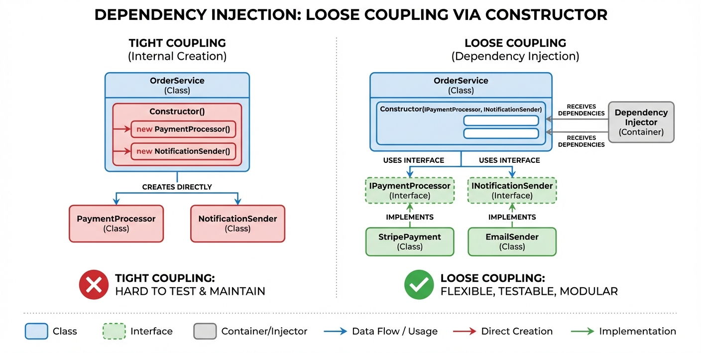
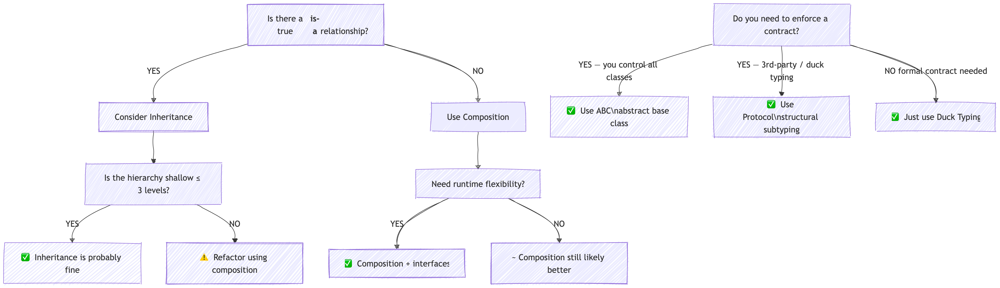

# YZM1022

## Advanced Programming

### Week 3: Abstract Classes, Interfaces, and Composition

**Instructor:** Ekrem Çetinkaya
**Date:** 11.03.2026

---

# Today's Agenda

<div class="two-columns">
<div class="column">

## Abstract Classes

- What are abstract classes and why use them
- Python's `abc` module
- Abstract methods and properties
- Template Method pattern

## Interfaces and Protocols

- Interface concept in Python
- Protocols (structural subtyping)
- Duck typing vs explicit interfaces
- Runtime checking

</div>
<div class="column">

## Composition

- Composition vs inheritance revisited
- Dependency injection
- Building flexible, testable systems
- Strategy and Decorator patterns

## Key Principles

- Program to interfaces, not implementations
- Favor composition over inheritance
- Depend on abstractions, not concretions

</div>
</div>

---

<!-- _footer: "" -->
<!-- _header: "" -->
<!-- _paginate: false -->

<style scoped>
p { text-align: center}
h1 {text-align: center; font-size: 72px}
</style>

# Abstract Classes

---

# The Problem - Incomplete Base Classes

Last week we used `raise NotImplementedError` in base classes to signal that subclasses should override certain methods. But this approach has a fundamental flaw

```python
class Shape:
    def __init__(self, color):
        self.color = color

    def area(self):
        pass  # What should this return?

    def perimeter(self):
        pass  # No sensible default implementation

# This is problematic:
shape = Shape("red")  # Can create instance of incomplete class!
print(shape.area())   # Returns None - silent failure
```

There are three problems here:

1. Nothing prevents us from creating a `Shape` object directly, even though _shape_ is too vague to have a meaningful area
2. If a subclass forgets to override `area()`, it silently returns `None` instead of raising an error
3. there is no way for Python to check at class-definition time whether all required methods are implemented.

---

# Attempt - Using NotImplementedError

The common workaround is to raise `NotImplementedError` as this at least gives an error message when the method is called. But it is still not good enough.

```python
class Shape:
    def __init__(self, color):
        self.color = color

    def area(self):
        raise NotImplementedError("Subclasses must implement area()")

    def perimeter(self):
        raise NotImplementedError("Subclasses must implement perimeter()")

# Still problematic:
shape = Shape("red")  # Can still create instance!
# Error only happens when calling the method
shape.area()  # NotImplementedError - but only at runtime when called
```

At least we get an error instead of silent `None`. But the error only appears **when the method is called**, not when the object is created.

- If your code creates a `Shape` object and passes it around for a while before calling `area()`, the bug hides until that moment.

What we really want is for Python to **refuse** to create the object in the first place if the required methods are missing. That is exactly what **abstract classes** provide.

---

# Abstract Class

An **abstract class** is a class that cannot be instantiated and may contain abstract methods that must be implemented by subclasses.

- Think of it as a blueprint that defines what methods a family of classes **must have**, while leaving the specific implementation to each subclass.

<div class="two-columns">
<div class="column">

### Characteristics

- **Cannot be instantiated** directly
- Contains one or more **abstract methods**
- Subclasses **must implement** all abstract methods
- Can also have implemented methods
- Defines a **contract/template** for subclasses

</div>
<div class="column">

### Real-World Analogy

**Animal** is abstract - you can't have just an _animal._ You have specific animals: dogs, cats, birds. All animals must be able to `eat()` and `move()`, but each does it differently.

**Vehicle** is abstract - you can't drive a _vehicle._ You drive a car, motorcycle, or truck. All must `start()`, `stop()`, and `accelerate()`.

</div>
</div>

---

# Python's `abc` Module

Python's `abc` (Abstract Base Class) module solves all three problems we mentioned before.

- By inheriting from `ABC` and decorating methods with `@abstractmethod`, we tell Python:

> This class is a blueprint; you cannot create instances of it, and any subclass **must** implement these methods before it can be instantiated.

---

# `abc` Example

```python
from abc import ABC, abstractmethod

class Shape(ABC):  # Step 1: Inherit from ABC
    def __init__(self, color):
        self.color = color

    @abstractmethod  # Step 2: Mark methods as abstract
    def area(self):
        """Calculate and return the area of the shape."""
        pass

    @abstractmethod
    def perimeter(self):
        """Calculate and return the perimeter of the shape."""
        pass

    # Concrete method  (has implementation, inherited normally)
    def describe(self):
        return f"A {self.color} shape"

# Now this fails immediately
shape = Shape("red")  # TypeError: Can't instantiate abstract class Shape with abstract methods area, perimeter
```

The error happens at **instantiation time**, not when you call the method.

---

# Understanding ABC

**ABC** stands for **Abstract Base Class**

```python
from abc import ABC, abstractmethod

# ABC is itself a class you inherit from
class MyAbstract(ABC):
    @abstractmethod
    def must_implement(self):
        pass
```

- Part of Python's `abc` module
- Provides metaclass machinery for abstract classes
- `@abstractmethod` decorator marks methods as abstract

### Implementing Abstract Classes

To use an abstract class, you create a **concrete subclass** that implements **every** abstract method.

- Only then can you create instances of that subclass.

---

# Implementing Abstract Classes

```python
from abc import ABC, abstractmethod

class Shape(ABC):
    def __init__(self, color):
        self.color = color

    @abstractmethod
    def area(self):
        pass

    @abstractmethod
    def perimeter(self):
        pass

class Rectangle(Shape):
    def __init__(self, color, width, height):
        super().__init__(color)
        self.width = width
        self.height = height

    def area(self):  # Must implement!
        return self.width * self.height

    def perimeter(self):  # Must implement!
        return 2 * (self.width + self.height)

rect = Rectangle("blue", 10, 5)  # OK - all abstract methods implemented
print(rect.area())  # 50
print(rect.describe())  # "A blue shape" - inherited concrete method works!
```

---

# How Abstract Classes Work

Let's trace through exactly what Python does when you use abstract classes:

**Step 1 - Define the abstract class:**
When Python sees `class Shape(ABC)` with `@abstractmethod`, it records which methods are abstract.

- Shape now has an internal set: `{area, perimeter}`.

**Step 2 - Try to create a Shape:**
`Shape("red")` -> Python checks: "_Does Shape have abstract methods?_" -> Yes -> `TypeError`. Blocked.

**Step 3 - Define a subclass:**
`class Rectangle(Shape)` -> Python checks: "_Does Rectangle implement all of Shape's abstract methods?_" -> If `area` and `perimeter` are both defined -> the abstract set becomes empty -> Rectangle is **concrete**.

**Step 4 - Create a Rectangle:**
`Rectangle("blue", 10, 5)` -> Python checks: "_Any remaining abstract methods?_" -> No -> Object created successfully.

> **Key insight:** The check happens at **instantiation time** (`__init__`), not at class definition time. You can define an incomplete subclass, Python only complains when you try to _create an object_ from it.

---

# What Happens If You Don't Implement?

```python
from abc import ABC, abstractmethod

class Shape(ABC):
    @abstractmethod
    def area(self):
        pass

    @abstractmethod
    def perimeter(self):
        pass

class IncompleteShape(Shape):
    def area(self):  # Only implements area, not perimeter
        return 0

# Trying to instantiate:
shape = IncompleteShape()
# TypeError: Can't instantiate abstract class IncompleteShape with abstract method perimeter
```

**Python enforces the contract at instantiation time!** The error message is clear, it tells you exactly which methods are missing.

---

# Multi-Level Abstract Hierarchies

Abstract classes can also form hierarchies. A subclass of an abstract class can itself be abstract

- Adding new abstract methods or leaving some unimplemented.
- Only the final **leaf** class that implements everything can be instantiated.

---

# Multi-Level Abstract Hierarchies

```python
from abc import ABC, abstractmethod

class Shape(ABC):
    @abstractmethod
    def area(self):
        pass

class Shape3D(Shape):       # Still abstract, area() not implemented
    @abstractmethod
    def volume(self):        # Adds a new abstract method
        pass

class Cube(Shape3D):         # Must implement both area() and volume()
    def __init__(self, side):
        self.side = side

    def area(self):          # From Shape
        return 6 * self.side ** 2

    def volume(self):        # From Shape3D
        return self.side ** 3

# Shape()    -> TypeError (area missing)
# Shape3D()  -> TypeError (area + volume missing)
cube = Cube(3)               # OK - everything implemented
print(cube.area())           # 54
print(cube.volume())         # 27
```

---

# Abstract Methods Can Have Default Implementation

```python
from abc import ABC, abstractmethod

class Animal(ABC):
    @abstractmethod
    def speak(self):
        """Default implementation that subclasses can use or override."""
        return "Some generic animal sound"

class Dog(Animal):
    def speak(self):
        # Can call the parent's implementation if needed
        default = super().speak()
        return "Woof! Woof!"

class Cat(Animal):
    def speak(self):
        # Or provide completely new implementation
        return "Meow!"

class GenericAnimal(Animal):
    def speak(self):
        # Or just use the parent's default
        return super().speak()

print(GenericAnimal().speak())  # "Some generic animal sound"
```

---

# Abstract Properties

Just like methods, **properties** can also be abstract.

- This is useful when you want every subclass to provide a specific piece of data (like a name, a configuration value, or a connection string) but each subclass computes or stores it differently.
- The syntax combines `@property` with `@abstractmethod`
  - Note that `@property` must come **first** (outermost decorator).

---

# Abstract Properties

```python
from abc import ABC, abstractmethod

class Database(ABC):
    @property
    @abstractmethod
    def connection_string(self):
        """Return the database connection string."""
        pass

    @abstractmethod
    def connect(self):
        pass

    @abstractmethod
    def execute(self, query):
        pass

class PostgreSQL(Database):
    def __init__(self, host, port, dbname):
        self.host = host
        self.port = port
        self.dbname = dbname

    @property
    def connection_string(self):  # Must implement as property
        return f"postgresql://{self.host}:{self.port}/{self.dbname}"

    def connect(self):
        return f"Connecting to {self.connection_string}"

    def execute(self, query):
        return f"Executing: {query}"
```

---

# Abstract Property with Setter

```python
from abc import ABC, abstractmethod

class ConfigurableService(ABC):
    @property
    @abstractmethod
    def config(self):
        """Get the current configuration."""
        pass

    @config.setter
    @abstractmethod
    def config(self, value):
        """Set the configuration."""
        pass

class WebService(ConfigurableService):
    def __init__(self):
        self._config = {}

    @property
    def config(self):
        return self._config

    @config.setter
    def config(self, value):
        if not isinstance(value, dict):
            raise TypeError("Config must be a dictionary")
        self._config = value

service = WebService()
service.config = {"host": "localhost", "port": 8080}
print(service.config)  # {'host': 'localhost', 'port': 8080}
```

---

# Abstract Class with Concrete Methods

```python
from abc import ABC, abstractmethod

class DataProcessor(ABC):
    def __init__(self, data):
        self.data = data
        self.processed = False

    @abstractmethod
    def process(self):
        """Process the data - must be implemented by subclass."""
        pass

    # Concrete method using abstract method
    def process_and_save(self, filename):
        result = self.process()  # Calls subclass implementation
        self.processed = True
        with open(filename, 'w') as f:
            f.write(str(result))
        return f"Saved to {filename}"

class CSVProcessor(DataProcessor):
    def process(self):
        # CSV-specific processing
        return [row.split(',') for row in self.data.split('\n')]

processor = CSVProcessor("a,b,c\n1,2,3")
print(processor.process_and_save("output.txt"))
```

---

# Practice - Create an Abstract Payment Processor

1. **Abstract class `PaymentProcessor(ABC)`**:
   - Abstract property: `provider_name` (string)
   - Abstract method: `validate_payment(amount)` -> returns bool
   - Abstract method: `process_payment(amount)` -> returns string
   - Concrete method: `make_payment(amount)`:
     - Validates first using `validate_payment()`
     - If valid, calls `process_payment()`
     - If invalid, returns "Payment validation failed"

2. **Concrete class `CreditCardProcessor`**:
   - `provider_name` returns "Credit Card"
   - `validate_payment()` returns True if amount > 0 and <= 10000
   - `process_payment()` returns "Processed ${amount} via Credit Card"

3. **Concrete class `PayPalProcessor`**:
   - Similar implementation with "PayPal" as provider

---

# Solution - Abstract Payment Processor

```python
from abc import ABC, abstractmethod

class PaymentProcessor(ABC):
    @property
    @abstractmethod
    def provider_name(self):
        pass

    @abstractmethod
    def validate_payment(self, amount):
        pass

    @abstractmethod
    def process_payment(self, amount):
        pass

    def make_payment(self, amount):
        if self.validate_payment(amount):
            return self.process_payment(amount)
        return "Payment validation failed"

class CreditCardProcessor(PaymentProcessor):
    @property
    def provider_name(self):
        return "Credit Card"

    def validate_payment(self, amount):
        return 0 < amount <= 10000
```

---

# Solution - Payment Processor

```python
class CreditCardProcessor(PaymentProcessor):
    # ... (previous code)

    def process_payment(self, amount):
        return f"Processed ${amount} via {self.provider_name}"

class PayPalProcessor(PaymentProcessor):
    @property
    def provider_name(self):
        return "PayPal"

    def validate_payment(self, amount):
        return 0 < amount <= 5000  # PayPal has lower limit

    def process_payment(self, amount):
        return f"Processed ${amount} via {self.provider_name}"

# Test
cc = CreditCardProcessor()
print(cc.make_payment(100))    # Processed $100 via Credit Card
print(cc.make_payment(15000))  # Payment validation failed

paypal = PayPalProcessor()
print(paypal.make_payment(100))  # Processed $100 via PayPal
```

---

# Template Method Pattern

<div class="two-columns">

<div class="column">

The **Template Method** pattern is one of the most practical applications of abstract classes. The idea is simple:

- Define the **skeleton** of an algorithm in the base class (the _template_), but leave certain steps as abstract methods that subclasses fill in.
- The overall flow stays the same; only the specific steps change.

</div>

<div class="column">

```python
from abc import ABC, abstractmethod

class ReportGenerator(ABC):
    def generate_report(self):  # Template method
        data = self.fetch_data()
        processed = self.process_data(data)
        formatted = self.format_output(processed)
        return self.deliver(formatted)

    @abstractmethod
    def fetch_data(self):
        pass

    @abstractmethod
    def process_data(self, data):
        pass

    def format_output(self, data):  # Default implementation
        return str(data)

    @abstractmethod
    def deliver(self, output):
        pass
```

</div>
</div>

---

# Template Method - Implementation Example

```python
class SalesReport(ReportGenerator):
    def fetch_data(self):
        return {"sales": [100, 200, 150, 300]}

    def process_data(self, data):
        total = sum(data["sales"])
        return {"total": total, "average": total / len(data["sales"])}

    def deliver(self, output):
        print(f"Sales Report: {output}")
        return output

class EmailReport(ReportGenerator):
    def __init__(self, recipient):
        self.recipient = recipient

    def fetch_data(self):
        return {"emails": 42, "unread": 5}

    def process_data(self, data):
        return f"You have {data['unread']} unread of {data['emails']} total"

    def deliver(self, output):
        return f"Sending to {self.recipient}: {output}"

# Same generate_report() flow, different implementations
SalesReport().generate_report()
```

---

# Registering Virtual Subclasses

<div class="two-columns">

<div class="column">

**Virtual subclasses** let you extend an ABC's type hierarchy without touching the original class which are ideal for third-party code you can't modify.

- Call `ABC.register(SomeClass)` to declare that `SomeClass` belongs to the ABC's family.
- After registration, `isinstance()` and `issubclass()` return `True` as if it were a real subclass.
- **Caveat:** the ABC has no way to verify that the registered class actually implements all abstract methods. It's a _trust-based_ contract.

Use this when integrating external libraries that already fulfil the expected interface but don't inherit from your ABC.

</div>

<div class="column">

```python
from abc import ABC, abstractmethod

class Drawable(ABC):
    @abstractmethod
    def draw(self):
        pass

# Regular class - not inheriting from Drawable
class Circle:
    def draw(self):
        return "Drawing a circle"

# Register as virtual subclass
Drawable.register(Circle)

# Now these work:
circle = Circle()
print(isinstance(circle, Drawable))  # True
print(issubclass(Circle, Drawable))  # True

# But note: ABC doesn't verify Circle actually implements draw()!
# This is trust-based registration
```

</div>
</div>

---

<!-- _footer: "" -->
<!-- _header: "" -->
<!-- _paginate: false -->

<style scoped>
p { text-align: center}
h1 {text-align: center; font-size: 72px}
</style>

# Interfaces and Protocols

---

# What is an Interface?

An **interface** defines a contract, a set of methods that a class must implement, without providing any implementation.

- It answers the question: _What can this object do?_ without saying anything about _how_ it does it.

* This separation of **what** from **how** is one of the most powerful ideas in software design.

<div class="two-columns">
<div class="column">

## In Other Languages

```java
// Java interface
interface Drawable {
    void draw();
    Color getColor();
}

class Circle implements Drawable {
    public void draw() { /* ... */ }
    public Color getColor() { /* ... */ }
}
```

- Explicit declaration
- Compile-time checking
- Multiple interfaces allowed

</div>
<div class="column">

## In Python

Python doesn't have a formal `interface` keyword, but we have:

1. **Duck Typing**: Implicit interfaces
2. **ABC (Abstract Base Classes)**: Explicit contracts
3. **Protocols**: Structural subtyping

```python
# Python: duck typing
class Circle:
    def draw(self):
        pass
    def get_color(self):
        pass

# If it has draw() and get_color(), it's "drawable"
```

</div>
</div>

---

# Interface via ABC

```python
from abc import ABC, abstractmethod

class Drawable(ABC):
    """Interface for objects that can be drawn."""

    @abstractmethod
    def draw(self):
        pass

    @abstractmethod
    def get_color(self):
        pass

class Circle(Drawable):
    def __init__(self, radius, color):
        self.radius = radius
        self.color = color

    def draw(self):
        return f"Drawing circle with radius {self.radius}"

    def get_color(self):
        return self.color

# Type checking
def render(drawable: Drawable):
    print(drawable.draw())
```

---

# Pure Interface Pattern

```python
from abc import ABC, abstractmethod

class Serializable(ABC):
    """Pure interface - all methods abstract, no state."""

    @abstractmethod
    def to_json(self) -> str:
        pass

    @abstractmethod
    def to_xml(self) -> str:
        pass

class Persistable(ABC):
    """Pure interface for objects that can be saved/loaded."""

    @abstractmethod
    def save(self, path: str) -> None:
        pass

    @abstractmethod
    def load(self, path: str) -> None:
        pass

# A class can implement multiple interfaces
class Document(Serializable, Persistable):
    # Must implement all 4 methods
    pass
```

---

# Protocols - Structural Subtyping

With ABCs, a class must **explicitly inherit** from the abstract class to be recognized as implementing the interface.

- But Python's philosophy is **duck typing**.
- **Protocols** bring this philosophy to the type system: a class satisfies a Protocol simply by having the right methods, **without inheriting from anything**.

---

# Protocols - Structural Subtyping

```python
from typing import Protocol

class Drawable(Protocol):
    """Protocol defines expected methods - no inheritance needed!"""

    def draw(self) -> str:
        ...

    def get_color(self) -> str:
        ...

# This class doesn't inherit from Drawable, but satisfies the Protocol
class Square:
    def __init__(self, side, color):
        self.side = side
        self.color = color

    def draw(self) -> str:
        return f"Drawing square with side {self.side}"

    def get_color(self) -> str:
        return self.color

def render(item: Drawable) -> None:  # Type hint with Protocol
    print(item.draw())

render(Square(10, "red"))  # Works! Square satisfies Drawable protocol
```

---

# Understanding Protocol vs ABC

<div class="two-columns">
<div class="column">

## ABC (Nominal Typing)

```python
from abc import ABC, abstractmethod

class Serializable(ABC):
    @abstractmethod
    def to_json(self) -> str:
        pass

# Must explicitly inherit
class User(Serializable):
    def to_json(self) -> str:
        return "{}"

def save(obj: Serializable):
    print(obj.to_json())

save(User())  # OK - User inherits Serializable
```

Type is determined by **class declaration**

</div>
<div class="column">

## Protocol (Structural Typing)

```python
from typing import Protocol

class Serializable(Protocol):
    def to_json(self) -> str:
        ...

# No inheritance needed!
class User:
    def to_json(self) -> str:
        return "{}"

def save(obj: Serializable):
    print(obj.to_json())

save(User())  # OK - User has to_json method
```

Type is determined by **structure (methods present)**

</div>
</div>

---

# ABC vs Protocol

| Feature                         | ABC                                  | Protocol                         |
| ------------------------------- | ------------------------------------ | -------------------------------- |
| Requires inheritance            | Yes - must write `class Dog(Animal)` | No - just have the right methods |
| Runtime checking (`isinstance`) | Yes - built-in                       | Only with `@runtime_checkable`   |
| Static type checking            | Yes                                  | Yes                              |
| Works with third-party classes  | Via `register()` only                | Automatically                    |
| Can have implementation         | Yes (concrete + abstract methods)    | Not recommended                  |
| Best for                        | Your own class hierarchies           | Duck typing with type hints      |

---

# ABC vs Protocol

```python
# Use ABC when you CONTROL the class hierarchy and want enforcement
from abc import ABC, abstractmethod

class Animal(ABC):           # You define the base
    @abstractmethod
    def speak(self): pass

class Dog(Animal):           # You define the subclasses
    def speak(self):
        return "Woof!"

# Use Protocol when you want FLEXIBILITY (duck typing + type hints)
from typing import Protocol

class HasLength(Protocol):
    def __len__(self) -> int: ...

def process(obj: HasLength):  # Works with list, str, dict, any class with __len__
    return len(obj)

process([1, 2, 3])   # Works - list has __len__
process("hello")     # Works - str has __len__
process({"a": 1})    # Works - dict has __len__
```

> If you are designing a class hierarchy from scratch, use ABC. If you want to write a function that accepts _anything with method X_, use Protocol.

---

# Protocol with Properties

```python
from typing import Protocol

class Named(Protocol):
    @property
    def name(self) -> str:
        ...

class Aged(Protocol):
    @property
    def age(self) -> int:
        ...

# Combined protocol
class Person(Protocol):
    @property
    def name(self) -> str: ...
    @property
    def age(self) -> int: ...

# This class satisfies Person protocol
class Employee:
    def __init__(self, name: str, age: int):
        self._name = name
        self._age = age

    @property
    def name(self) -> str:
        return self._name

    @property
    def age(self) -> int:
        return self._age
```

---

# Multiple Interfaces

```python
from abc import ABC, abstractmethod

class Printable(ABC):
    @abstractmethod
    def to_string(self) -> str:
        pass

class Saveable(ABC):
    @abstractmethod
    def save(self, path: str) -> None:
        pass

class Loadable(ABC):
    @abstractmethod
    def load(self, path: str) -> None:
        pass

# Implement multiple interfaces
class Document(Printable, Saveable, Loadable):
    def __init__(self, content=""):
        self.content = content

    def to_string(self) -> str:
        return self.content

    def save(self, path: str) -> None:
        with open(path, 'w') as f:
            f.write(self.content)

    def load(self, path: str) -> None:
        with open(path, 'r') as f:
            self.content = f.read()
```

---

# Runtime Interface Checking - ABC vs Protocol

Both ABCs and Protocols support `isinstance()` checks at runtime, but they work differently.

**With ABC** - subclasses must explicitly inherit, so `isinstance` reflects the inheritance tree directly.

**With Protocol** - add `@runtime_checkable` and `isinstance` checks structural compatibility, no inheritance needed.

---

# Runtime Interface Checking - ABC vs Protocol

<div class="two-columns">

<div class="column">

```python
from abc import ABC, abstractmethod

class Flyable(ABC):
    @abstractmethod
    def fly(self): pass

class Swimmable(ABC):
    @abstractmethod
    def swim(self): pass

class Duck(Flyable, Swimmable):
    def fly(self):   return "Duck flying"
    def swim(self):  return "Duck swimming"

class Penguin(Swimmable):
    def swim(self):  return "Penguin swimming fast"

def make_it_fly(animal):
    if isinstance(animal, Flyable):
        print(animal.fly())
    else:
        print(f"{animal.__class__.__name__} cannot fly!")

make_it_fly(Duck())     # Duck flying
make_it_fly(Penguin())  # Penguin cannot fly!
```

</div>

<div class="column">

```python
from typing import Protocol, runtime_checkable

@runtime_checkable  # Required for isinstance() checks!
class Flyable(Protocol):
    def fly(self) -> str: ...

class Bird:
    def fly(self) -> str:
        return "Bird is flying"

class Fish:
    def swim(self) -> str:
        return "Fish is swimming"

bird, fish = Bird(), Fish()

print(isinstance(bird, Flyable))  # True
print(isinstance(fish, Flyable))  # False

def safe_fly(animal):
    if isinstance(animal, Flyable):
        return animal.fly()
    return "Cannot fly"

print(safe_fly(bird))  # Bird is flying
print(safe_fly(fish))  # Cannot fly
```

</div>
</div>

---

# Practice - Create Interface Hierarchy for Shapes

1. **Protocol `HasArea`**:
   - Method: `area() -> float`

2. **Protocol `HasPerimeter`**:
   - Method: `perimeter() -> float`

3. **Protocol `Shape`** (combines both):
   - Has both `area()` and `perimeter()`

4. **Implement three shape classes** (without inheriting from protocols):
   - `Rectangle(width, height)`
   - `Circle(radius)`
   - `Triangle(a, b, c)` - sides a, b, c

5. **Function `describe_shape(shape: Shape)`**:
   - Prints area and perimeter

---

# Solution - Shape Protocols

```python
from typing import Protocol
import math

class HasArea(Protocol):
    def area(self) -> float: ...

class HasPerimeter(Protocol):
    def perimeter(self) -> float: ...

class Shape(HasArea, HasPerimeter, Protocol):
    pass

class Rectangle:
    def __init__(self, width: float, height: float):
        self.width = width
        self.height = height

    def area(self) -> float:
        return self.width * self.height

    def perimeter(self) -> float:
        return 2 * (self.width + self.height)
```

---

# Solution - Shape Protocols

```python
class Circle:
    def __init__(self, radius: float):
        self.radius = radius

    def area(self) -> float:
        return math.pi * self.radius ** 2

    def perimeter(self) -> float:
        return 2 * math.pi * self.radius

class Triangle:
    def __init__(self, a: float, b: float, c: float):
        self.a, self.b, self.c = a, b, c

    def area(self) -> float:
        s = self.perimeter() / 2  # Semi-perimeter
        return math.sqrt(s * (s-self.a) * (s-self.b) * (s-self.c))

    def perimeter(self) -> float:
        return self.a + self.b + self.c

def describe_shape(shape: Shape) -> None:
    print(f"Area: {shape.area():.2f}, Perimeter: {shape.perimeter():.2f}")

# Test - all work without inheriting from Shape!
describe_shape(Rectangle(10, 5))  # Area: 50.00, Perimeter: 30.00
describe_shape(Circle(7))         # Area: 153.94, Perimeter: 43.98
describe_shape(Triangle(3, 4, 5)) # Area: 6.00, Perimeter: 12.00
```

---

<!-- _footer: "" -->
<!-- _header: "" -->
<!-- _paginate: false -->

<style scoped>
p { text-align: center}
h1 {text-align: center; font-size: 72px}
</style>

# Composition

---

# Inheritance vs Composition - Reminder

<div class="two-columns">
<div class="column">

## Inheritance ("Is-A")

```python
class Engine:
    def start(self):
        return "Engine started"

class Car(Engine):  # Car IS an Engine??
    pass

car = Car()
car.start()
```

**Problem**: A car is NOT an engine!
This violates the "is-a" test.

</div>
<div class="column">

## Composition ("Has-A")

```python
class Engine:
    def start(self):
        return "Engine started"

class Car:
    def __init__(self):
        self.engine = Engine()  # Car HAS an Engine

    def start(self):
        return self.engine.start()

car = Car()
car.start()
```

**Correct**: A car HAS an engine.

</div>
</div>

---

# Why Favor Composition?

The Gang of Four, the authors of the seminal _Design Patterns_ book, gave one of the most cited pieces of advice in software engineering: **"Favor object composition over class inheritance."**

- This does not mean inheritance is bad, but it should not be the default tool for code reuse. Here is why:

<div class="two-columns">
<div class="column">

### Problems with Inheritance

1. **Tight coupling** - Child depends on parent internals
2. **Fragile base class** - Parent changes break children
3. **Limited flexibility** - Can't change behavior at runtime
4. **Deep hierarchies** - Hard to understand and maintain
5. **Forced inheritance** - Must take everything, even what you don't need

</div>
<div class="column">

### Benefits of Composition

1. **Loose coupling** - Components are independent
2. **Flexibility** - Swap components at runtime
3. **Easier testing** - Mock individual components
4. **Single responsibility** - Each class does one thing well
5. **Pick and choose** - Use only what you need

</div>
</div>

---

# The _Is-A_ Test

Before using inheritance, always ask yourself: **"Is [Child] a [Parent]?"**

- If the answer sounds wrong, use composition instead.

| Relationship          | "Is-A" Test                   | Verdict                               |
| --------------------- | ----------------------------- | ------------------------------------- |
| Dog -> Animal         | "A Dog _is an_ Animal"        | Inheritance                           |
| Car -> Vehicle        | "A Car _is a_ Vehicle"        | Inheritance                           |
| Car -> Engine         | "A Car _is an_ Engine"        | Composition (Car _has_ an Engine)     |
| Employee -> Person    | "An Employee _is a_ Person"   | Inheritance                           |
| Employee -> Laptop    | "An Employee _is a_ Laptop"   | Composition (Employee _has_ a Laptop) |
| Logger -> FileHandler | "A Logger _is a_ FileHandler" | Composition (Logger _has_ handlers)   |

When the answer is "has-a" or "uses-a," use composition.

---

# Composition Example - Building a Computer

```python
class CPU:
    def __init__(self, model):
        self.model = model
    def process(self):
        return f"{self.model} processing data"

class Memory:
    def __init__(self, size_gb):
        self.size = size_gb
    def store(self, data):
        return f"Storing {data} in {self.size}GB RAM"

class Storage:
    def __init__(self, capacity_gb):
        self.capacity = capacity_gb
    def save(self, data):
        return f"Saving {data} to {self.capacity}GB storage"
```

---

# Composition Example - The Computer Class

```python
class Computer:
    def __init__(self, cpu, memory, storage):
        self.cpu = cpu          # Composition
        self.memory = memory    # Composition
        self.storage = storage  # Composition

    def run_program(self, program):
        return f"{self.cpu.process()} -> {self.memory.store(program)}"
```

**Computer "has-a" CPU, Memory, and Storage**, this is composition

---

# Flexible Component Swapping

```python
# Create components
intel_cpu = CPU("Intel i9")
amd_cpu = CPU("AMD Ryzen 9")
ram_16 = Memory(16)
ram_32 = Memory(32)
ssd = Storage(512)
hdd = Storage(2000)

# Build different computers by composing components
gaming_pc = Computer(intel_cpu, ram_32, ssd)
budget_pc = Computer(amd_cpu, ram_16, hdd)

# Can even swap at runtime!
class UpgradeableComputer:
    def __init__(self, cpu, memory, storage):
        self.cpu = cpu
        self.memory = memory
        self.storage = storage

    def upgrade_memory(self, new_memory):
        self.memory = new_memory
        return f"Upgraded to {new_memory.size}GB RAM"

pc = UpgradeableComputer(intel_cpu, ram_16, ssd)
print(pc.upgrade_memory(ram_32))  # Upgraded to 32GB RAM
```

---

# Composition for Behavior Combination

```python
class Walkable:
    def walk(self):
        return "Walking..."

class Runnable:
    def run(self):
        return "Running..."

class Jumpable:
    def jump(self):
        return "Jumping..."

# Using composition instead of multiple inheritance
class Athlete:
    def __init__(self):
        self.walker = Walkable()
        self.runner = Runnable()
        self.jumper = Jumpable()

    def walk(self):
        return self.walker.walk()

    def run(self):
        return self.runner.run()

    def jump(self):
        return self.jumper.jump()

    def triathlon(self):
        return f"{self.run()} -> {self.walk()} -> {self.jump()}"
```

---

# Dependency Injection



<!-- _footer: "Generated by Nano Banana" -->

---

# Understanding Dependency Injection

**Dependency Injection** (DI) is a technique where objects receive their dependencies from outside rather than creating them internally.

- Instead of a class deciding which database or service to use, the caller passes in the dependency; making the code **flexible, testable,** and **loosely coupled**.

<div class="two-columns">
<div class="column">

## Without DI (Tight Coupling)

```python
class UserService:
    def __init__(self):
        # Creates its own dependency - hard to test!
        self.db = PostgresDatabase()

    def get_user(self, id):
        return self.db.query(f"SELECT * FROM users WHERE id={id}")

# Testing is hard - always uses real database
```

</div>
<div class="column">

## With DI (Loose Coupling)

```python
class UserService:
    def __init__(self, database):
        # Dependency injected from outside
        self.db = database

    def get_user(self, id):
        return self.db.query(f"SELECT * FROM users WHERE id={id}")

# Easy to test with mock!
service = UserService(MockDatabase())
# Easy to swap implementations
service = UserService(PostgresDatabase())
service = UserService(MySQLDatabase())
```

</div>
</div>

---

# Types of Dependency Injection

<div class="two-columns">
<div class="column">

## Constructor Injection

```python
class ReportService:
    def __init__(self, renderer: Renderer):
        self.renderer = renderer  # injected once, always available

service = ReportService(PdfRenderer())
```

Dependencies are declared up front, making them **explicit and required**. The object is always in a valid state after construction.

</div>
<div class="column">

## Method Injection

```python
class ReportService:
    def generate(self, data, renderer: Renderer):
        return renderer.render(data)  # injected per-call

service = ReportService()
service.generate(data, PdfRenderer())
service.generate(data, HtmlRenderer())  # different renderer each call
```

Useful when the dependency **varies per operation** rather than per instance.

</div>
</div>

---

# Types of Dependency Injection

<div class="two-columns">
<div class="column">

## Setter Injection

```python
class ReportService:
    def set_renderer(self, renderer: Renderer):
        self.renderer = renderer  # injected after construction

service = ReportService()
service.set_renderer(PdfRenderer())  # must remember to call this!
```

Useful when the dependency is **optional or interchangeable** at runtime, but risks the object being used before the dependency is set.

</div>
<div class="column">

## Quick Comparison

|                       | Constructor | Setter        | Method        |
| --------------------- | ----------- | ------------- | ------------- |
| Required?             | Yes         | Optional      | Per-call      |
| Always available?     | Yes         | No            | No            |
| Swappable at runtime? | No          | Yes           | Yes           |
| Recommended for?      | Core deps   | Optional deps | Per-call deps |

</div>
</div>

---

# DI with Abstract Interfaces

The real power of DI comes when combined with abstract classes.

- By depending on an **abstraction** (ABC) rather than a **concrete class**, your code becomes completely independent of the specific implementation.

* You can swap databases, change APIs, or inject test mocks; all without changing a single line in your service code.

```python
from abc import ABC, abstractmethod

class Database(ABC):
    @abstractmethod
    def query(self, sql: str):
        pass
    @abstractmethod
    def execute(self, sql: str):
        pass

class PostgresDatabase(Database):
    def query(self, sql: str):
        return f"Postgres: {sql}"
    def execute(self, sql: str):
        return f"Postgres executing: {sql}"
```

---

# DI with Interfaces - Mock for Testing

```python
class MockDatabase(Database):
    def __init__(self):
        self.queries = []

    def query(self, sql: str):
        self.queries.append(sql)
        return {"mock": "data"}

    def execute(self, sql: str):
        self.queries.append(sql)
        return True
```

**MockDatabase** allows easy testing without a real database

---

# DI with Interfaces - UserRepository

```python
class UserRepository:
    def __init__(self, database: Database):
        self.db = database

    def find_by_id(self, user_id: int):
        return self.db.query(f"SELECT * FROM users WHERE id = {user_id}")

    def save(self, user):
        return self.db.execute(f"INSERT INTO users VALUES ({user})")

# Production
prod_repo = UserRepository(PostgresDatabase())
prod_repo.find_by_id(123)

# Testing
def test_find_by_id():
    mock_db = MockDatabase()
    repo = UserRepository(mock_db)

    repo.find_by_id(456)

    # Verify the correct query was made
    assert "SELECT * FROM users WHERE id = 456" in mock_db.queries
```

---

# Practice - Build a Logger System with DI

1. **Abstract class `LogHandler(ABC)`**:
   - Abstract method: `handle(message: str) -> None`

2. **Concrete handlers**:
   - `ConsoleHandler`: prints to console with `[CONSOLE]` prefix
   - `FileHandler(filename)`: appends to file with timestamp
   - `NullHandler`: does nothing (for testing)

3. **`Logger` class** (uses composition and DI):
   - Takes a list of handlers in `__init__`
   - Method `log(level, message)`: calls all handlers
   - Method `add_handler(handler)`: adds new handler
   - Methods `info(msg)`, `warning(msg)`, `error(msg)`

4. Test with different handler combinations

**Time: 12 minutes**

---

# Solution - Logger System - Handlers

```python
from abc import ABC, abstractmethod
from datetime import datetime

class LogHandler(ABC):
    @abstractmethod
    def handle(self, message: str) -> None:
        pass

class ConsoleHandler(LogHandler):
    def handle(self, message: str) -> None:
        print(f"[CONSOLE] {message}")

class FileHandler(LogHandler):
    def __init__(self, filename: str):
        self.filename = filename

    def handle(self, message: str) -> None:
        timestamp = datetime.now().isoformat()
        with open(self.filename, 'a') as f:
            f.write(f"[{timestamp}] {message}\n")
```

---

# Solution - NullHandler

```python
class NullHandler(LogHandler):
    def handle(self, message: str) -> None:
        pass  # Do nothing - useful for testing
```

---

# Solution - Logger System

```python
class Logger:
    def __init__(self, handlers: list = None):
        self.handlers = handlers or []

    def add_handler(self, handler: LogHandler) -> None:
        self.handlers.append(handler)

    def log(self, level: str, message: str) -> None:
        formatted = f"[{level.upper()}] {message}"
        for handler in self.handlers:
            handler.handle(formatted)

    def info(self, message: str) -> None:
        self.log("INFO", message)

    def warning(self, message: str) -> None:
        self.log("WARNING", message)

    def error(self, message: str) -> None:
        self.log("ERROR", message)

# Usage
logger = Logger([ConsoleHandler(), FileHandler("app.log")])
logger.info("Application started")
logger.error("Something went wrong")
```

---

# Composition with Strategy Pattern

The **Strategy Pattern** is one of the most important design patterns, and it is built entirely on composition.

- Instead of hardcoding an algorithm inside a class, you **extract** it into a separate object (the **strategy**) and pass it in.

* This lets you swap algorithms at runtime without modifying the class that uses them.

Think of it like a GPS app; the navigation logic (shortest route, fastest route, scenic route) is the _strategy_, and the app switches between them based on user preference.

---

```python
from abc import ABC, abstractmethod

class RouteStrategy(ABC):
    @abstractmethod
    def calculate(self, origin: str, destination: str) -> str:
        pass

class ShortestRoute(RouteStrategy):
    def calculate(self, origin: str, destination: str) -> str:
        return f"Shortest route from {origin} to {destination}: 12 km via highway"

class FastestRoute(RouteStrategy):
    def calculate(self, origin: str, destination: str) -> str:
        return f"Fastest route from {origin} to {destination}: 15 km, avoids traffic"

class ScenicRoute(RouteStrategy):
    def calculate(self, origin: str, destination: str) -> str:
        return f"Scenic route from {origin} to {destination}: 20 km along the coast"

class GPSNavigator:
    def __init__(self, strategy: RouteStrategy):
        self.strategy = strategy  # Composed, not inherited

    def set_route_preference(self, strategy: RouteStrategy):
        self.strategy = strategy  # Swap algorithm at runtime!

    def navigate(self, origin: str, destination: str) -> str:
        return self.strategy.calculate(origin, destination)

gps = GPSNavigator(FastestRoute())
print(gps.navigate("Home", "Airport"))   # Fastest route ...

gps.set_route_preference(ScenicRoute())
print(gps.navigate("Hotel", "Beach"))    # Scenic route ...
```

---

# Decorator Pattern with Composition

The **Decorator Pattern** adds behavior to an object dynamically by _wrapping_ it inside another object that has the same interface.

- Instead of creating subclasses for every combination (MilkCoffee, SugarCoffee, MilkSugarCoffee, MilkSugarWhippedCreamCoffee...), you stack decorators like layers.

This is different from Python's `@decorator` syntax (which decorates functions), the Decorator Pattern decorates **objects**.

---

```python
from abc import ABC, abstractmethod

class Coffee(ABC):
    @abstractmethod
    def cost(self) -> float:
        pass

    @abstractmethod
    def description(self) -> str:
        pass

class SimpleCoffee(Coffee):
    def cost(self) -> float:
        return 2.0

    def description(self) -> str:
        return "Simple coffee"

class CoffeeDecorator(Coffee):
    def __init__(self, coffee: Coffee):
        self._coffee = coffee  # Composition!

class MilkDecorator(CoffeeDecorator):
    def cost(self) -> float:
        return self._coffee.cost() + 0.5

    def description(self) -> str:
        return self._coffee.description() + " + milk"
```

---

# Decorator Pattern Example

```python
class SugarDecorator(CoffeeDecorator):
    def cost(self) -> float:
        return self._coffee.cost() + 0.25

    def description(self) -> str:
        return self._coffee.description() + " + sugar"

class WhippedCreamDecorator(CoffeeDecorator):
    def cost(self) -> float:
        return self._coffee.cost() + 0.75

    def description(self) -> str:
        return self._coffee.description() + " + whipped cream"

# Build up a coffee order through composition
coffee = SimpleCoffee()
print(f"{coffee.description()}: ${coffee.cost()}")
# Simple coffee: $2.0

coffee = MilkDecorator(coffee)
coffee = SugarDecorator(coffee)
coffee = WhippedCreamDecorator(coffee)
print(f"{coffee.description()}: ${coffee.cost()}")
# Simple coffee + milk + sugar + whipped cream: $3.5
```

---

# Decorator Pattern - Why Not Inheritance?

To understand why the Decorator Pattern uses composition, imagine solving the coffee problem with inheritance instead:

```python
# With inheritance: Explosion of classes!
class Coffee: pass
class MilkCoffee(Coffee): pass
class SugarCoffee(Coffee): pass
class MilkSugarCoffee(Coffee): pass
class WhippedCreamCoffee(Coffee): pass
class MilkWhippedCreamCoffee(Coffee): pass
class SugarWhippedCreamCoffee(Coffee): pass
class MilkSugarWhippedCreamCoffee(Coffee): pass
# ... 2^n classes for n possible add-ons!
```

With 4 add-ons, you need 16 classes. With 10 add-ons, you need 1024 classes. This is called a **class explosion** - and it is unsustainable.

The Decorator Pattern avoids this entirely

- You have one class per add-on (MilkDecorator, SugarDecorator, etc.) and **compose** them in any order at runtime. $n$ add-ons = $n$ classes, not $2^n$.

> This is a nice example of why **favor composition over inheritance** is such important advice.

---

# Practice - Build a Text Processor with Composition

1. **Abstract class `TextTransformer(ABC)`**:
   - Abstract method: `transform(text: str) -> str`

2. **Concrete transformers**:
   - `UpperCaseTransformer`: converts to uppercase
   - `TrimTransformer`: removes leading/trailing whitespace
   - `ReplaceTransformer(old, new)`: replaces old with new

3. **`TextProcessor` class** (uses composition):
   - Constructor takes list of transformers
   - Method `process(text)`: applies all transformers in order
   - Method `add_transformer(transformer)`: adds transformer to pipeline

4. Test with text: `"  Hello World  "` and transformers in different orders

---

# Solution - Text Processor - Transformers

```python
from abc import ABC, abstractmethod

class TextTransformer(ABC):
    @abstractmethod
    def transform(self, text: str) -> str:
        pass

class UpperCaseTransformer(TextTransformer):
    def transform(self, text: str) -> str:
        return text.upper()

class TrimTransformer(TextTransformer):
    def transform(self, text: str) -> str:
        return text.strip()

class ReplaceTransformer(TextTransformer):
    def __init__(self, old: str, new: str):
        self.old = old
        self.new = new
    def transform(self, text: str) -> str:
        return text.replace(self.old, self.new)
```

---

# Solution - Text Processor

```python
class TextProcessor:
    def __init__(self, transformers: list = None):
        self.transformers = transformers or []

    def add_transformer(self, transformer: TextTransformer) -> None:
        self.transformers.append(transformer)

    def process(self, text: str) -> str:
        result = text
        for transformer in self.transformers:
            result = transformer.transform(result)
        return result

# Test
processor = TextProcessor([
    TrimTransformer(),
    UpperCaseTransformer(),
    ReplaceTransformer("WORLD", "PYTHON")
])

text = "  Hello World  "
print(processor.process(text))  # HELLO PYTHON

# Different order = different result
processor2 = TextProcessor([
    UpperCaseTransformer(),
    TrimTransformer()  # Trim after uppercase
])
print(processor2.process(text))  # HELLO WORLD (trimmed)
```

---

# When to Use What?

<div class="two-columns">
<div class="column">

## Use Inheritance When

- True **"is-a"** relationship
- You want to **reuse implementation**
- Creating a **framework** with extension points
- Building **type hierarchies** (Shape -> Circle)

## Examples

- `Exception` subclasses
- `unittest.TestCase` subclasses
- GUI widget hierarchies

</div>
<div class="column">

## Use Composition When

- **"Has-a"** relationship
- You need **runtime flexibility**
- Components should be **swappable**
- You want **loose coupling**
- **Multiple behaviors** needed

## Examples

- Service classes with repositories
- Strategy pattern implementations
- Building complex objects from parts

</div>
</div>

---

# Decision Flowchart



---

<!-- _class: lead -->

# Thank You!

## Contact Information

- **Email:** ekrem.cetinkaya@yildiz.edu.tr
- **Office Hours:** Wednesday 13:30-15:30 - Room C-120
- **Book a slot before coming:** [Booking Link](https://dub.sh/ekrem-office)
- **Course Repository:** [GitHub](https://github.com/ekremcet/yzm1022-advanced-programming)

## Next Week

**Week 4:** Design Patterns - Creational Patterns
