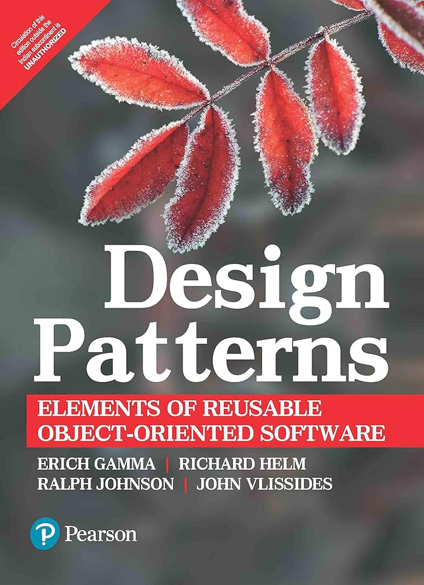
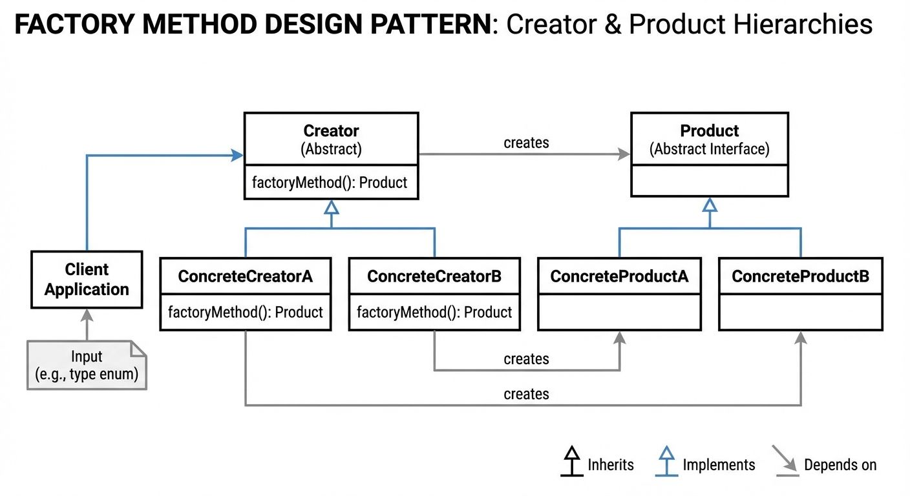
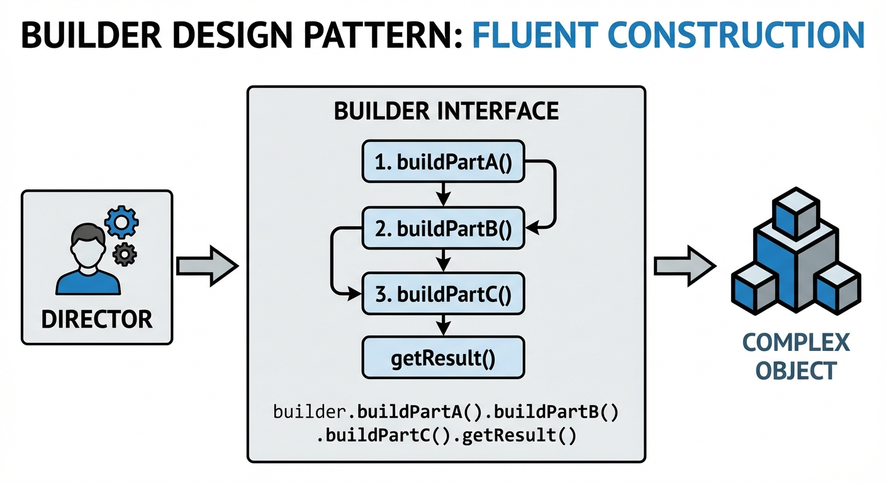
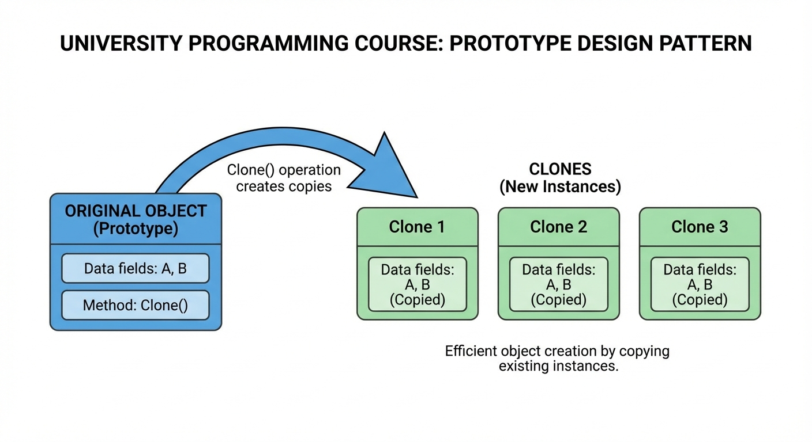

# YZM1022

## Advanced Programming

### Week 4: Design Patterns - Creational Patterns

**Instructor:** Ekrem Çetinkaya
**Date:** 18.03.2026

---

# Today's Focus

<div class="two-columns">
<div class="column">

## Introduction to Design Patterns

- What are design patterns and why use them
- Categories: Creational, Structural, Behavioral

## Factory Patterns

- **Factory Method** - delegate creation to subclasses
- **Abstract Factory** - create families of related objects

</div>
<div class="column">

## Builder and Singleton

- **Builder** - construct complex objects step by step
- **Singleton** - ensure only one instance exists

## Prototype

- **Prototype** - clone existing objects
- Shallow vs deep copy
- Prototype Registry pattern

</div>
</div>

---

<!-- _footer: "" -->
<!-- _header: "" -->
<!-- _paginate: false -->

<style scoped>
p { text-align: center}
h1 {text-align: center; font-size: 64px}
</style>

# What Are Design Patterns?

---

# Design Patterns: Definition

A **design pattern** is a general, reusable solution to a commonly occurring problem in software design. It is not a piece of code you can copy-paste, it is a _template_ for solving a problem that you adapt to your specific situation.

- Think of it like an architectural blueprint: it does not tell you the exact measurements of your house, but it shows you a proven way to organize rooms, plumbing, and wiring.

<div class="two-columns">
<div class="column">

## Key Characteristics

- **Not code**: Patterns are templates, not implementations
- **Proven solutions**: Battle-tested approaches
- **Common vocabulary**: Shared language among developers

## Origin

- **1994**: "Design Patterns: Elements of Reusable Object-Oriented Software"
- Authors: Gamma, Helm, Johnson, Vlissides
- Known as the **"Gang of Four" (GoF)**

</div>
<div class="column">

## Why Use Patterns?

1. **Don't reinvent the wheel**: Proven solutions exist
2. **Communication**: _Use a Factory_ is clear and concise
3. **Maintainability**: Well-known structures
4. **Flexibility**: Designed for change
5. **Learning**: Understand good design principles

</div>
</div>

---

# The Gang of Four Book



In 1994, four authors (**Erich Gamma**, **Richard Helm**, **Ralph Johnson**, and **John Vlissides**) published _"Design Patterns: Elements of Reusable Object-Oriented Software"_.

- This book defined 23 design patterns that the authors had observed recurring across many different software projects

* Despite being over 30 years, the patterns it describes are still the foundation of modern software design.

### How Patterns Are Described

1. **Name** - A memorable identifier that becomes shared vocabulary
2. **Intent** - What problem does this pattern solve?
3. **Motivation** - A scenario that illustrates the problem
4. **Structure** - A class diagram showing participants
5. **Consequences** - Trade-offs and side effects

> _"Each pattern describes a problem which occurs over and over again in our environment, and then describes the core of the solution."_

---

# Categories of Design Patterns

The patterns are organized into three categories based on what aspect of software design they address.

<div class="two-columns">
<div class="column">

### Creational Patterns (5)

_"How are objects created?"_

Factory Method, Abstract Factory, Builder, Singleton, Prototype

These patterns abstract the instantiation process; they help you create objects without hardcoding which class to use.

### Structural Patterns (7)

_"How are objects composed into larger structures?"_

Adapter, Bridge, Composite, Decorator, Facade, Flyweight, Proxy

These patterns deal with assembling objects and classes into larger structures while keeping those structures flexible and efficient.

</div>
<div class="column">

### Behavioral Patterns (11)

_"How do objects communicate and distribute responsibility?"_

Chain of Responsibility, Command, Iterator, Mediator, Memento, Observer, State, Strategy, Template Method, Visitor

These patterns focus on algorithms and the assignment of responsibilities between objects like who does what, and how objects notify each other of changes.

</div>
</div>

---

# When to Use Design Patterns

The most important skill with design patterns is knowing **when NOT to use them**.

- A pattern is a tool for managing complexity - but it also _adds_ complexity (more classes, more indirection, more code to maintain).
- The trade-off is only worthwhile when the flexibility the pattern provides justifies the structural overhead it introduces.

<div class="two-columns">
<div class="column">

### Good Reasons to Use

- You are solving a **known, recurring problem** that matches a pattern's intent
- You need **flexibility for future changes**
- You are working on a **team** and patterns provide shared vocabulary
- You are building a **framework or library** where extensibility matters
- Object creation is **complex** and needs to be separated from usage

</div>
<div class="column">

### Bad Reasons to Use

- _"It looks professional"_
- You don't fully understand the pattern
- The problem is **simple** and a straightforward solution exists
- You are **over-engineering from the start**

</div>
</div>

---

# Pattern Anti-Pattern - Over-Engineering

One of the biggest mistakes we make is applying patterns to problems that do not need them.

- A pattern adds structural complexity (more classes, more indirection, more code to read...).
- This complexity is justified when it buys you flexibility, testability, or maintainability.
- Always ask: "_What problem am I solving?_" If the answer is "none," do not use the pattern.

```python
class GreetingFactory(ABC):
    @abstractmethod
    def create_greeting(self): pass

class EnglishGreetingFactory(GreetingFactory):
    def create_greeting(self):
        return EnglishGreeting()

class EnglishGreeting:
    def greet(self):
        return "Hello"

# SIMPLE - Right solution for simple problem
def greet():
    return "Hello"
```

---

<!-- _footer: "" -->
<!-- _header: "" -->
<!-- _paginate: false -->

<style scoped>
p { text-align: center}
h1 {text-align: center; font-size: 72px}
</style>

# Factory Method Pattern

---

# The Problem - Hardcoded Object Creation

To understand why Factory Method exists, let's look at the most common anti-pattern in object creation: a single class that uses `if-elif` chains to decide which concrete class to instantiate.

- This approach violates the **Open/Closed Principle** as every time you add a new type, you must modify this class.

<div class="two-columns">
<div class="column">

```python
class ReportGenerator:
    def generate(self, data, format_type):
        if format_type == "pdf":
            report = PDFReport()
        elif format_type == "excel":
            report = ExcelReport()
        elif format_type == "html":
            report = HTMLReport()
        else:
            raise ValueError(f"Unknown format: {format_type}")

        report.create(data)
        return report
```

</div>

<div class="column">

### Problems

- **Tight coupling**: Generator knows about all report types
- **Open/Closed violation**: Must modify to add new formats
- **Hard to test**: Can't easily mock specific report types

</div>
</div>

---



<!-- _footer: "Generated by Nano Banana" -->

---

# Factory Method

The **Factory Method** pattern solves the hardcoded creation problem by defining an interface for creating objects, but letting **subclasses decide** which class to instantiate.

- Instead of one class knowing about all possible types, each subclass is responsible for creating exactly one type.

<div class="two-columns">
<div class="column">

### Structure

1. **Product** - Common interface for all created objects
2. **Concrete Products** - Specific implementations
3. **Creator** - Declares the factory method (abstract)
4. **Concrete Creators** - Each overrides factory method to return a specific product

### When to Use

- You don't know exact types beforehand
- You want subclasses to decide which objects to create
- You want to comply with the Open/Closed Principle

</div>
<div class="column">

### Benefits

- **Loose coupling** - Creator doesn't know concrete products
- **Open/Closed** - Add new products without changing existing code
- **Single Responsibility** - Creation logic in one place

</div>
</div>

---

# Factory Method - Product Interface

The first step is defining a **Product interface**, an abstract class that declares what every product must be able to do.

- All concrete products will implement this interface, and client code will only interact through it.
- The code that _uses_ documents never needs to know whether it is working with a PDF, Word, or HTML document.

```python
from abc import ABC, abstractmethod

class Document(ABC):
    @abstractmethod
    def create(self) -> str:
        """Create and return the document content."""
        pass

    @abstractmethod
    def save(self, filename: str) -> str:
        """Save the document to a file."""
        pass

    @abstractmethod
    def get_extension(self) -> str:
        """Return the file extension for this document type."""
        pass
```

---

# Factory Method - Concrete Products

Each concrete product implements the `Document` interface with its own specific behavior.

```python
class PDFDocument(Document):
    def create(self) -> str:
        return "Creating PDF document with vector graphics support"
    def save(self, filename: str) -> str:
        return f"Saving to {filename}.pdf"
    def get_extension(self) -> str:
        return "pdf"

class WordDocument(Document):
    def create(self) -> str:
        return "Creating Word document with rich text formatting"
    def save(self, filename: str) -> str:
        return f"Saving to {filename}.docx"
    def get_extension(self) -> str:
        return "docx"

class HTMLDocument(Document):
    def create(self) -> str:
        return "Creating HTML document with web styling"
    def save(self, filename: str) -> str:
        return f"Saving to {filename}.html"
    def get_extension(self) -> str:
        return "html"
```

---

# Factory Method - Creator Classes

The **Creator** class declares an abstract `create_document()` method (the **factory method**) and uses it inside `generate_report()` **without knowing** which concrete class will be returned.

- Each **Concrete Creator** overrides the factory method to return a specific product.

* This is the **Open/Closed Principle** in action as we can add new document types by adding new creator subclasses, without modifying any existing code.

```python
class DocumentCreator(ABC):
    @abstractmethod
    def create_document(self) -> Document:
        """Factory method - subclasses decide what to create"""
        pass

    def generate_report(self, content: str) -> str:
        """Uses the factory method - doesn't know which document is created"""
        document = self.create_document()  # Call factory method
        result = document.create()
        return f"{result} with content: {content}"
```

---

# Factory Method - Creator Classes

```python
# Concrete Creators - each returns a specific document type
class PDFCreator(DocumentCreator):
    def create_document(self) -> Document:
        return PDFDocument()

class WordCreator(DocumentCreator):
    def create_document(self) -> Document:
        return WordDocument()

class HTMLCreator(DocumentCreator):
    def create_document(self) -> Document:
        return HTMLDocument()
```

---

# Factory Method - Usage

The client code `process_document()` works entirely through the abstract `DocumentCreator` interface as it has no idea whether it is creating PDFs, Word files, or HTML.

```python
def process_document(creator: DocumentCreator, content: str):
    """Client code works with creators via abstract interface"""
    print(creator.generate_report(content))

# Usage - client code is decoupled from concrete products
process_document(PDFCreator(), "Annual Report")
# Creating PDF document with vector graphics support with content: Annual Report

process_document(WordCreator(), "Meeting Notes")
# Creating Word document with rich text formatting with content: Meeting Notes

process_document(HTMLCreator(), "Web Page")
# Creating HTML document with web styling with content: Web Page
```

---

# Factory Method - Usage

When we need to support a new format (Markdown), we just create two new classes and pass them in. **Zero changes** to existing code.

```python
# Adding a new document type is easy:
class MarkdownDocument(Document):
    def create(self) -> str:
        return "Creating Markdown document"
    def save(self, filename: str) -> str:
        return f"Saving to {filename}.md"
    def get_extension(self) -> str:
        return "md"

class MarkdownCreator(DocumentCreator):
    def create_document(self) -> Document:
        return MarkdownDocument()

# No changes to existing code
```

---

# Practice - Implement a Vehicle Factory

Create a Factory Method pattern for vehicles:

1. **Product interface `Vehicle(ABC)`**:
   - Abstract methods: `start()`, `stop()`, `get_type()`

2. **Concrete Products**:
   - `Car`: returns "Car engine starting/stopping"
   - `Motorcycle`: returns "Motorcycle engine starting/stopping"
   - `Bicycle`: returns "Pedaling/Stopping pedaling"

3. **Creator `VehicleCreator(ABC)`**:
   - Abstract factory method: `create_vehicle() -> Vehicle`
   - Concrete method: `rent_vehicle(hours: int)` that creates and starts vehicle

4. **Concrete Creators** for each vehicle type

5. Test by renting different vehicles

---

# Solution - Vehicle Factory

We start by defining the `Vehicle` ABC with three abstract methods, then implement three concrete vehicles.

```python
from abc import ABC, abstractmethod

class Vehicle(ABC):
    @abstractmethod
    def start(self) -> str:
        pass

    @abstractmethod
    def stop(self) -> str:
        pass

    @abstractmethod
    def get_type(self) -> str:
        pass
```

---

# Solution - Vehicle Factory

Each vehicle returns its own specific message for `start()`, `stop()`, and `get_type()`.

```python
class Car(Vehicle):
    def start(self) -> str:
        return "Car engine starting... Vroom!"
    def stop(self) -> str:
        return "Car engine stopping"
    def get_type(self) -> str:
        return "Car"

class Motorcycle(Vehicle):
    def start(self) -> str:
        return "Motorcycle engine starting... Brum brum!"
    def stop(self) -> str:
        return "Motorcycle engine stopping"
    def get_type(self) -> str:
        return "Motorcycle"

class Bicycle(Vehicle):
    def start(self) -> str:
        return "Pedaling the bicycle..."
    def stop(self) -> str:
        return "Stopping pedaling"
    def get_type(self) -> str:
        return "Bicycle"

```

---

# Solution - Vehicle Factory

Now we define the Creator hierarchy. The abstract `VehicleCreator` declares the factory method and provides `rent_vehicle()` which uses it.

```python
class VehicleCreator(ABC):
    @abstractmethod
    def create_vehicle(self) -> Vehicle:
        pass

    def rent_vehicle(self, hours: int) -> str:
        vehicle = self.create_vehicle()
        return f"Renting {vehicle.get_type()} for {hours} hours. {vehicle.start()}"
```

---

# Solution - Vehicle Factory

Each concrete creator overrides `create_vehicle()` to return its specific vehicle type. Notice that `rent_vehicle()` never knows which vehicle it is creating - it works entirely through the abstract interface.

```python
class VehicleCreator(ABC):
    @abstractmethod
    def create_vehicle(self) -> Vehicle:
        pass

    def rent_vehicle(self, hours: int) -> str:
        vehicle = self.create_vehicle()
        return f"Renting {vehicle.get_type()} for {hours} hours. {vehicle.start()}"

class CarCreator(VehicleCreator):
    def create_vehicle(self) -> Vehicle:
        return Car()

class MotorcycleCreator(VehicleCreator):
    def create_vehicle(self) -> Vehicle:
        return Motorcycle()

class BicycleCreator(VehicleCreator):
    def create_vehicle(self) -> Vehicle:
        return Bicycle()
```

---

<!-- _footer: "" -->
<!-- _header: "" -->
<!-- _paginate: false -->

<style scoped>
p { text-align: center}
h1 {text-align: center; font-size: 72px}
</style>

# Abstract Factory Pattern

---

# Abstract Factory Pattern

The Factory Method creates one product at a time. But what if you need to create **families** of related objects that must work together?

- For example, a UI toolkit needs buttons, checkboxes, and text fields.
- The **Abstract Factory** pattern solves this by providing an interface for creating _entire families_ of related objects without specifying their concrete classes.

<div class="two-columns">
<div class="column">

### When to Use

- Creating **families** of related objects
- System should be independent of how products are created
- Products in a family are designed to work together
- Want to provide a library without exposing implementation

</div>
<div class="column">

### Example - UI Toolkit

Different look-and-feel for different OS:

- **Windows**: WindowsButton, WindowsCheckbox
- **macOS**: MacButton, MacCheckbox
- **Linux**: LinuxButton, LinuxCheckbox

All buttons work the same way; all from same factory work together.

</div>
</div>

---

# Factory Method vs Abstract Factory

Factory Method answers "which _class_ should I instantiate?" while Abstract Factory answers "which _family_ of classes should I use?"

| Aspect                  | Factory Method                        | Abstract Factory                                        |
| ----------------------- | ------------------------------------- | ------------------------------------------------------- |
| **Scope**               | Creates one product at a time         | Creates families of related products                    |
| **Methods**             | Single factory method                 | Multiple factory methods (one per product type)         |
| **Mechanism**           | Uses inheritance (subclass overrides) | Uses composition (factory object is injected)           |
| **Adding new products** | Add a new creator subclass            | Add a new factory class                                 |
| **Complexity**          | Simpler - good starting point         | More complex - use when families matter                 |
| **Example**             | `PDFCreator.create_document()`        | `WindowsFactory.create_button()` + `.create_checkbox()` |

---

# Abstract Factory - Product Interfaces

The first step is defining **abstract product interfaces**. Each interface declares what the product can do, without saying anything about how it looks on a specific OS.

```python
from abc import ABC, abstractmethod
class Button(ABC):
    @abstractmethod
    def render(self) -> str:
        pass

    @abstractmethod
    def on_click(self) -> str:
        pass

class Checkbox(ABC):
    @abstractmethod
    def render(self) -> str:
        pass

    @abstractmethod
    def on_toggle(self) -> str:
        pass
```

---

# Abstract Factory - Windows Products

Now we implement the **Windows family**.

- Three concrete classes that all look and behave like native Windows controls.
- Each class implements its corresponding abstract interface.
- Every product in this family is designed to work together visually and functionally.

```python
class WindowsButton(Button):
    def render(self) -> str:
        return "[====Windows Button====]"
    def on_click(self) -> str:
        return "Windows button clicked!"

class WindowsCheckbox(Checkbox):
    def render(self) -> str:
        return "[☐] Windows Checkbox"
    def on_toggle(self) -> str:
        return "Windows checkbox toggled!"
```

---

# Abstract Factory - macOS Products

The **macOS family** implements the same interfaces with macOS-specific appearance.

- You _never_ mix Windows buttons with macOS checkboxes
- Each factory guarantees a consistent family. This constraint is what makes Abstract Factory different from having three separate Factory Methods.

```python
class MacButton(Button):
    def render(self) -> str:
        return "( Mac Button )"
    def on_click(self) -> str:
        return "Mac button clicked!"

class MacCheckbox(Checkbox):
    def render(self) -> str:
        return "○ Mac Checkbox"
    def on_toggle(self) -> str:
        return "Mac checkbox toggled!"
```

---

# Abstract Factory - Factory Interface

The **Abstract Factory** itself declares one creation method per product type.

- Each concrete factory (WindowsFactory, MacFactory) returns the products from its own family.

```python
class GUIFactory(ABC):
    @abstractmethod
    def create_button(self) -> Button:
        pass

    @abstractmethod
    def create_checkbox(self) -> Checkbox:
        pass

# Concrete Factories - each creates a complete family
class WindowsFactory(GUIFactory):
    def create_button(self) -> Button:
        return WindowsButton()

    def create_checkbox(self) -> Checkbox:
        return WindowsCheckbox()
```

---

# Abstract Factory - Mac Factory

The Mac factory follows the same structure as Windows. It implements all three factory methods but returns Mac-specific products.

- The `get_factory()` helper function acts as a simple registry that maps OS names to factory classes, making it easy to select the right factory at runtime based on configuration or environment detection.

```python
class MacFactory(GUIFactory):
    def create_button(self) -> Button:
        return MacButton()

    def create_checkbox(self) -> Checkbox:
        return MacCheckbox()

# Factory selector
def get_factory(os_name: str) -> GUIFactory:
    factories = {
        "windows": WindowsFactory,
        "macos": MacFactory,
    }
    if os_name.lower() not in factories:
        raise ValueError(f"Unknown OS: {os_name}")
    return factories[os_name.lower()]()
```

---

# Abstract Factory

- The `Application` class receives a factory through its constructor (dependency injection) and uses it to build the entire UI.
- It never imports `WindowsButton` or `MacCheckbox` as it only knows about the abstract interfaces.
- To switch the entire app from Windows to macOS, you change which factory you pass in.

```python
class Application:
    def __init__(self, factory: GUIFactory):
        self.factory = factory
        self.button = None
        self.checkbox = None

    def create_ui(self):
        self.button = self.factory.create_button()
        self.checkbox = self.factory.create_checkbox()

    def render(self):
        print("=== Application UI ===")
        print(f"Button: {self.button.render()}")
        print(f"Checkbox: {self.checkbox.render()}")

# Client code - OS-agnostic
factory = get_factory("windows")
app = Application(factory)
app.create_ui()
app.render()
```

---

# Practice - Create a Furniture Factory

Build an Abstract Factory for furniture styles:

1. **Product interfaces**:
   - `Chair(ABC)`: `sit()`, `get_style()`
   - `Table(ABC)`: `place_items()`, `get_style()`
   - `Sofa(ABC)`: `lie_down()`, `get_style()`

2. **Two furniture families**:
   - **Modern**: sleek, minimalist descriptions
   - **Victorian**: ornate, classic descriptions

3. **Abstract Factory `FurnitureFactory(ABC)`**:
   - Methods to create each furniture type

4. **Concrete factories**: `ModernFactory`, `VictorianFactory`

5. **Test**: Create a room with furniture from each style

---

# Solution - Furniture Factory

We define abstract product interfaces for Chair, Table, and Sofa, then implement two families (Modern and Victorian).

```python
from abc import ABC, abstractmethod

class Chair(ABC):
    @abstractmethod
    def sit(self) -> str: pass
    @abstractmethod
    def get_style(self) -> str: pass

class Table(ABC):
    @abstractmethod
    def place_items(self) -> str: pass
    @abstractmethod
    def get_style(self) -> str: pass

class Sofa(ABC):
    @abstractmethod
    def lie_down(self) -> str: pass
    @abstractmethod
    def get_style(self) -> str: pass

```

---

# Solution - Furniture Factory

Each family provides its own versions of all three furniture types, ensuring visual consistency within a family.

```python
# Modern Family
class ModernChair(Chair):
    def sit(self) -> str:
        return "Sitting on sleek chrome and leather chair"
    def get_style(self) -> str:
        return "Modern"

class ModernTable(Table):
    def place_items(self) -> str:
        return "Placing items on minimalist glass table"
    def get_style(self) -> str:
        return "Modern"

class ModernSofa(Sofa):
    def lie_down(self) -> str:
        return "Lying on low-profile sectional sofa"
    def get_style(self) -> str:
        return "Modern"
```

---

# Solution - Furniture Factory

```python
# Victorian Family
class VictorianChair(Chair):
    def sit(self) -> str:
        return "Sitting on ornate carved wooden chair"
    def get_style(self) -> str:
        return "Victorian"

class VictorianTable(Table):
    def place_items(self) -> str:
        return "Placing items on mahogany table with intricate details"
    def get_style(self) -> str:
        return "Victorian"

class VictorianSofa(Sofa):
    def lie_down(self) -> str:
        return "Lying on tufted velvet Chesterfield sofa"
    def get_style(self) -> str:
        return "Victorian"
```

---

# Solution - Furniture Factory

Now we create the Abstract Factory interface and two concrete factories.

- Each factory returns products from its own family.

```python
class FurnitureFactory(ABC):
    @abstractmethod
    def create_chair(self) -> Chair: pass
    @abstractmethod
    def create_table(self) -> Table: pass
    @abstractmethod
    def create_sofa(self) -> Sofa: pass

class ModernFactory(FurnitureFactory):
    def create_chair(self) -> Chair: return ModernChair()
    def create_table(self) -> Table: return ModernTable()
    def create_sofa(self) -> Sofa: return ModernSofa()

class VictorianFactory(FurnitureFactory):
    def create_chair(self) -> Chair: return VictorianChair()
    def create_table(self) -> Table: return VictorianTable()
    def create_sofa(self) -> Sofa: return VictorianSofa()
```

---

# Solution - Furniture Factory

The client code receives a factory and creates furniture without knowing whether it is Modern or Victorian.

```python
# Test
def furnish_room(factory: FurnitureFactory):
    chair = factory.create_chair()
    table = factory.create_table()
    print(f"{chair.get_style()} room: {chair.sit()}, {table.place_items()}")

furnish_room(ModernFactory())     # Modern room: Sitting on sleek...
furnish_room(VictorianFactory())  # Victorian room: Sitting on ornate...
```

---

<!-- _footer: "" -->
<!-- _header: "" -->
<!-- _paginate: false -->

<style scoped>
p { text-align: center}
h1 {text-align: center; font-size: 72px}
</style>

# Builder Pattern

---

# The Problem - Complex Object Construction

```python
class Pizza:
    def __init__(self, size, crust, sauce, cheese, toppings,
                 extra_cheese, gluten_free, vegan, spicy_level):
        self.size = size
        self.crust = crust
        self.sauce = sauce
        self.cheese = cheese
        self.toppings = toppings
        self.extra_cheese = extra_cheese
        self.gluten_free = gluten_free
        self.vegan = vegan
        self.spicy_level = spicy_level

# Constructing is painful
pizza = Pizza("large", "thin", "tomato", "mozzarella",
              ["pepperoni", "mushrooms"], True, False, False, 2)

# What do all those arguments mean? Hard to read and maintain
```

---

# Builder Pattern



<!-- _footer: "Generated by Nano Banana" -->

---

# Builder Pattern

The **Builder** pattern separates the construction of a complex object from its representation.

- Instead of a constructor with 10 parameters, you use named methods that build the object step by step.

<div class="two-columns">
<div class="column">

### Structure

1. **Product** - Complex object being built
2. **Builder** - Interface for building parts
3. **Concrete Builder** - Specific construction logic
4. **Director** (optional) - Defines construction order

### Benefits

- **Readable code** - Named methods instead of positional args
- **Step-by-step** - Build incrementally
- **Validation** - Check before creating
- **Fluent interface** - Method chaining (`obj.a().b().c()`)

</div>
<div class="column">

### When to Use

- Complex objects with many components
- Multiple representations of same type
- Object must be immutable once created
- Construction requires multiple steps

```python
# Goal: Fluent, readable construction
pizza = (PizzaBuilder()
    .size("large")
    .crust("thin")
    .sauce("tomato")
    .add_topping("pepperoni")
    .add_topping("mushrooms")
    .extra_cheese()
    .build())
```

</div>
</div>

---

# Builder - Product Class

The **Product** is the complex object being built.

- In this example, it is a `Pizza` with many attributes.
- Class itself is straightforward, the complexity is in _constructing_ it with valid combinations of options.
- The constructor accepts keyword arguments with sensible defaults.

```python
class Pizza:
    """The complex object we're building"""
    def __init__(self):
        self.size = None
        self.crust = None
        self.sauce = None
        self.cheese = None
        self.toppings = []
        self.extra_cheese = False
        self.gluten_free = False
        self.spicy_level = 0
```

---

# Builder - Product Class

The `__str__` method provides a human-readable representation of the pizza.

- This is important for debugging and logging because when you print a Pizza object, you want to see its full configuration at a glance.
- Notice how the method handles optional attributes gracefully: it only includes _extra cheese_ or _gluten-free_ in the output if they are actually set.

```python
class Pizza:
    def __str__(self):
        toppings = ", ".join(self.toppings) if self.toppings else "none"
        extras = []
        if self.extra_cheese:
            extras.append("extra cheese")
        if self.gluten_free:
            extras.append("gluten-free")
        if self.spicy_level > 0:
            extras.append(f"spicy level {self.spicy_level}")
        extras_str = f" ({', '.join(extras)})" if extras else ""
        return (f"{self.size} {self.crust} crust pizza with {self.sauce} "
                f"sauce, {self.cheese} cheese, toppings: {toppings}{extras_str}")
```

---

# Builder - Builder Class

The **Builder** class provides named methods for setting each attribute.

- The important point here is the **method chaining** (also called a "fluent interface").
  - Each setter returns `self`, allowing calls to be chained like `.size("large").crust("thin").sauce("tomato")`.
  - The `build()` method at the end validates the configuration and creates the final product.

```python
class PizzaBuilder:
    """Builder with fluent interface (method chaining)"""
    def __init__(self):
        self._pizza = Pizza()

    def size(self, size: str) -> 'PizzaBuilder':
        self._pizza.size = size
        return self  # Return self for chaining

    def crust(self, crust: str) -> 'PizzaBuilder':
        self._pizza.crust = crust
        return self

    def sauce(self, sauce: str) -> 'PizzaBuilder':
        self._pizza.sauce = sauce
        return self

    def cheese(self, cheese: str) -> 'PizzaBuilder':
        self._pizza.cheese = cheese
        return self
```

---

# Builder - More Builder Methods

We add the remaining builder methods.

- Each method encapsulates a small piece of configuration logic `extra_cheese()` is a boolean toggle, `spicy_level()` validates the range.
- This kind of **validation logic inside the builder** is one of the pattern's biggest advantages over raw constructors.

```python
class PizzaBuilder:
    def add_topping(self, topping: str) -> 'PizzaBuilder':
        self._pizza.toppings.append(topping)
        return self

    def extra_cheese(self) -> 'PizzaBuilder':
        self._pizza.extra_cheese = True
        return self

    def gluten_free(self) -> 'PizzaBuilder':
        self._pizza.gluten_free = True
        return self

    def spicy(self, level: int) -> 'PizzaBuilder':
        self._pizza.spicy_level = level
        return self
```

---

# Builder - More Builder Methods

We add the remaining builder methods.

- Each method encapsulates a small piece of configuration logic `extra_cheese()` is a boolean toggle, `spicy_level()` validates the range, and `vegan()` enforces consistency by automatically disabling extra cheese.
- This kind of **validation logic inside the builder** is one of the pattern's biggest advantages over raw constructors.

```python
class PizzaBuilder:
    def build(self) -> Pizza:
        """Validate and return the built pizza"""
        if not self._pizza.size or not self._pizza.crust:
            raise ValueError("Pizza must have size and crust")
        if not self._pizza.sauce:
            self._pizza.sauce = "tomato"  # Default
        if not self._pizza.cheese:
            self._pizza.cheese = "mozzarella"  # Default
        return self._pizza
```

---

# Builder with Director

Director provides pre-configured recipes using the Builder

```python
class PizzaDirector:
    """Defines standard pizza recipes - optional component"""

    @staticmethod
    def make_margherita(builder: PizzaBuilder) -> Pizza:
        return (builder
            .size("medium").crust("thin").sauce("tomato")
            .cheese("fresh mozzarella")
            .add_topping("basil").add_topping("olive oil")
            .build())


    @staticmethod
    def make_vegetarian(builder: PizzaBuilder) -> Pizza:
        return (builder
            .size("medium").crust("whole wheat").sauce("tomato")
            .cheese("mozzarella")
            .add_topping("mushrooms").add_topping("peppers")
            .add_topping("onions").add_topping("olives")
            .build())
```

---

# Builder with Director

```python
# Use director for standard pizzas
margherita = PizzaDirector.make_margherita(PizzaBuilder())
pepperoni = PizzaDirector.make_pepperoni(PizzaBuilder())
veggie = PizzaDirector.make_vegetarian(PizzaBuilder())

print(margherita)
print(pepperoni)
print(veggie)

# Can still customize after director creates base
custom = (PizzaBuilder()
    .size("large")  # Start from scratch
    .crust("stuffed")
    .sauce("white garlic")
    .cheese("four cheese blend")
    .add_topping("chicken")
    .add_topping("spinach")
    .add_topping("sun-dried tomatoes")
    .build())

print(custom)
```

---

# Practice - Create an Email Builder

Build a fluent Email builder:

1. **`Email` class** with attributes:
   - `sender`, `recipients` (list), `cc` (list), `bcc` (list)
   - `subject`, `body`, `attachments` (list)
   - `priority` (normal/high/low), `html` (bool)

2. **`EmailBuilder`** with fluent methods:
   - `from_address(email)`, `to(email)`, `cc(email)`, `bcc(email)`
   - `subject(text)`, `body(text)`, `html_body(text)`
   - `attach(filename)`, `priority(level)`
   - `build()` - validate (must have sender, recipient, subject)

3. **Test**: Build a business email and a newsletter

---

# Solution - Email Builder

We start with the `Email` product class and the `EmailBuilder` that constructs it step by step.

```python
class Email:
    def __init__(self):
        self.sender = None
        self.recipients = []
        self.cc = []
        self.bcc = []
        self.subject = None
        self.body = None
        self.attachments = []
        self.priority = "normal"
        self.html = False

    def __str__(self):
        return (f"From: {self.sender}\n"
                f"To: {', '.join(self.recipients)}\n"
                f"Subject: {self.subject}\n"
                f"Priority: {self.priority}\n"
                f"---\n{self.body}")
```

---

# Solution - Email Builder

Each builder method returns `self` for method chaining, and `build()` validates the email before returning the final product.

```python
class EmailBuilder:
    def __init__(self):
        self._email = Email()

    def from_address(self, email: str) -> 'EmailBuilder':
        self._email.sender = email
        return self
```

---

# Solution - Email Builder

We add optional configuration methods: CC, attachments, priority, and HTML body.

```python
class EmailBuilder:
    def to(self, email: str) -> 'EmailBuilder':
        self._email.recipients.append(email)
        return self

    def cc(self, email: str) -> 'EmailBuilder':
        self._email.cc.append(email)
        return self

    def subject(self, text: str) -> 'EmailBuilder':
        self._email.subject = text
        return self

    def body(self, text: str) -> 'EmailBuilder':
        self._email.body = text
        self._email.html = False
        return self
```

---

# Solution - Email Builder

Each method handles its own validation (e.g., priority must be "low", "normal", or "high") and returns `self` for chaining.

```python
class EmailBuilder:
    def html_body(self, text: str) -> 'EmailBuilder':
        self._email.body = text
        self._email.html = True
        return self

    def attach(self, filename: str) -> 'EmailBuilder':
        self._email.attachments.append(filename)
        return self

    def priority(self, level: str) -> 'EmailBuilder':
        allowed = ["low", "normal", "high"]
        if level not in allowed:
            raise ValueError(f"Priority must be one of {allowed}")
        self._email.priority = level
        return self
```

---

# Solution - Email Builder

The `build()` method validates required fields (to, subject, body) before creating the Email.

```python
class EmailBuilder:
    def build(self) -> Email:
        if not self._email.sender:
            raise ValueError("Email must have a sender")
        if not self._email.recipients:
            raise ValueError("Email must have at least one recipient")
        if not self._email.subject:
            raise ValueError("Email must have a subject")
        return self._email
# Test
business_email = (EmailBuilder()
    .from_address("boss@company.com")
    .to("team@company.com")
    .cc("manager@company.com")
    .subject("Q4 Results")
    .body("Please review the attached Q4 results.")
    .attach("q4_results.pdf")
    .priority("high")
    .build())
```

---

<!-- _footer: "" -->
<!-- _header: "" -->
<!-- _paginate: false -->

<style scoped>
p { text-align: center}
h1 {text-align: center; font-size: 72px}
</style>

# Singleton Pattern

---

# Singleton Pattern

The **Singleton** pattern ensures a class has only **one instance** and provides a global point of access to it.

- This is useful when exactly one object is needed to coordinate actions across the system (a configuration manager, a database connection pool, or a central logger)

### When to Use

- **Shared resource**: Database connection, file handle
- **Configuration**: App-wide settings
- **Caching**: Single cache instance
- **Logging**: Central logger
- **Thread pools**: Resource management

### Benefits

- Controlled access to sole instance
- Permits refinement of operations
- Can allow variable number of instances

---

# Singleton - Module-Level

The simplest and most Pythonic way to implement Singleton is to use **module-level variables**.

- Python modules are imported only once and subsequent `import` statements return the same module object.
- If you create an instance at module level, every file that imports it gets the same instance.

```python
class _Config:
    def __init__(self):
        self._settings = {
            "debug": False,
            "log_level": "INFO",
            "database_url": "localhost:5432"
        }

    def get(self, key, default=None):
        return self._settings.get(key, default)

    def set(self, key, value):
        self._settings[key] = value

# Create single instance at module level
config = _Config()
# Usage from other modules:
# from config import config
# config.set("debug", True)
# print(config.get("debug"))  # True
```

---

# Singleton - `__new__` Approach

If you need more control you can override `__new__`, which is the method Python calls _before_ `__init__` to actually create the object.

```python
class Singleton:
    _instance = None
    def __new__(cls):
        if cls._instance is None:
            cls._instance = super().__new__(cls)
            cls._instance._initialized = False
        return cls._instance

    def __init__(self):
        if self._initialized:
            return
        self._initialized = True
        # Actual initialization here
        self.value = 0
        print("Singleton initialized!")
```

---

# Singleton - `__new__` Approach

We store the single instance as a class attribute and return it every time `__new__` is called. `MyClass()` always returns the same object, no matter how many times it is called.

```python
# Usage
s1 = Singleton()  # Singleton initialized
s2 = Singleton()  # No output - reuses existing instance

print(s1 is s2)  # True - same instance

s1.value = 42
print(s2.value)  # 42 - same object
```

---

# Singleton - Decorator Approach

A third approach uses a **decorator** which is a function that wraps a class and caches its single instance.

- This is the most reusable approach as you can make _any_ class a Singleton by just adding `@singleton` above it.
- The decorator stores instances in a dictionary keyed by the class, so you can apply it to multiple classes independently.

```python
def singleton(cls):
    """Decorator that makes a class a singleton"""
    instances = {}

    def get_instance(*args, **kwargs):
        if cls not in instances:
            instances[cls] = cls(*args, **kwargs)
        return instances[cls]

    return get_instance
@singleton
class DatabaseConnection:
    def __init__(self, host="localhost"):
        self.host = host
        self.connected = False
        print(f"Creating connection to {host}...")

    def connect(self):
        self.connected = True
        return f"Connected to {self.host}"
```

---

# Singleton - Decorator Approach

A third approach uses a **decorator** which is a function that wraps a class and caches its single instance.

- This is the most reusable approach as you can make _any_ class a Singleton by just adding `@singleton` above it.
- The decorator stores instances in a dictionary keyed by the class, so you can apply it to multiple classes independently.

```python
# Usage
db1 = DatabaseConnection("server1")  # Creating connection to server1...
db2 = DatabaseConnection("server2")  # No output - returns existing instance

print(db1 is db2)  # True
print(db2.host)    # server1 - original instance
```

---

<!-- _footer: "" -->
<!-- _header: "" -->
<!-- _paginate: false -->

<style scoped>
p { text-align: center}
h1 {text-align: center; font-size: 72px}
</style>

# Prototype Pattern

---

# Prototype Pattern



<!-- _footer: "Generated by Nano Banana" -->

---

# Prototype Pattern

The **Prototype** pattern creates new objects by **cloning** an existing object (the _prototype_) rather than constructing from scratch.

- This is useful when object creation is expensive (e.g., involves database queries, file I/O, or complex initialization) or when you need many objects that are mostly identical with small variations.

<div class="two-columns">
<div class="column">

### When to Use

- Creating objects is expensive
- Objects have many shared properties
- Avoid building class hierarchies of factories
- Runtime-specified classes
- Many similar objects needed

### Python Support

- `copy.copy()`: Shallow copy
- `copy.deepcopy()`: Deep copy
- `__copy__()` and `__deepcopy__()`: Custom copy behavior

</div>
<div class="column">

### Example Use Cases

- Game objects
- Document templates
- GUI component prototypes
- Configuration presets
- Database record templates

```python
import copy

original = ComplexObject()
# ... configure original ...

# Clone instead of recreate
clone1 = copy.deepcopy(original)
clone2 = copy.deepcopy(original)
```

</div>
</div>

---

# Shallow vs Deep Copy

A shallow copy creates a new object but shares references to nested objects. Changing a nested list in the copy _also changes the original_.

```python
import copy

class Team:
    def __init__(self, name):
        self.name = name
        self.members = []  # Mutable nested object

team1 = Team("Alpha")
team1.members.append("Alice")
team1.members.append("Bob")

# Shallow copy - shares nested objects
team2 = copy.copy(team1)
team2.name = "Beta"  # This is independent
team2.members.append("Charlie")  # This affects team1

print(team1.members)  # ['Alice', 'Bob', 'Charlie'] - Affected
print(team2.members)  # ['Alice', 'Bob', 'Charlie'] - Same list
```

---

# Shallow vs Deep Copy

A deep copy recursively copies everything, creating fully independent objects.

```python
import copy

class Team:
    def __init__(self, name):
        self.name = name
        self.members = []  # Mutable nested object

team1 = Team("Alpha")
team1.members.append("Alice")
team1.members.append("Bob")

# Deep copy - completely independent
team3 = copy.deepcopy(team1)
team3.name = "Gamma"
team3.members.append("Diana")

print(team1.members)  # ['Alice', 'Bob', 'Charlie']
print(team3.members)  # ['Alice', 'Bob', 'Charlie', 'Diana'] - Independent
```

---

# Prototype - Implementation

The `Enemy` class implements `clone()` using `copy.deepcopy()`, which creates a fully independent copy.

- We can then create a complex prototype (with stats, inventory, abilities) once, and clone it cheaply to spawn many similar enemies.

```python
import copy
from abc import ABC, abstractmethod

class Prototype(ABC):
    @abstractmethod
    def clone(self):
        """Return a copy of this object"""
        pass

class Enemy(Prototype):
    def __init__(self, name, health, attack, defense):
        self.name = name
        self.health = health
        self.attack = attack
        self.defense = defense
        self.position = [0, 0]
        self.buffs = []

    def clone(self):
        """Create a deep copy of this enemy"""
        return copy.deepcopy(self)
```

---

# Prototype - Usage

We create one `goblin_prototype` with base stats, then clone it three times.

- Each clone gets its own position and can be independently modified
  - `goblin2` gets a "rage" buff, `goblin3` gets more health.
- Because we used `deepcopy`, each clone has its own independent copy of every attribute, including nested lists like `buffs` and `inventory`.

```python
goblin_prototype = Enemy("Goblin", health=50, attack=10, defense=5)

goblin2 = goblin_prototype.clone()
goblin2.position = [30, 40]
goblin2.buffs.append("rage")  # Only affects goblin2

goblin3 = goblin_prototype.clone()
goblin3.position = [50, 60]
goblin3.health = 75  # A stronger goblin

print(goblin2)  # Goblin (HP:50, ATK:10, DEF:5) at [30, 40]
print(goblin3)  # Goblin (HP:75, ATK:10, DEF:5) at [50, 60]

# Prototype unchanged
print(goblin_prototype)  # Goblin (HP:50, ATK:10, DEF:5) at [0, 0]
```

---

# Prototype - Registry Pattern

In practice, prototypes are often stored in a **Registry** which is a dictionary that maps names to prototype objects.

- When you need a new enemy, you ask the registry for a clone by name.
- This combines Prototype with the registry idiom we saw in Simple Factory, giving you a clean API
- `registry.create("goblin")` returns a fresh, independent clone every time.

```python
class EnemyRegistry:
    def __init__(self):
        self._prototypes = {}

    def register(self, name: str, prototype: Enemy):
        self._prototypes[name] = prototype

    def unregister(self, name: str):
        del self._prototypes[name]

    def create(self, name: str, **modifications) -> Enemy:
        if name not in self._prototypes:
            raise ValueError(f"Unknown enemy type: {name}")
        clone = self._prototypes[name].clone()
        # Apply any modifications
        for key, value in modifications.items():
            setattr(clone, key, value)
        return clone
```

---

# Prototype - Registry Pattern

In practice, prototypes are often stored in a **Registry** which is a dictionary that maps names to prototype objects.

- When you need a new enemy, you ask the registry for a clone by name.
- This combines Prototype with the registry idiom we saw in Simple Factory, giving you a clean API
- `registry.create("goblin")` returns a fresh, independent clone every time.

```python
registry = EnemyRegistry()
registry.register("goblin", Enemy("Goblin", 50, 10, 5))
registry.register("orc", Enemy("Orc", 100, 20, 15))
registry.register("dragon", Enemy("Dragon", 500, 50, 40))
registry.register("skeleton", Enemy("Skeleton", 30, 15, 3))

# Create enemies from prototypes
enemies = [
    registry.create("goblin", position=[10, 10]),
    registry.create("goblin", position=[20, 10]),
    registry.create("orc", position=[50, 50], health=120),  # Stronger orc
    registry.create("dragon", position=[100, 100]),
]
```

---

# Practice - Create a Document Template System

Build a Prototype-based document template system:

1. **`DocumentTemplate` class**:
   - Attributes: `title`, `content`, `author`, `styles` (dict), `sections` (list)
   - Method: `clone()` using deep copy
   - Method: `__str__()` to display document

2. **`TemplateRegistry`**:
   - Methods: `register(name, template)`, `create(name, **modifications)`
   - Store various document templates

3. **Create templates**:
   - "report": Business report format
   - "letter": Formal letter format
   - "memo": Internal memo format

4. **Test**: Clone templates and customize them

---

# Solution - Document Template System

We create a `DocumentTemplate` class with `clone()` using `copy.deepcopy()`.

- Templates store default sections, formatting, and metadata.
- Cloning creates a fully independent copy that we can customize without affecting the original.

```python
import copy

class DocumentTemplate:
    def __init__(self, title="", content="", author=""):
        self.title = title
        self.content = content
        self.author = author
        self.styles = {"font": "Arial", "size": 12}
        self.sections = []

    def clone(self):
        return copy.deepcopy(self)

    def __str__(self):
        sections = "\n".join(f"  - {s}" for s in self.sections)
        return (f"=== {self.title} ===\n"
                f"Author: {self.author}\n"
                f"Sections:\n{sections}\n"
                f"Content: {self.content[:50]}...")
```

---

# Solution - Document Template System

We create a `DocumentTemplate` class with `clone()` using `copy.deepcopy()`.

- Templates store default sections, formatting, and metadata.
- Cloning creates a fully independent copy that we can customize without affecting the original.

```python
class TemplateRegistry:
    def __init__(self):
        self._templates = {}

    def register(self, name: str, template: DocumentTemplate):
        self._templates[name] = template

    def create(self, name: str, **modifications) -> DocumentTemplate:
        if name not in self._templates:
            raise ValueError(f"Unknown template: {name}")
        clone = self._templates[name].clone()
        for key, value in modifications.items():
            setattr(clone, key, value)
        return clone
```

---

# Solution - Document Template

We create two prototypes (report and letter templates), then clone them to produce specific documents.

- Each clone gets customized with its own title, author, and content.

```python
# Create templates
registry = TemplateRegistry()

report = DocumentTemplate("Business Report", "", "")
report.sections = ["Executive Summary", "Analysis", "Recommendations"]
report.styles = {"font": "Times New Roman", "size": 12}
registry.register("report", report)

letter = DocumentTemplate("Formal Letter", "", "")
letter.sections = ["Greeting", "Body", "Closing"]
registry.register("letter", letter)

# Use templates
my_report = registry.create("report", title="Q4 Analysis", author="John")
my_letter = registry.create("letter", title="Job Application", author="Jane")
print(my_report)
```

---

# Creational Patterns Summary

We covered all five creational patterns.

- Each one solves a different aspect of the object creation problem
- The challenge of deciding _what_ to create, _how_ to create it, and _when_ to create it, without coupling the client code to specific concrete classes.

| Pattern              | Problem It Solves                       | Key Benefit                                         | Python Idiom                     |
| -------------------- | --------------------------------------- | --------------------------------------------------- | -------------------------------- |
| **Factory Method**   | "Which class should I instantiate?"     | Extensibility via subclassing                       | ABC + subclass overrides         |
| **Abstract Factory** | "Which family of objects should I use?" | Guaranteed consistency across a product family      | Factory object injected via DI   |
| **Builder**          | "Too many constructor parameters"       | Readable, step-by-step construction with validation | Method chaining (`return self`)  |
| **Singleton**        | "I need exactly one shared instance"    | Global access to a shared resource                  | Module-level variable (Pythonic) |
| **Prototype**        | "Object creation is expensive"          | Fast cloning of pre-configured templates            | `copy.deepcopy()`                |

---

# Choosing the Right Pattern

With five patterns to choose from, it can be overwhelming to decide which one to use. Decision tree below simplifies the choice to a series of yes/no questions about your specific problem.

```
Need to create objects?
│
├── Single type of object?
│   ├── Many configuration options? -> Builder
│   ├── Expensive to create? -> Prototype
│   ├── Need only one instance? -> Singleton
│   └── Want subclasses to decide? -> Factory Method
│
└── Family of related objects?
    └── Abstract Factory

Questions to ask:
1. How complex is the object construction?
2. Do I need flexibility in what gets created?
3. Are there families of related objects?
4. Is object creation expensive?
5. Do I need exactly one instance?
```

---

# Combining Patterns

In real-world applications, patterns rarely appear in isolation as they are combined to solve complex problems.

```python
# Builder + Factory Method
class PizzaBuilder:
    def build(self) -> Pizza:
        return self.factory_method()

# Singleton + Factory
@singleton
class ConnectionFactory:
    def create_connection(self, db_type):
        # Factory logic here
        pass

# Prototype + Registry (itself a pattern!)
class GameObjectRegistry:
    def __init__(self):
        self._prototypes = {}
    # ...

# Abstract Factory + Builder
class VehicleFactory(ABC):
    @abstractmethod
    def create_builder(self) -> VehicleBuilder:
        pass
```

---

<!-- _class: lead -->

# Thank You!

## Contact Information

- **Email:** ekrem.cetinkaya@yildiz.edu.tr
- **Office Hours:** Wednesday 13:30-15:30 - Room C-120
- **Book a slot before coming:** [Booking Link](https://dub.sh/ekrem-office)
- **Course Repository:** [GitHub](https://github.com/ekremcet/yzm1022-advanced-programming)

## Next Week

**Week 5:** Design Patterns - Structural and Behavioral
