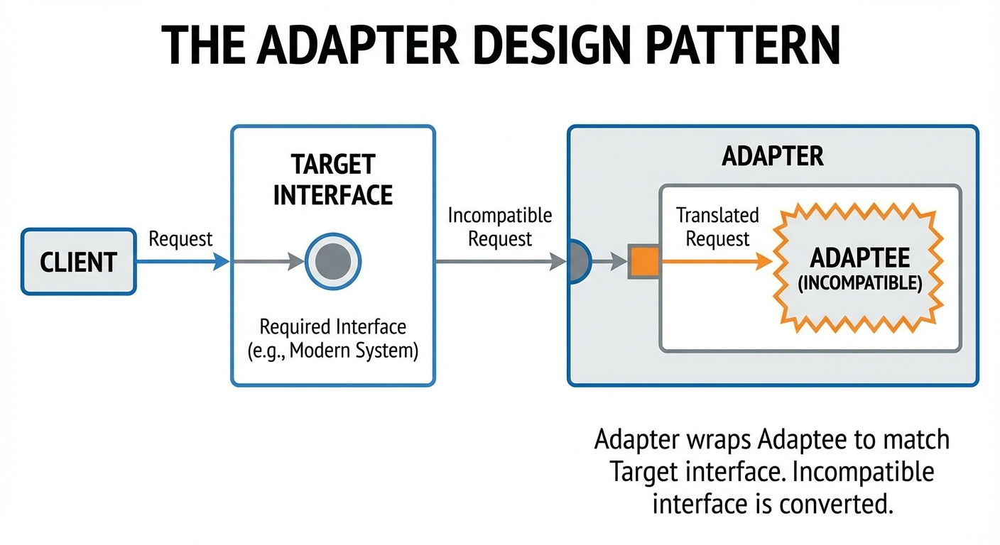
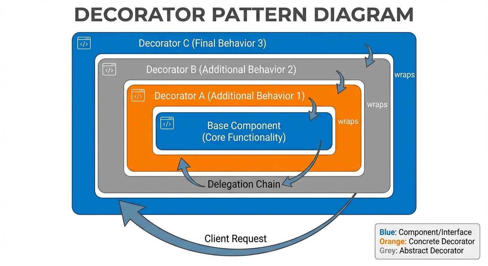
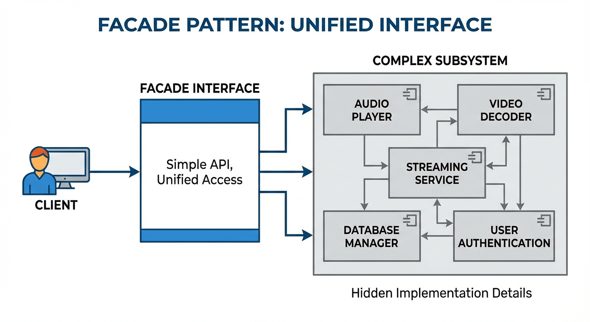

# YZM1022

## Advanced Programming

### Week 5: Design Patterns - Structural and Behavioral

**Instructor:** Ekrem Çetinkaya
**Date:** 25.03.2026

---

# Today's Agenda

<div class="two-columns">
<div class="column">

**Structural Patterns** (How objects are composed)

- **Adapter**: Make incompatible interfaces work together
- **Decorator**: Add responsibilities dynamically
- **Facade**: Simplify complex subsystems
- **Proxy**: Control access to an object

</div>
<div class="column">

**Behavioral Patterns** (How objects communicate)

- **Observer**: Define subscription mechanism
- **Strategy**: Encapsulate interchangeable algorithms
- **Command**: Encapsulate requests as objects

</div>
</div>

---

# Pattern Categories Overview

<div class="two-columns">
<div class="column">

## Structural Patterns

Focus on **composition** - how objects are assembled

- **Object composition**: Combine objects to form larger structures
- **Class composition**: Use inheritance to compose interfaces

**Key benefit**: Create flexible structures while keeping them efficient

</div>
<div class="column">

## Behavioral Patterns

Focus on **communication** - how objects interact

- **Object behavior**: Distribute behavior among objects
- **Communication patterns**: Define message passing

**Key benefit**: Reduce coupling while enabling complex workflows

</div>
</div>

---

<!-- _footer: "" -->
<!-- _header: "" -->
<!-- _paginate: false -->

<style scoped>
p { text-align: center}
h1 {text-align: center; font-size: 72px}
</style>

# Structural Patterns

---

# Adapter Pattern



<!-- _footer: "Generated by Nano Banana" -->

---

# Adapter Pattern Concept

**Adapter** allows objects with incompatible interfaces to collaborate by wrapping one object to make it compatible with another.

- Acts as a **bridge** between two incompatible interfaces, enabling classes to work together that couldn't otherwise due to incompatible interfaces.

<div class="two-columns">
<div class="column">

### Real-World Analogy

**Power Adapter**

- US plugs don't fit EU sockets
- Adapter converts between them
- Both sides work unchanged

### When to Use

- Integrate legacy code with new systems
- Use third-party libraries with different interfaces
- Make existing classes work with others

</div>
<div class="column">

### Benefits

- Reuse existing code
- Single Responsibility: Separate interface conversion
- Open/Closed: Add adapters without changing existing code

</div>
</div>

---

# Adapter - The Problem

A common scenario in software development where we have existing code that expects one interface, but we need to integrate with a third-party library that provides a completely different interface.

For example:

- The `MediaPlayer` interface expects a simple `play()` method, while the `AdvancedMediaLibrary` provides format-specific methods.
- Without the _Adapter_ pattern, we would need to either modify our existing client code or wrap every call to the library
  - Tight coupling and maintenance issues.

```python
# Your application expects this interface
class MediaPlayer:
    def play(self, filename: str):
        pass

# But you have a library with a different interface
class AdvancedMediaLibrary:
    def play_vlc(self, filename: str):
        return f"Playing VLC: {filename}"

    def play_mp4(self, filename: str):
        return f"Playing MP4: {filename}"

# These don't match! How to make them work together?
```

---

# Adapter - Implementation

The Adapter pattern solution involves creating a new class that implements the target interface while internally using the incompatible class.

- The `MediaAdapter` acts as a translator, converting calls from the expected interface to the actual library's interface.
  - Maintains the existing client code unchanged while seamlessly integrating the third-party library functionality.

<div class="two-columns">

<div class="column">

```python
from abc import ABC, abstractmethod

# Target interface (what your code expects)
class MediaPlayer(ABC):
    @abstractmethod
    def play(self, filename: str) -> str:
        pass

# Adaptee (existing class with incompatible interface)
class AdvancedMediaLibrary:
    def play_vlc(self, filename: str) -> str:
        return f"Playing VLC format: {filename}"

    def play_mp4(self, filename: str) -> str:
        return f"Playing MP4 format: {filename}"
```

</div>
<div class="column">

```python
# Adapter (makes Adaptee compatible with Target)
class MediaAdapter(MediaPlayer):
    def __init__(self, advanced_player: AdvancedMediaLibrary):
        self.advanced_player = advanced_player

    def play(self, filename: str) -> str:
        if filename.endswith('.vlc'):
            return self.advanced_player.play_vlc(filename)
        elif filename.endswith('.mp4'):
            return self.advanced_player.play_mp4(filename)
        else:
            return f"Format not supported: {filename}"
```

</div>
</div>

---

# Adapter - Usage

The `AudioPlayer` handles MP3 and WAV natively, but transparently delegates unsupported formats to the `MediaAdapter`.

The client code calls `player.play()` for any file.

- It has no idea that VLC and MP4 files go through a completely different code path via the adapter.

```python
class AudioPlayer(MediaPlayer):
    """Standard player for common formats"""
    def play(self, filename: str) -> str:
        if filename.endswith('.mp3'):
            return f"Playing MP3: {filename}"
        elif filename.endswith('.wav'):
            return f"Playing WAV: {filename}"
        else:
            # Use adapter for other formats
            adapter = MediaAdapter(AdvancedMediaLibrary())
            return adapter.play(filename)

# Client code
player = AudioPlayer()
print(player.play("song.mp3"))    # Playing MP3: song.mp3
print(player.play("video.mp4"))   # Playing MP4 format: video.mp4
print(player.play("movie.vlc"))   # Playing VLC format: movie.vlc

# Client doesn't know about the adapter or incompatible interface!
```

---

# Adapter - Object vs Class Adapter

There are two fundamental ways to implement an Adapter in Python.

- The **Object Adapter** uses composition and it holds a reference to the adaptee and delegates calls to it, making it highly flexible and testable.
- The **Class Adapter** uses multiple inheritance to inherit from both the target interface and the adaptee, which is simpler but creates tighter coupling.

<div class="two-columns">
<div class="column">

## Object Adapter (Composition)

```python
class ObjectAdapter(Target):
    def __init__(self, adaptee: Adaptee):
        self.adaptee = adaptee

    def request(self):
        return self.adaptee.specific_request()
```

</div>
<div class="column">

## Class Adapter (Multiple Inheritance)

```python
class ClassAdapter(Target, Adaptee):
    def request(self):
        return self.specific_request()
```

</div>
</div>

---

# Adapter Example - Database

Database libraries are a classic scenario where the Adapter pattern is important.

- Every major database (PostgreSQL, MySQL, SQLite) ships with its own API using different method names and parameter conventions.
- By defining a unified `DatabaseAdapter` interface and writing a thin adapter for each library, your application code stays completely decoupled from any specific database vendor.

<div class="two-columns">

<div class="column">

```python
# Different database libraries have different interfaces
class PostgreSQLDatabase:
    def pg_connect(self, host, port, db): ...
    def pg_query(self, sql): ...
    def pg_close(self): ...

class MySQLDatabase:
    def mysql_connect(self, config): ...
    def mysql_execute(self, query): ...
    def mysql_disconnect(self): ...

# Unified interface for your application
class DatabaseAdapter(ABC):
    @abstractmethod
    def connect(self, config: dict): pass
    @abstractmethod
    def execute(self, query: str): pass
    @abstractmethod
    def close(self): pass
```

</div>

<div class="column">

```python
class PostgreSQLAdapter(DatabaseAdapter):
    def __init__(self):
        self.db = PostgreSQLDatabase()

    def connect(self, config: dict):
        self.db.pg_connect(config['host'], config['port'], config['database'])

    def execute(self, query: str):
        return self.db.pg_query(query)

    def close(self):
        self.db.pg_close()
```

</div>
</div>

---

# Decorator Pattern



<!-- _footer: "Generated by Nano Banana" -->

---

# Decorator Pattern

**Decorator** attaches additional responsibilities to an object dynamically. Decorators provide a flexible alternative to subclassing for extending functionality.

- It allows behavior to be added to objects without altering their structure, enabling the composition of behaviors at **runtime** rather than **compile** time.

<div class="two-columns">
<div class="column">

### Real-World Analogy

**Coffee Shop**

- Start with basic coffee
- Add milk -> Latte
- Add vanilla -> Vanilla Latte

Each addition _decorates_ the coffee.

### When to Use

- Add responsibilities without inheritance
- Behaviors can be combined in many ways
- Need to add/remove features at runtime

</div>
<div class="column">

### Benefits

- More flexible than inheritance
- Single Responsibility: Split functionality
- Open/Closed: Extend without modification

</div>
</div>

---

# Why Not Just Use Inheritance?

The traditional inheritance approach quickly becomes unmanageable when dealing with multiple optional features.

- Each combination of features requires a separate class, leading to exponential growth in the number of classes.
- _Class explosion_ problem makes the codebase difficult to maintain, extend, and test.
- The Decorator pattern solves this by allowing features to be combined **dynamically** through composition rather than static inheritance.

```python
# Inheritance approach - class explosion
class Coffee: pass
class CoffeeWithMilk(Coffee): pass
class CoffeeWithVanilla(Coffee): pass
class CoffeeWithMilkAndVanilla(Coffee): pass
class CoffeeWithMilkAndWhippedCream(Coffee): pass
class CoffeeWithVanillaAndWhippedCream(Coffee): pass
class CoffeeWithMilkAndVanillaAndWhippedCream(Coffee): pass
# ... combinations explode!

# With 5 add-ons, you need 2^5 = 32 classes!
# With 10 add-ons, you need 1024 classes!
```

**Decorator solves this** by composing behaviors at runtime.

---

# Decorator - Implementation

The Decorator pattern establishes a component hierarchy where decorators wrap other components (including other decorators).

- Each decorator implements the same interface as the component it decorates, allowing for transparent composition.
- The base `CoffeeDecorator` class provides the foundation for all concrete decorators by simply delegating calls to the wrapped component, which concrete decorators can then enhance.

<div class="two-columns">

<div class="column">

```python
from abc import ABC, abstractmethod

# Component interface
class Coffee(ABC):
    @abstractmethod
    def get_description(self) -> str:
        pass

    @abstractmethod
    def get_cost(self) -> float:
        pass

# Concrete Component
class SimpleCoffee(Coffee):
    def get_description(self) -> str:
        return "Simple Coffee"

    def get_cost(self) -> float:
        return 2.00
```

</div>

<div class="column">

```python
# Base Decorator
class CoffeeDecorator(Coffee):
    def __init__(self, coffee: Coffee):
        self._coffee = coffee

    def get_description(self) -> str:
        return self._coffee.get_description()

    def get_cost(self) -> float:
        return self._coffee.get_cost()
```

</div>

</div>

---

# Decorator - Concrete Decorators

Each concrete decorator extends `CoffeeDecorator` and adds its own cost and description on top of whatever component it wraps.

- Every decorator calls `self._coffee.get_description()` and `self._coffee.get_cost()` first, then appends its own contribution.
- Delegation chain is what makes decorators composable as each one is unaware of what it is wrapping.

```python
class MilkDecorator(CoffeeDecorator):
    def get_description(self) -> str:
        return f"{self._coffee.get_description()}, Milk"

    def get_cost(self) -> float:
        return self._coffee.get_cost() + 0.50

class VanillaDecorator(CoffeeDecorator):
    def get_description(self) -> str:
        return f"{self._coffee.get_description()}, Vanilla"

    def get_cost(self) -> float:
        return self._coffee.get_cost() + 0.75

class WhippedCreamDecorator(CoffeeDecorator):
    def get_description(self) -> str:
        return f"{self._coffee.get_description()}, Whipped Cream"

    def get_cost(self) -> float:
        return self._coffee.get_cost() + 0.60
```

---

# Decorator - Usage

You start with a `SimpleCoffee`, wrap it in `MilkDecorator`, then wrap _that_ in `VanillaDecorator`, and so on.

- Each wrapper adds to the description and the cost. The order of wrapping does not matter for the final price, but it affects the description string.

```python
# Start with simple coffee
coffee = SimpleCoffee()
print(f"{coffee.get_description()}: ${coffee.get_cost():.2f}")
# Simple Coffee: $2.00

# Add milk
coffee = MilkDecorator(coffee)
print(f"{coffee.get_description()}: ${coffee.get_cost():.2f}")
# Simple Coffee, Milk: $2.50

# Add vanilla
coffee = VanillaDecorator(coffee)
print(f"{coffee.get_description()}: ${coffee.get_cost():.2f}")
# Simple Coffee, Milk, Vanilla: $3.25

# Add whipped cream
coffee = WhippedCreamDecorator(coffee)
print(f"{coffee.get_description()}: ${coffee.get_cost():.2f}")
# Simple Coffee, Milk, Vanilla, Whipped Cream: $3.85

# Order: SimpleCoffee -> Milk -> Vanilla -> WhippedCream
```

---

# Python's Built-in Decorators

Python has the `@decorator` syntax built into the language and it is a direct implementation of the Decorator pattern applied to _functions_ rather than objects.

- A decorator function takes a function as input, wraps it with additional behavior, and returns the wrapped version.

```python
def log_calls(func):
    """Decorator that logs function calls"""
    def wrapper(*args, **kwargs):
        print(f"Calling {func.__name__} with {args}, {kwargs}")
        result = func(*args, **kwargs)
        print(f"{func.__name__} returned {result}")
        return result
    return wrapper

@log_calls
def add(a, b):
    return a + b

add(3, 5)
# Calling add with (3, 5), {}
# add returned 8

# This is equivalent to:
# add = log_calls(add)
```

---

# Python Decorator with functools

When writing function decorators, always use `@wraps(func)` from `functools` as without it, the wrapper replaces the original function's `__name__`, `__doc__`, and other metadata, which breaks debugging, help text, and introspection tools.

- Below is a **decorator factory**: a function that takes parameters and returns a decorator.
- Decorator factories are the standard technique for parameterized decorators such as `@retry_decorator(max_retries=3)`.

<div class="two-columns">

<div class="column">

```python
from functools import wraps
import time

def timing_decorator(func):
    """Decorator that measures execution time"""
    @wraps(func)  # Preserves function metadata
    def wrapper(*args, **kwargs):
        start = time.time()
        result = func(*args, **kwargs)
        end = time.time()
        print(f"{func.__name__} took {end - start:.4f} seconds")
        return result
    return wrapper
```

</div>

<div class="column">

```python
def retry_decorator(max_retries=3):
    """Decorator factory with parameters"""
    def decorator(func):
        @wraps(func)
        def wrapper(*args, **kwargs):
            for attempt in range(max_retries):
                try:
                    return func(*args, **kwargs)
                except Exception as e:
                    if attempt == max_retries - 1:
                        raise
                    print(f"Attempt {attempt + 1} failed, retrying...")
        return wrapper
    return decorator

@timing_decorator
@retry_decorator(max_retries=3)
def fetch_data(url):
    # ... implementation
    pass
```

</div>

</div>

---

# Decorator Example - Text Processing

Text processing pipelines require individual transformations (trimming whitespace, converting case, escaping HTML, etc.) and each of these are independent operations that can be composed in any order.

- Instead of writing a single monolithic function with a long list of boolean flags, each transformation becomes its own decorator class.
- The pipeline is assembled at runtime by nesting constructors, making it easy to add, remove, or reorder steps without touching any existing code.

<div class="two-columns">

<div class="column">

```python
class TextProcessor(ABC):
    @abstractmethod
    def process(self, text: str) -> str:
        pass

class PlainText(TextProcessor):
    def process(self, text: str) -> str:
        return text

class TextDecorator(TextProcessor):
    def __init__(self, processor: TextProcessor):
        self._processor = processor
```

</div>

<div class="column">

```python
class UppercaseDecorator(TextDecorator):
    def process(self, text: str) -> str:
        return self._processor.process(text).upper()

class TrimDecorator(TextDecorator):
    def process(self, text: str) -> str:
        return self._processor.process(text).strip()

class HTMLEscapeDecorator(TextDecorator):
    def process(self, text: str) -> str:
        text = self._processor.process(text)
        return text.replace("&", "&amp;").replace("<", "&lt;").replace(">", "&gt;")

# Compose processing pipeline
processor = HTMLEscapeDecorator(TrimDecorator(UppercaseDecorator(PlainText())))
print(processor.process("  <hello world>  "))  # &LT;HELLO WORLD&GT;
```

</div>

</div>

---

# Facade Pattern



<!-- _footer: "Generated by Nano Banana" -->

---

# Facade Pattern Concept

**Facade** provides a simplified interface to a complex subsystem, making it easier to use.

- It defines a higher-level interface that makes the subsystem easier to use by hiding the complexity and providing a unified interface to a set of interfaces in a subsystem.

<div class="two-columns">
<div class="column">

### Real-World Analogy

**Car**

- Complex system: engine, transmission, electrical
- Simple interface: key, steering wheel, pedals
- You don't need to know how it works

### When to Use

- Complex subsystem with many classes
- Want a simple interface for common tasks
- Need to layer a subsystem

</div>
<div class="column">

### Benefits

- Simplifies usage
- Decouples client from subsystem
- Doesn't prevent direct access if needed

</div>
</div>

---

# Facade - The Problem

<div class="two-columns">

<div class="column">

Every client that needs to place an order must understand and orchestrate the entire chain of subsystems in the correct sequence.

- If the order of operations changes (e.g., payment before stock reservation instead of after), every client must be updated individually.
- It also makes the calling code verbose, hard to read, and difficult to test in isolation.

The Facade pattern solves this by **centralizing the orchestration** in one place.

</div>

<div class="column">

```python
# Without Facade - client must understand the entire subsystem
class OrderProcessor:
    def process_order(self, order):
        # Inventory check
        inventory = InventorySystem()
        if not inventory.check_availability(order.items):
            raise Exception("Items not available")

        # Payment processing
        payment = PaymentGateway()
        payment.validate_card(order.card)
        payment.charge(order.card, order.total)

        # Shipping
        shipping = ShippingService()
        shipping.calculate_rates(order.address)
        shipping.create_label(order)

        # Notification
        notifier = NotificationService()
        notifier.send_email(order.customer_email)
        notifier.send_sms(order.customer_phone)

# Client needs to know about ALL these systems
```

</div>

</div>

---

# Facade - Implementation

The computer boot sequence is a classic Facade example because starting a computer involves a very specific sequence of low-level hardware operations (freezing the CPU, reading from disk, loading memory, jumping to an address, and finally executing).

- The `ComputerFacade` encapsulates this entire sequence behind a single `start()` call, hiding the subsystem complexity completely.
- Clients only need to know that computers start; they do not need to understand the boot protocol.

<div class="two-columns">

<div class="column">

```python
# Complex subsystems
class CPU:
    def freeze(self): return "CPU: Freezing..."
    def jump(self, address): return f"CPU: Jumping to {address}"
    def execute(self): return "CPU: Executing..."

class Memory:
    def load(self, address, data):
        return f"Memory: Loading {data} at {address}"

class HardDrive:
    def read(self, sector, size):
        return f"HardDrive: Reading {size} bytes from sector {sector}"
```

</div>

<div class="column">

```python
# Facade - simple interface
class ComputerFacade:
    def __init__(self):
        self.cpu = CPU()
        self.memory = Memory()
        self.hard_drive = HardDrive()

    def start(self):
        """Simple interface to start computer"""
        results = []
        results.append(self.cpu.freeze())
        results.append(self.hard_drive.read(0, 1024))
        results.append(self.memory.load(0, "boot data"))
        results.append(self.cpu.jump(0))
        results.append(self.cpu.execute())
        return "\n".join(results)
```

</div>

</div>

---

# Facade - Best Practices

A well-designed Facade is thin, focused, and self-explanatory. The most common mistake is letting the facade accumulate too much logic until it becomes _the class_ that owns unrelated responsibilities.

- At that point it is no longer a facade, it is technical debt.
- A good rule of thumb is to use multiple small, purpose-specific facades (one for reporting, one for admin operations, one for user-facing features) rather than a single all-encompassing one.

<div class="two-columns">
<div class="column">

### Do

- Keep the facade simple
- Provide convenience methods for common tasks
- Allow direct access to subsystems if needed
- Use multiple facades for different concerns

</div>
<div class="column">

### Don't

- Make facade a "god class"
- Force all access through facade
- Add business logic to facade
- Create circular dependencies

</div>
</div>

---

# Proxy Pattern

The Proxy pattern places an intermediary object between a client and the real service object, giving you a chance to execute logic before or after the request reaches the real object.

<div class="two-columns">
<div class="column">

### Types of Proxies

1. **Virtual Proxy**: Lazy initialization
2. **Protection Proxy**: Access control
3. **Remote Proxy**: Local rep. of remote object
4. **Caching Proxy**: Store results

### When to Use

- Lazy initialization of heavy objects
- Access control needed
- Local execution of remote service
- Logging, caching, etc.

</div>
<div class="column">

### Benefits

- Control access without changing client
- Manage lifecycle of service object
- Works even if service unavailable

</div>
</div>

---

# Proxy - Virtual Proxy

Virtual Proxy is used for deferred object creation, which is crucial for performance optimization in resource-intensive applications.

- In this example, the `ImageProxy` acts as a placeholder for the expensive `HighResolutionImage`, creating the actual image only when needed.
- This approach is particularly valuable when dealing with large datasets, network resources, or memory-intensive objects where we want to delay costly operations until absolutely necessary.

<div class="two-columns">

<div class="column">

```python
from abc import ABC, abstractmethod

# Subject interface
class Image(ABC):
    @abstractmethod
    def display(self) -> str:
        pass

# RealSubject - expensive to create
class HighResolutionImage(Image):
    def __init__(self, filename: str):
        self.filename = filename
        self._load_from_disk()  # Expensive operation!

    def _load_from_disk(self):
        print(f"Loading {self.filename} from disk... (slow)")

    def display(self) -> str:
        return f"Displaying {self.filename}"
```

</div>

<div class="column">

```python
# Proxy - lazy loading
class ImageProxy(Image):
    def __init__(self, filename: str):
        self.filename = filename
        self._image = None  # Not loaded yet!

    def display(self) -> str:
        if self._image is None:
            self._image = HighResolutionImage(self.filename)
        return self._image.display()
```

</div>

</div>

---

# Proxy - Protection Proxy

Protection Proxy enforces authorization rules transparently, without the client needing any knowledge of the security logic.

- In this example, the `ProtectedDocumentProxy` intercepts `write()` calls and checks the user's role before delegating to the real document, while `read()` passes through freely.
- This keeps security concerns centralized in the proxy rather than scattered across the codebase.

<div class="two-columns">

<div class="column">

```python
class Document(ABC):
    @abstractmethod
    def read(self) -> str:
        pass

    @abstractmethod
    def write(self, content: str) -> None:
        pass

class RealDocument(Document):
    def __init__(self, filename: str):
        self.filename = filename
        self.content = f"Content of {filename}"

    def read(self) -> str:
        return self.content

    def write(self, content: str) -> None:
        self.content = content
```

</div>

<div class="column">

```python
class ProtectedDocumentProxy(Document):
    def __init__(self, document: RealDocument, user_role: str):
        self._document = document
        self._user_role = user_role

    def read(self) -> str:
        return self._document.read()  # Everyone can read

    def write(self, content: str) -> None:
        if self._user_role != "admin":
            raise PermissionError("Only admins can write")
        self._document.write(content)
```

</div>

</div>

---

# Proxy - Caching Proxy

A Caching Proxy stores the results of expensive operations so that repeated calls return immediately from memory.

- The `CachingProxy` here adds a TTL (time-to-live) to each cached entry, automatically expiring stale data.
- It implements the same `DataService` interface, the client cannot tell (_and does not need to know_) whether it is talking to the real service or a cache.

<div class="two-columns">

<div class="column">

```python
import time

class DataService(ABC):
    @abstractmethod
    def get_data(self, key: str) -> str:
        pass

class SlowDataService(DataService):
    def get_data(self, key: str) -> str:
        time.sleep(2)  # Simulate slow database query
        return f"Data for {key}"
```

</div>

<div class="column">

```python
class CachingProxy(DataService):
    def __init__(self, service: DataService, ttl: int = 60):
        self._service = service
        self._cache = {}
        self._ttl = ttl

    def get_data(self, key: str) -> str:
        if key in self._cache:
            data, timestamp = self._cache[key]
            if time.time() - timestamp < self._ttl:
                print(f"Cache hit for {key}")
                return data

        print(f"Cache miss for {key}, fetching...")
        data = self._service.get_data(key)
        self._cache[key] = (data, time.time())
        return data

service = CachingProxy(SlowDataService())
print(service.get_data("user_1"))  # Cache miss, slow
print(service.get_data("user_1"))  # Cache hit, fast!
```

</div>

</div>

---

<!-- _footer: "" -->
<!-- _header: "" -->
<!-- _paginate: false -->

<style scoped>
p { text-align: center}
h1 {text-align: center; font-size: 72px}
</style>

# Behavioral Patterns

---

# Observer Pattern

**Observer** defines a one-to-many dependency between objects so that when one object changes state, all its dependents are notified and updated automatically.

- The subject (**publisher**) maintains a list of observers (**subscribers**) and notifies them automatically, keeping the two sides loosely coupled

<div class="two-columns">
<div class="column">

### Real-World Analogy

**Newsletter Subscription**

- Publisher has news
- Subscribers sign up
- When news arrives, all subscribers notified
- Subscribers can unsubscribe anytime

### When to Use

- Changes in one object require changes in others
- Don't know how many objects need updating
- Object should notify without knowing who

</div>
<div class="column">

### Benefits

- Loose coupling: subject and observers are independent
- Open/Closed: add new observers without modifying subject
- Dynamic relationships: observers added/removed at runtime

</div>
</div>

---

# Observer - The Problem

Tight coupling issues can arise when objects directly reference all their dependents. In this example:

- The `TemperatureSensor` class has explicit knowledge of every component that needs to be notified of temperature changes, creating rigid dependencies.
- This makes the system inflexible and violates the Open/Closed Principle, as adding new notification recipients requires **modifying the sensor's code**, increasing the risk of introducing bugs and making maintenance difficult.

```python
# Without Observer - tight coupling
class TemperatureSensor:
    def __init__(self):
        self.temp = 0
        # Hard-coded dependencies
        self.display = DisplayPanel()
        self.logger = Logger()
        self.alert_system = AlertSystem()

    def set_temperature(self, temp):
        self.temp = temp
        # Must update all manually - tightly coupled
        self.display.update(temp)
        self.logger.log(temp)
        if temp > 100:
            self.alert_system.trigger()
```

---

# Observer - Implementation

`NewsAgency` is the subject that extends the base `Subject` class and adds domain-specific behaviour.

- When `publish_news()` is called, it delegates to `notify()` which dispatches the message to all currently registered observers.

<div class="two-columns">

<div class="column">

```python
from abc import ABC, abstractmethod
from typing import List

# Observer interface
class Observer(ABC):
    @abstractmethod
    def update(self, message: str) -> None:
        pass

# Subject (Observable)
class Subject:
    def __init__(self):
        self._observers: List[Observer] = []

    def attach(self, observer: Observer) -> None:
        self._observers.append(observer)

    def detach(self, observer: Observer) -> None:
        self._observers.remove(observer)

    def notify(self, message: str) -> None:
        for observer in self._observers:
            observer.update(message)
```

</div>

<div class="column">

```python
class NewsAgency(Subject):
    def __init__(self, name: str):
        super().__init__()
        self.name = name

    def publish_news(self, news: str) -> None:
        print(f"\n{self.name} publishing: {news}")
        self.notify(news)
```

</div>

</div>

---

# Observer - Implementation

Each concrete observer implements `update()` with its own notification channel (email, SMS, or push notification) all sharing the identical method signature.

- The subject can call `observer.update(message)` on any observer without knowing its type.
- Adding a new notification channel (e.g., `SlackSubscriber`) requires zero changes to `NewsAgency` or any other existing observer.

```python
class EmailSubscriber(Observer):
    def __init__(self, email: str):
        self.email = email
    def update(self, message: str) -> None:
        print(f"  Email to {self.email}: {message}")

class PhoneSubscriber(Observer):
    def __init__(self, phone: str):
        self.phone = phone
    def update(self, message: str) -> None:
        print(f"  SMS to {self.phone}: {message}")

class AppSubscriber(Observer):
    def __init__(self, user_id: str):
        self.user_id = user_id
    def update(self, message: str) -> None:
        print(f"  Push notification to {self.user_id}: {message}")
```

---

# Observer - Implementation

```python
# Create subject
bbc = NewsAgency("BBC News")

# Create observers
email_sub = EmailSubscriber("user@email.com")
phone_sub = PhoneSubscriber("+1234567890")
app_sub = AppSubscriber("user_123")

# Subscribe
bbc.attach(email_sub)
bbc.attach(phone_sub)
bbc.attach(app_sub)

# Publish news - all observers notified
bbc.publish_news("Breaking: Important Event!")
# BBC News publishing: Breaking: Important Event!
#   Email to user@email.com: Breaking: Important Event!
#   SMS to +1234567890: Breaking: Important Event!
#   Push notification to user_123: Breaking: Important Event!

# Unsubscribe phone
bbc.detach(phone_sub)

bbc.publish_news("Update: More details available")
# Only email and app notified, not phone
```

---

# Observer - Push vs Pull Model

There are two common communication strategies between subjects and observers.

- In the **Push model**, the subject packages all relevant data and sends it with every notification
  - Convenient for observers but potentially wasteful if different observers need different subsets of data.
- In the **Pull model**, the subject sends only a reference to itself; each observer then queries exactly the data it needs.
  - More flexible and avoids sending unnecessary data, but it requires observers to hold a reference to the subject.

<div class="two-columns">
<div class="column">

### Push Model

```python
class Observer(ABC):
    @abstractmethod
    def update(self, temp, humidity, pressure):
        pass

class WeatherStation(Subject):
    def notify(self):
        for obs in self._observers:
            obs.update(
                self.temp,
                self.humidity,
                self.pressure
            )
```

</div>
<div class="column">

### Pull Model

```python
class Observer(ABC):
    @abstractmethod
    def update(self, subject):
        pass

class TemperatureDisplay(Observer):
    def update(self, subject):
        # Pull only what we need
        temp = subject.get_temperature()
        print(f"Temp: {temp}")
```

</div>
</div>

---

# Observer - Event-Based Implementation

Modern event-driven systems often implement the Observer pattern using callbacks rather than class hierarchies.

- The `EventEmitter` class maps event names to lists of callable handlers, providing `on()` to subscribe, `off()` to unsubscribe, and `emit()` to notify.

```python
from typing import Callable, Dict, List

class EventEmitter:
    def __init__(self):
        self._listeners: Dict[str, List[Callable]] = {}

    def on(self, event: str, callback: Callable) -> None:
        if event not in self._listeners:
            self._listeners[event] = []
        self._listeners[event].append(callback)

    def off(self, event: str, callback: Callable) -> None:
        if event in self._listeners:
            self._listeners[event].remove(callback)

    def emit(self, event: str, *args, **kwargs) -> None:
        if event in self._listeners:
            for callback in self._listeners[event]:
                callback(*args, **kwargs)
```

---

# Observer - Event-Based Usage

Multiple handlers are registered for the same `"user_login"` event using simple lambda functions, and `emit()` fires all of them in registration order.

- This is the same mechanism used in web server request hooks, UI toolkits, and game engines to decouple event producers from event consumers without any shared base class.

```python
# Usage
emitter = EventEmitter()
emitter.on("user_login", lambda user: print(f"User logged in: {user}"))
emitter.on("user_login", lambda user: log_to_database(user))
emitter.emit("user_login", "john_doe")
# User logged in: john_doe
# (and logged to database)
```

---

# Strategy Pattern

The Strategy pattern answers a fundamental design question: _what do you do when a class needs to perform the same kind of task (sorting, compressing, paying, routing) but the exact algorithm should vary?_

- Instead of encoding every variant inside the class with conditionals, you extract each algorithm into its own strategy class and inject the desired one at runtime.

<div class="two-columns">
<div class="column">

### Real-World Analogy

**Navigation App**

- Different routes: fastest, shortest, scenic
- Same input (start, end)
- Different algorithms
- User can switch strategies

### When to Use

- Many related classes differ only in behavior
- Need different variants of an algorithm
- Algorithm should be selected at runtime

</div>
<div class="column">

### Benefits

- Open/Closed: Add strategies without changing context
- Eliminate conditionals
- Runtime algorithm selection

</div>
</div>

---

# Strategy - The Problem

The common problem of implementing multiple algorithms using conditional statements is the main algorithm becomes a monolithic class that contains all possible calculation methods.

- As new shipping options are added, the class grows larger and more complex, violating the _Single Responsibility Principle_ and making it difficult to test individual algorithms in isolation.

```python
# Without Strategy
class ShippingCalculator:
    def calculate_cost(self, package, method):
        if method == "ground":
            # Ground shipping logic
            return package.weight * 1.5
        elif method == "air":
            # Air shipping logic
            return package.weight * 3.0
        elif method == "express":
            # Express shipping logic
            return package.weight * 5.0 + 10
        elif method == "overnight":
            # Overnight logic
            return package.weight * 8.0 + 25
        # Adding new shipping method requires modifying this class
        # Violates Open/Closed Principle
```

---

# Strategy - Implementation

The Strategy pattern encapsulates each algorithm in its own class, all implementing a common interface.

- This separates the algorithm implementation from the client code that uses it, enabling runtime algorithm selection and making it easy to add new methods without modifying existing code.

```python
from abc import ABC, abstractmethod
# Strategy interface
class PaymentStrategy(ABC):
    @abstractmethod
    def pay(self, amount: float) -> str:
        pass

# Concrete Strategies
class CreditCardPayment(PaymentStrategy):
    def __init__(self, card_number: str):
        self.card = card_number
    def pay(self, amount: float) -> str:
        return f"Paid ${amount:.2f} with Credit Card ending {self.card[-4:]}"

class PayPalPayment(PaymentStrategy):
    def __init__(self, email: str):
        self.email = email
    def pay(self, amount: float) -> str:
        return f"Paid ${amount:.2f} via PayPal ({self.email})"
```

---

# Strategy - Context

The `ShoppingCart` is the **context** which is the class that uses a strategy but does not dictate which one.

- It stores a reference to the currently active `PaymentStrategy` and delegates the payment to it at checkout time.
- Notice that `ShoppingCart` has no `if/elif` chains; all payment-specific logic lives inside the strategy classes.

```python
class ShoppingCart:
    def __init__(self):
        self.items = []
        self._payment_strategy = None

    def add_item(self, item: str, price: float):
        self.items.append({"item": item, "price": price})

    def set_payment_strategy(self, strategy: PaymentStrategy):
        self._payment_strategy = strategy

    def checkout(self) -> str:
        total = sum(item["price"] for item in self.items)
        if not self._payment_strategy:
            return "No payment method selected"
        return self._payment_strategy.pay(total)
```

---

# Strategy - Usage

The Strategy pattern is useful when you need to switch algorithms at runtime.

- In this example, the shopping cart uses different payment strategies as the same cart can pay with credit card, PayPal, or any future payment method without changing a single line of `ShoppingCart` code.

```python
cart = ShoppingCart()
cart.add_item("Laptop", 999.99)
cart.add_item("Mouse", 29.99)

cart.set_payment_strategy(CreditCardPayment("1234567890123456"))
print(cart.checkout())  # Paid $1029.98 with Credit Card ending 3456

cart.set_payment_strategy(PayPalPayment("user@example.com"))
print(cart.checkout())  # Paid $1029.98 via PayPal (user@example.com)
```

---

# Command Pattern

**Command** encapsulates a request as an object, thereby letting you parameterize clients with different requests, queue or log requests, and support undoable operations.

<div class="two-columns">
<div class="column">

### Real-World Analogy

**Restaurant Order**

- Waiter takes order (Command)
- Order goes to kitchen (Invoker -> Receiver)
- Order can be queued, prioritized, canceled
- Supports "undo" (cancel order)

### When to Use

- Parameterize objects with operations
- Queue, schedule, or execute later
- Support undo/redo

</div>
<div class="column">

### Benefits

- Decouple sender from receiver
- Commands are first-class objects
- Composite commands possible
- Undo/redo support

</div>
</div>

---

# Command - The Problem

Some components can become tightly coupled to business logic when they directly invoke methods on target objects. This usually hapens in UI part.

- The `Button` class must know about every possible action and its specific method signature, creating tight dependencies.
- This makes it difficult to implement advanced features like undo/redo, macro recording, or operation queuing, since the actions are executed immediately and their context is lost.

```python
# Without Command - tight coupling
class Button:
    def __init__(self, action_type, target):
        self.action_type = action_type
        self.target = target

    def click(self):
        # Button knows about ALL possible actions
        if self.action_type == "save":
            self.target.save()
        elif self.action_type == "open":
            self.target.open()
        elif self.action_type == "print":
            self.target.print_doc()
        elif self.action_type == "email":
            self.target.send_email()
        # Adding new actions requires modifying Button
```

---

# Command - Implementation

The Command pattern transforms requests into standalone objects that contain all the information needed to execute the action.

- In this example, the `TextEditor` acts as the receiver that performs the actual work, while `Command` objects serve as intermediaries that can store both the action and the information needed to reverse it.

```python
from abc import ABC, abstractmethod
# Command interface
class Command(ABC):
    @abstractmethod
    def execute(self) -> None:
        pass

    @abstractmethod
    def undo(self) -> None:
        pass
# Receiver
class TextEditor:
    def __init__(self):
        self.text = ""

    def insert(self, text: str):
        self.text += text

    def delete(self, count: int):
        self.text = self.text[:-count] if count <= len(self.text) else ""
```

---

# Command - Example Commands

`InsertCommand` and `DeleteCommand` are concrete command objects that capture not only the action to perform but also everything needed to reverse it.

- `InsertCommand.undo()` knows exactly how many characters to delete because it stored the inserted text at creation time.
- `DeleteCommand.execute()` saves the text it is about to delete so that `undo()` can reinsert it later.
- This _snapshot-before-execution_ pattern is the foundation of reliable undo/redo in any editor or design tool.

<div class="two-columns">

<div class="column">

```python
class InsertCommand(Command):
    def __init__(self, editor: TextEditor, text: str):
        self.editor = editor
        self.text = text

    def execute(self) -> None:
        self.editor.insert(self.text)

    def undo(self) -> None:
        self.editor.delete(len(self.text))
```

</div>

<div class="column">

```python
class DeleteCommand(Command):
    def __init__(self, editor: TextEditor, count: int):
        self.editor = editor
        self.count = count
        self.deleted_text = ""

    def execute(self) -> None:
        self.deleted_text = self.editor.text[-self.count:]
        self.editor.delete(self.count)

    def undo(self) -> None:
        self.editor.insert(self.deleted_text)
```

</div>

</div>

---

# Command - Invoker

`CommandHistory` is the **invoker** as it executes commands through a uniform interface and keeps a record of every command it has run.

- When the user requests an undo, the invoker pops the most recent command from the history stack and calls `undo()` on it.
- The invoker does not need to understand what any individual command does; it simply manages the execution order and the history log, giving us a clean separation of concerns between _what to do_ and _when to do it._

<div class="two-columns">

<div class="column">

```python
class CommandHistory:
    def __init__(self):
        self.history = []

    def execute(self, command: Command):
        command.execute()
        self.history.append(command)

    def undo(self):
        if self.history:
            command = self.history.pop()
            command.undo()

```

</div>

<div class="column">

```python
# Usage
editor = TextEditor()
history = CommandHistory()

history.execute(InsertCommand(editor, "Hello"))
print(editor)  # Text: 'Hello'

history.execute(InsertCommand(editor, " World"))
print(editor)  # Text: 'Hello World'

history.undo()
print(editor)  # Text: 'Hello'

history.undo()
print(editor)  # Text: ''
```

</div>

</div>

---

# Command - Macro Commands

`MacroCommand` combines the Command pattern with the Composite pattern.

- The `MacroCommand` is itself a command, but it contains a list of commands and orchestrates their execution.
- The key detail is in `undo()` here as it iterates through the command list in _reverse_ order, because undoing a sequence of actions must happen in the opposite order from which they were applied.
- This makes `MacroCommand` suitable for recording and replaying complex multi-step operations, such as keyboard macros or batch edit operations.

```python
class MacroCommand(Command):
    """Composite command that executes multiple commands"""
    def __init__(self, commands: list = None):
        self.commands = commands or []

    def add(self, command: Command):
        self.commands.append(command)

    def execute(self):
        for command in self.commands:
            command.execute()

    def undo(self):
        for command in reversed(self.commands):  # Undo in reverse order
            command.undo()
```

---

# Pattern Comparison - When to Use What

Selecting the right pattern starts with identifying the problem you are actually trying to solve.

- Remember that patterns are not mutually exclusive and many real systems combine two or three of these patterns to handle different layers of the same problem.

| Pattern       | Purpose                    | Key Benefit                         |
| ------------- | -------------------------- | ----------------------------------- |
| **Adapter**   | Interface compatibility    | Integrate legacy/third-party code   |
| **Decorator** | Add responsibilities       | Flexible alternative to subclassing |
| **Facade**    | Simplify complex systems   | Easy-to-use interface               |
| **Proxy**     | Control access             | Lazy loading, access control        |
| **Observer**  | Notify dependents          | Loose coupling, event systems       |
| **Strategy**  | Interchangeable algorithms | Runtime behavior selection          |
| **Command**   | Encapsulate requests       | Undo/redo, queuing                  |

---

# Common Pattern Combinations

Patterns become more powerful when composed together.

- `Decorator + Strategy` lets you build configurable wrappers whose behaviour can be swapped at runtime.
- `Observer + Command` creates event-driven systems where each event triggers a full command object, enabling undo for event-sourced actions.
- `Facade + Proxy` combines a simplified interface with access control or lazy loading.
- `Adapter + Factory` cleanly encapsulates the logic for selecting and constructing the right adapter for a given data source.

These combinations are common in production codebases and worth recognising on sight.

---

<!-- _class: lead -->

# Thank You!

## Contact Information

- **Email:** ekrem.cetinkaya@yildiz.edu.tr
- **Office Hours:** Wednesday 13:30-15:30 - Room C-120
- **Book a slot before coming:** [Booking Link](https://dub.sh/ekrem-office)
- **Course Repository:** [GitHub](https://github.com/ekremcet/yzm1022-advanced-programming)

## Next Week

**Week 6:** Advanced Pythonic Programming Syntax
