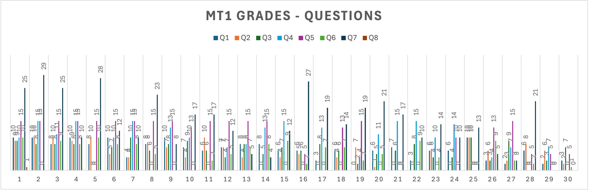

# YZM1022

## Advanced Programming

### Week 9: Functional Programming Fundamentals

**Instructor:** Ekrem Çetinkaya
**Date:** 22.04.2026

---

# Midterm Grades Are Out

### Average: 55

### Maximum: 88

### Average Points per Question

- Q1: 6,3 / 10
- Q2: 5,3 / 10
- Q3: 6,2 / 10
- Q4: 8,1 / 15
- Q5: 9,8 / 15
- Q6: 4,7 / 10
- Q7: 14,3 / 30

---

<!-- _footer: "" -->
<!-- _header: "" -->
<!-- _paginate: false -->
<style scoped>
p {text-align: center; font-size: 24px; font-style: italic}
</style>


---

<!-- _footer: "" -->
<!-- _header: "" -->
<!-- _paginate: false -->

<style scoped>
p {text-align: center; font-size: 24px; font-style: italic}
</style>



---

# How Was the Open Book Exam Experience?

<div class="two-columns">

<div class="column">

## Expectation


</div>

<div class="column">

## Reality


</div>

</div>

---

# Recap

So far we focused on how to **structure** object-oriented code well. SOLID principles give each class a clear responsibility, clean code makes intent readable, and `pytest` gives us the safety net to change code confidently.

Functional programming is **not** a replacement for OOP; it's a complementary toolset.

- **OOP** excels at modelling _entities with state_: a User, an Order, a Connection.
- **FP** excels at modelling _transformations_: taking data in, producing new data out.

Many industry codebases mix both: OOP for system structure, FP for data pipelines.

---

# Today's Running Example - Orders Dataset

We will use **one dataset** throughout the lecture so each FP concept is applied to the same problem, and you can see how the tools layer on top of each other.

```python
orders = [
    {"id": 1, "customer": "Alice",   "total": 150.0, "status": "completed"},
    {"id": 2, "customer": "Bob",     "total":  80.0, "status": "pending"},
    {"id": 3, "customer": "Charlie", "total": 200.0, "status": "completed"},
    {"id": 4, "customer": "Alice",   "total":  50.0, "status": "cancelled"},
    {"id": 5, "customer": "Bob",     "total": 120.0, "status": "completed"},
]
```

We will start with an **imperative** version that processes these orders step by step, then progressively convert it to a **declarative, functional** style using pure functions, first-class functions, and map/filter/reduce.

> The code will get shorter and more expressive at each step without losing readability.

---

# The Problem We're Solving Today

Here is a typical imperative function that processes the orders dataset. It works but look at how many things it does at once.

```python
def process_orders(orders, discount_rate):
    total = 0
    names = []
    for order in orders:
        if order["status"] == "completed":         # filtering
            discounted = order["total"] * (1 - discount_rate)  # transforming
            total += discounted                     # accumulating
            names.append(order["customer"])         # collecting
    return total, names
```

Four concerns tangled into one loop: **filtering** (completed only), **transforming** (apply discount), **accumulating** (running total), **collecting** (names list).

Try to test just the discount calculation, you can't.

Change what "completed" means, you rewrite the loop.

Add a new output, the whole function grows.

---

# What is Functional Programming?

Functional programming is a programming paradigm where programs are constructed by applying and composing functions. FP treats computation as the **evaluation of mathematical functions**.

- The output depends only on the input, never on hidden state or call history.
- You can understand any function in isolation, without tracing what the rest of the program may have mutated.

<div class="two-columns">
<div class="column">

## Core Concepts

1. **Pure functions** - same input always gives the same output; no hidden side effects
2. **Immutability** - data is never changed in place; operations return new values
3. **First-class functions** - functions can be stored, passed, and returned like any value
4. **Higher-order functions** - functions that accept or produce other functions
5. **Declarative style** - describe _what_ you want, not _how_ to compute it

</div>
<div class="column">

## Languages

**Pure FP:**

- Haskell, Elm, Erlang

**Multi-paradigm (FP support):**

- **Python**
- JavaScript, Scala, Kotlin, Rust

Python doesn't enforce FP but it enables FP and mixing styles is normal and encouraged.

</div>
</div>

---

# Why Learn Functional Programming?

FP directly solves problems you encounter every day in production code.

**Easier to Test** - A pure function has no setup cost. Call it with inputs, check the output. No database, no mocks, no environment to configure.

**Fewer Bugs** - Most subtle bugs trace back to mutable shared state: one part of the code changes data another part was relying on. Immutability eliminates the entire category.

**Better Concurrency** - Immutable data can be read by any number of threads simultaneously without locks. Pure functions can run in parallel without race conditions.

**Modern Relevance** - React's components, Redux's reducers, Spark's RDDs, and Pandas' method chains are all built on FP ideas. Understanding FP makes these tools feel obvious rather than arbitrary.

---

<!-- _footer: "" -->
<!-- _header: "" -->
<!-- _paginate: false -->

<style scoped>
p { text-align: center}
h1 {text-align: center; font-size: 72px}
</style>

# Imperative vs Declarative

---

# Two Ways to Think About Problems

There are two fundamentally different ways to instruct a computer. The distinction isn't just syntactic as it reflects a different way of thinking about what a program _is_.

<div class="two-columns">
<div class="column">

## Imperative - Tell it _How_

Enumerate every step. The programmer controls the execution sequence explicitly.

Like giving driving directions:

1. Turn left at the light
2. Go straight for 2 miles
3. Turn right at the store
4. Destination is on your left

The receiver has no choice but to follow the steps in order.

</div>
<div class="column">

## Declarative - Say _What_

Describe the goal. The system works out how to achieve it.

Like using GPS:

- "Take me to Barbaros Bulvarı, No:2"

The route may change depending on traffic but the destination never changes.

</div>
</div>

In code, imperative means loops, counters, and mutation. Declarative means expressions that read like the question you're trying to answer.

---

# Imperative Style

A mutable accumulator, an explicit loop, a conditional check, and a manual update. Each line describes a mechanical action. The _intent_ here (sum of squares of even numbers) is nowhere stated directly. You have to reconstruct it by reading all five lines together.

```python
# Problem: Get the sum of squares of even numbers from 1 to 10

numbers = [1, 2, 3, 4, 5, 6, 7, 8, 9, 10]
result = 0

for num in numbers:                    # iterate
    if num % 2 == 0:                   # filter
        squared = num * num            # transform
        result = result + squared      # accumulate

print(result)  # 220
```

Four distinct operations but they are binded together into a single loop. Changing any one of them (e.g., summing cubes instead of squares) requires editing the middle of the loop without breaking the rest.

---

# Declarative Style

Each operation is **named and separate**. The code reads almost like the problem statement: _sum the squares of the even numbers_.

```python
numbers = [1, 2, 3, 4, 5, 6, 7, 8, 9, 10]

# One expression, reads like the problem statement
result = sum(x ** 2 for x in numbers if x % 2 == 0)

print(result)  # 220
```

With explicit `filter -> map -> reduce` steps (the same operations, made visible):

```python
from functools import reduce

result = reduce(
    lambda acc, x: acc + x,           # accumulate (reduce)
    map(lambda x: x ** 2,             # transform  (map)
        filter(lambda x: x % 2 == 0,  # select     (filter)
               numbers))
)
```

There is no mutable variable. To change the transformation, you change exactly one lambda. The three concerns (selection, transformation, accumulation) are cleanly isolated.

---

# Comparison - Finding Maximum

A classic example where the imperative version forces you to think about _how the algorithm works_ rather than _what you want_. The declarative version delegates that thinking to Python.

<div class="two-columns">
<div class="column">

## Imperative

```python
numbers = [3, 1, 4, 1, 5, 9, 2, 6]

max_value = numbers[0]      # initialise with a guess

for num in numbers:
    if num > max_value:     # compare
        max_value = num     # mutate

print(max_value)  # 9
```

You are implementing the algorithm; track a running candidate, update it on each comparison. You have to get the seed value right (what if the list is empty?), and the `max_value` variable changes meaning mid-loop.

</div>
<div class="column">

## Declarative

```python
numbers = [3, 1, 4, 1, 5, 9, 2, 6]

max_value = max(numbers)

print(max_value)  # 9
```

You are stating the goal. `max` handles the iteration, handles the empty-list case, and returns an immutable result. The variable is assigned once and never changes.

</div>
</div>

---

# Running Example - Imperative vs Declarative

The same business question "_what is the total revenue from completed orders?_" expressed two ways on the same data.

<div class="two-columns">
<div class="column">

## Imperative

```python
revenue = 0
for order in orders:
    if order["status"] == "completed":
        revenue += order["total"]
# revenue = 470.0
```

Five lines. `revenue` starts at 0, gets mutated on every completed order, and means something different at every iteration. To understand the final value you have to simulate the loop.

</div>
<div class="column">

## Declarative

```python
revenue = sum(
    o["total"] for o in orders
    if o["status"] == "completed"
)
# revenue = 470.0
```

One expression. It reads as a sentence: _the sum of totals, for orders whose status is completed._ `revenue` is assigned exactly once and never changes.

</div>
</div>

Both produce the same number but only one of them **reads like the question it is answering**. That is the core promise of declarative style.

---

# SQL is Declarative

```sql
-- You already know declarative programming!

-- Don't specify HOW to find the data:
-- "Scan the users table row by row, check each age..."

-- Just specify WHAT you want:
SELECT name, email
FROM users
WHERE age >= 18
ORDER BY name
LIMIT 10;

-- The database optimizer figures out HOW
```

**Functional programming brings this declarative power to general programming!**

---

# From Declarative to Pure Functions

Writing declarative code requires a foundation: functions that **always behave the same way**.

If a function depends on a global variable, the database, or the current time, then calling it declaratively is a lie as the same expression can produce different results on different days, in different environments, in different call orders.

The declarative style only works reliably when the building blocks are **pure** which means they are guaranteed to return the same output for the same input, every single time.

That guarantee is what we build next.

---

<!-- _footer: "" -->
<!-- _header: "" -->
<!-- _paginate: false -->

<style scoped>
p { text-align: center}
h1 {text-align: center; font-size: 72px}
</style>

# Pure Functions

---

# What is a Pure Function?

> A **pure function** always returns the same output for the same input and has no side effects.

**Why pure functions matter**

- **Testability:** A pure function is easy to test. Call it with inputs, check the output. No database, no time, no network to mock.
- **Predictability:** You can read a pure function in isolation and know exactly what it does. Hidden state cannot change its behavior.
- **Cacheability (memoization):** Because the output is fully determined by the input, results can be cached safely. `functools.lru_cache` only works on pure functions.
- **Parallelism:** Pure functions can run on multiple threads without race conditions as there is no shared mutable state to corrupt.

**Properties:**

1. **Deterministic**: Same input -> same output
2. **No side effects**: Doesn't modify external state
3. **Self-contained**: Depends only on its parameters

---

# Pure vs Impure Functions

<div class="two-columns">
<div class="column">

## Pure ✅

```python
def calculate_tax(amount, rate):
    """Pure: depends only on inputs"""
    return amount * rate

def get_discount_price(price, discount):
    """Pure: no external dependencies"""
    return price * (1 - discount)

def format_currency(amount):
    """Pure: deterministic formatting"""
    return f"${amount:.2f}"

# Always predictable
assert calculate_tax(100, 0.1) == 10
assert calculate_tax(100, 0.1) == 10
assert calculate_tax(100, 0.1) == 10
```

</div>
<div class="column">

## Impure ❌

```python
tax_rate = 0.1  # External state

def calculate_tax(amount):
    """Impure: depends on external state"""
    return amount * tax_rate

total = 0  # Mutable external state

def add_to_total(amount):
    """Impure: modifies external state"""
    global total
    total += amount
    return total

# Results can vary!
print(add_to_total(10))  # 10
print(add_to_total(10))  # 20
print(add_to_total(10))  # 30
```

</div>
</div>

---

# Side Effects

A **side effect** is any observable change outside the function's return value.

```python
# 1. Modifying global variables
counter = 0
def increment():
    global counter
    counter += 1  # Side effect

# 2. Modifying input parameters
def add_item(items, item):
    items.append(item)  # Side effect, modifies input

# 3. I/O operations
def log_message(msg):
    print(msg)  # Side effect, output to console

# 4. Database operations
def save_user(user):
    database.insert(user)  # Side effect, changes database

# 5. Network calls
def fetch_data(url):
    return requests.get(url)  # Side effect, network I/O
```

---

# Impure - Modifying Input

```python
# Impure: Modifies the input list
def add_item_impure(items: list, item) -> list:
    items.append(item)  # Modifies original
    return items

original = [1, 2, 3]
result = add_item_impure(original, 4)

print(original)  # [1, 2, 3, 4] - Original was modified!
print(result)    # [1, 2, 3, 4]
print(original is result)  # True - Same object

# ✅ Pure: Creates a new list
def add_item_pure(items: list, item) -> list:
    return items + [item]  # Returns new list

original = [1, 2, 3]
result = add_item_pure(original, 4)

print(original)  # [1, 2, 3] - Original unchanged
print(result)    # [1, 2, 3, 4]
print(original is result)  # False - Different objects
```

---

# Making Functions Pure

```python
# Impure: Uses current time (non-deterministic)
def get_greeting_impure():
    from datetime import datetime
    hour = datetime.now().hour
    if hour < 12:
        return "Good morning"
    elif hour < 18:
        return "Good afternoon"
    return "Good evening"

# Pure: Time is passed as parameter
def get_greeting_pure(hour: int) -> str:
    if hour < 12:
        return "Good morning"
    elif hour < 18:
        return "Good afternoon"
    return "Good evening"

# Now it's testable and predictable
assert get_greeting_pure(9) == "Good morning"
assert get_greeting_pure(14) == "Good afternoon"
assert get_greeting_pure(20) == "Good evening"
```

**The pattern:** push anything that varies (time, random values, external state) out into parameters, and the function body becomes pure.

---

# Pure Functions in Practice

```python
# Impure: Reads from database
def get_user_discount_impure(user_id: int) -> float:
    user = database.get_user(user_id)  # Side effect: DB read
    if user.is_premium:
        return 0.2
    return 0.1

# Pure: User is passed in
def calculate_user_discount(user: User) -> float:
    if user.is_premium:
        return 0.2
    return 0.1

# The impure part is isolated and pushed to the edges
def get_user_discount(user_id: int) -> float:
    user = database.get_user(user_id)  # Impure - isolated here
    return calculate_user_discount(user)  # Calls pure function
```

**Strategy: Push side effects to the edges of your program.**

The core logic (`calculate_user_discount`) stays pure and testable. The I/O boundary (`get_user_discount`) is a thin wrapper that feeds data into the pure core.

---

# Testing Pure vs Impure

```python
# Hard to test impure function
def calculate_order_total_impure(order_id):
    order = database.get_order(order_id)  # Need database!
    tax_rate = config.get("tax_rate")     # Need config!
    shipping = shipping_api.calculate()    # Need API!
    return order.subtotal * (1 + tax_rate) + shipping

# How do you test this? Need to mock everything!

# Easy to test pure function
def calculate_order_total_pure(subtotal, tax_rate, shipping_cost):
    return subtotal * (1 + tax_rate) + shipping_cost

# Test is trivial!
def test_calculate_order_total():
    result = calculate_order_total_pure(100, 0.1, 5)
    assert result == 115  # 100 * 1.1 + 5

    result = calculate_order_total_pure(50, 0.2, 10)
    assert result == 70   # 50 * 1.2 + 10
```

---

# Orders - Pure Functions in Action

Let's extract two pure functions from the messy `process_orders` function we started with. Each does exactly one thing and depends only on its arguments.

```python
def is_completed(order: dict) -> bool:
    """Pure: same order always gives same answer."""
    return order["status"] == "completed"

def apply_discount(order: dict, rate: float) -> float:
    """Pure: computes discounted total, modifies nothing."""
    return order["total"] * (1 - rate)

# Both are trivially testable — no setup required
assert is_completed({"status": "completed"}) is True
assert is_completed({"status": "pending"})   is False
assert apply_discount({"total": 100.0}, 0.1) == 90.0
assert apply_discount({"total": 200.0}, 0.0) == 200.0
```

Notice what disappeared:

- The loop, the conditional, the accumulator, the mutation.
- Each function is now a single, verifiable fact about an order.

---

# From Pure Functions to Immutability

`is_completed` and `apply_discount` are pure as they don't modify anything. But what about the data they operate on?

Python dicts and lists are **mutable by default**.

- If a function receives an order dict and modifies it in place, the caller's copy changes too; silently, without warning.
- One function's "update" becomes another function's unexpected bug.

```python
# Looks like a pure update but it isn't
def mark_as_shipped(order):
    order["status"] = "shipped"   # modifies the caller's dict
    return order

original = {"id": 1, "total": 150.0, "status": "completed"}
shipped  = mark_as_shipped(original)

print(original["status"])  # "shipped", the original changed
```

Pure functions don't modify their inputs. But in Python that discipline requires extra effort. **Immutability** is the set of tools and conventions that make it automatic.

---

<!-- _footer: "" -->
<!-- _header: "" -->
<!-- _paginate: false -->

<style scoped>
p { text-align: center}
h1 {text-align: center; font-size: 72px}
</style>

# Immutability

---

# What is Immutability?

**Immutable** data cannot be changed after it's created. Instead of modifying, you create new values.

**Why immutability matters**

- **No accidental sharing:** When you pass a list to a function, you have to worry whether the function modifies it. With immutable data, you never have to worry - the original is always safe.
- **Easy history / undo:** Every "change" produces a new version. If you keep a reference to the old version, you have history for free (this is exactly how Redux works).
- **Thread safety:** Multiple threads can read immutable data simultaneously without any locking. Locks are only needed when data can change.
- **Predictable code flow:** The value of a variable is fixed from the moment it's created, so you can always trace what it is by looking at one line.

---

# Immutability in Python

## Immutable Built-in Types

| Type        | Immutable? | Example                  |
| ----------- | ---------- | ------------------------ |
| `int`       | ✅ Yes     | `x = 5`                  |
| `float`     | ✅ Yes     | `x = 3.14`               |
| `str`       | ✅ Yes     | `s = "hello"`            |
| `tuple`     | ✅ Yes     | `t = (1, 2, 3)`          |
| `frozenset` | ✅ Yes     | `fs = frozenset([1, 2])` |
| `list`      | ❌ No      | `l = [1, 2, 3]`          |
| `dict`      | ❌ No      | `d = {"a": 1}`           |
| `set`       | ❌ No      | `s = {1, 2, 3}`          |

---

# Working with Immutable Data

```python
# Mutable approach
def add_to_list_mutable(lst, item):
    lst.append(item)  # Modifies original
    return lst

# Immutable approach
def add_to_list_immutable(lst, item):
    return lst + [item]  # Creates new list

# Mutable approach
def update_dict_mutable(d, key, value):
    d[key] = value  # Modifies original
    return d

# Immutable approach
def update_dict_immutable(d, key, value):
    return {**d, key: value}  # Creates new dict

# Usage
original_list = [1, 2, 3]
new_list = add_to_list_immutable(original_list, 4)
print(original_list)  # [1, 2, 3] - unchanged
print(new_list)       # [1, 2, 3, 4] - new list

original_dict = {"a": 1, "b": 2}
new_dict = update_dict_immutable(original_dict, "c", 3)
print(original_dict)  # {"a": 1, "b": 2} - unchanged
print(new_dict)       # {"a": 1, "b": 2, "c": 3} - new dict
```

---

# Creating Immutable Objects

```python
from dataclasses import dataclass

# Regular dataclass (mutable)
@dataclass
class MutableUser:
    name: str
    age: int

mutable_user = MutableUser("Alice", 25)
mutable_user.age = 26  # Can modify!

# Frozen dataclass (immutable)
@dataclass(frozen=True)
class ImmutableUser:
    name: str
    age: int

immutable_user = ImmutableUser("Alice", 25)
# immutable_user.age = 26  # FrozenInstanceError!

# To "modify", create a new instance
from dataclasses import replace

older_user = replace(immutable_user, age=26)
print(immutable_user.age)  # 25 - original unchanged
print(older_user.age)      # 26 - new instance
```

---

# Named Tuples for Immutable Data

```python
from typing import NamedTuple

class Point(NamedTuple):
    x: float
    y: float

    def move(self, dx: float, dy: float) -> 'Point':
        """Return new point - doesn't modify self"""
        return Point(self.x + dx, self.y + dy)

    def distance_from_origin(self) -> float:
        return (self.x ** 2 + self.y ** 2) ** 0.5

# Usage
p1 = Point(3, 4)
p2 = p1.move(1, 1)

print(p1)  # Point(x=3, y=4) - unchanged
print(p2)  # Point(x=4, y=5) - new point

# Immutable benefits
# p1.x = 10  # AttributeError: can't set attribute

# Can be used as dict keys (hashable)
point_names = {Point(0, 0): "origin", Point(1, 0): "unit x"}
```

---

# Benefits of Immutability

<div class="two-columns">
<div class="column">

## 1. Predictability

```python
def process_orders(orders):
    # With immutable data, we know
    # 'orders' won't change unexpectedly
    for order in orders:
        send_notification(order)
    # 'orders' is still the same!
```

## 2. Easy to Track Changes

```python
# Each change creates new version
v1 = {"count": 0}
v2 = {**v1, "count": 1}
v3 = {**v2, "count": 2}

# History is preserved!
print(v1)  # {"count": 0}
print(v2)  # {"count": 1}
print(v3)  # {"count": 2}
```

</div>
<div class="column">

## 3. Thread Safety

```python
# Immutable data can be shared
# safely between threads
import threading

# This is safe because tuple is immutable
config = ("localhost", 8080, True)

def worker():
    host, port, debug = config
    # config can't change mid-execution
```

## 4. Easier Debugging

```python
# With immutability, you can trace
# exactly when and where new values
# are created
```

</div>
</div>

---

# Orders - Immutability in Action

Applied to our orders dataset; updating an order's status without touching the original.

```python
# ❌ Mutable — silently changes the caller's dict
def mark_as_shipped_mutable(order):
    order["status"] = "shipped"
    return order

# ✅ Immutable — creates and returns a new dict
def mark_as_shipped(order: dict) -> dict:
    return {**order, "status": "shipped"}

original = {"id": 1, "customer": "Alice", "total": 150.0, "status": "completed"}
shipped  = mark_as_shipped(original)

print(original["status"])  # "completed" — untouched
print(shipped["status"])   # "shipped"   — new dict

# The original is still safe to use elsewhere:
revenue = apply_discount(original, 0.1)  # still works on "completed" order
```

`{**order, "status": "shipped"}` is Python's idiomatic spread-and-override: copy all fields from `order`, then set `"status"` to the new value. The original is never touched.

---

<!-- _class: practice -->

# Practice - Pure Function Refactoring

Refactor these impure functions to be pure:

```python
# 1. Depends on global state
discount_rate = 0.1
def calculate_discount(price):
    return price * discount_rate

# 2. Modifies input
def remove_duplicates(items):
    seen = set()
    i = 0
    while i < len(items):
        if items[i] in seen:
            items.pop(i)
        else:
            seen.add(items[i])
            i += 1
    return items

# 3. Uses current time
def is_expired(expiry_date):
    from datetime import date
    return date.today() > expiry_date
```

---

<!-- _class: functional -->

# Solution

```python
# 1. Pass discount_rate as parameter
def calculate_discount(price: float, discount_rate: float) -> float:
    return price * discount_rate

# 2. Return new list, don't modify input
def remove_duplicates(items: list) -> list:
    seen = set()
    result = []
    for item in items:
        if item not in seen:
            seen.add(item)
            result.append(item)
    return result

# Or more Pythonic:
def remove_duplicates_v2(items: list) -> list:
    return list(dict.fromkeys(items))  # Preserves order

# 3. Pass current_date as parameter
def is_expired(expiry_date, current_date) -> bool:
    return current_date > expiry_date

# Usage
from datetime import date
is_expired(date(2024, 12, 31), date.today())  # Testable!
```

---

# From Immutability to First-Class Functions

We now have two pure functions `is_completed` and `apply_discount` that work on immutable order dicts. Each does one thing. Neither modifies anything.

The next question is: how do we _combine_ them?

In imperative code you write a new `for` loop every time you want a different combination. Want completed orders? Loop and check. Want discounted totals? Loop and transform. Want both? Loop and do both. Every new requirement means a new, slightly different loop.

**First-class functions** offer a different answer: write one general loop, and pass the decision about _what to do_ as a function argument. The loop becomes a reusable engine; the functions become swappable parts.

This is the step that turns separate functions into a **composable pipeline**.

---

<!-- _footer: "" -->
<!-- _header: "" -->
<!-- _paginate: false -->

<style scoped>
p { text-align: center}
h1 {text-align: center; font-size: 72px}
</style>

# First-Class Functions

---

# First-Class Functions

In most languages, functions are a special kind of thing. They have syntax, but they are not _values_ you can move around.

In Python, a function is an ordinary object. You can store it in a variable, put it in a list, pass it as an argument, return it from another function, or look it up in a dictionary. There is nothing special about the way Python handles it compared to handling an integer or a string.

This is what "_first-class_" means: **functions are values**, subject to exactly the same operations as any other value.

**Why this matters in practice:**

- **Eliminates repetition:** instead of ten loops with slightly different logic, write one loop and pass a different function each time.
- **Enables configuration:** separate _what to do_ from _when and to what_. The caller decides the policy, the function implements the mechanism.
- **Foundation of the standard library:** `map`, `filter`, `sorted`, `max(key=...)`, `pytest.fixture`, `@property` — all of these exist because Python can receive and store functions as values.

**The four operations first-class functions support:**

1. **Assign** to a variable
2. **Pass** as an argument
3. **Return** from a function
4. **Store** in a data structure

---

# Functions as Variables

When you write `operation = add`, you are not calling `add`. You are pointing `operation` at the same function object that `add` points at. Both names refer to the same thing. Calling `operation(5, 3)` is identical to calling `add(5, 3)`.

```python
def add(a, b):      return a + b
def subtract(a, b): return a - b
def multiply(a, b): return a * b

operation = add
print(operation(5, 3))   # 8  - same as add(5, 3)

operation = multiply
print(operation(5, 3))   # 15 - now points at multiply
```

Because functions are values, you can store them in a dictionary and use a key to select which function to call at runtime. This replaces a chain of `if/elif` entirely:

```python
operations = {"+": add, "-": subtract, "*": multiply}

op = input("Enter operation (+, -, *): ")
result = operations[op](10, 5)   # calls the chosen function
print(result)
```

---

# Functions as Arguments - Higher-Order Functions

A **higher-order function** is any function that accepts another function as an argument, or returns a function. This is the pattern that makes `map`, `filter`, and `sorted` work.

The fundamental idea is to separate the _algorithm_ (what the loop does structurally) from the _policy_ (the decision made at each step). The caller provides the policy as a function; the higher-order function runs the algorithm.

```python
def apply_operation(func, a, b):
    """The algorithm: apply func to a and b."""
    return func(a, b)

print(apply_operation(add, 5, 3))       # 8  — policy: add
print(apply_operation(multiply, 5, 3))  # 15 — policy: multiply
```

---

# Functions as Arguments - Higher-Order Functions

`sorted` is a higher-order function in the standard library. The `key` argument is the policy, it extracts the value to compare:

```python
students = [
    {"name": "Alice", "grade": 85},
    {"name": "Bob", "grade": 92},
    {"name": "Charlie", "grade": 78},
]

# Pass a function as the sorting policy
sorted_by_grade = sorted(students, key=lambda s: s["grade"])
# ['Charlie', 'Alice', 'Bob']

sorted_by_name = sorted(students, key=lambda s: s["name"])
# ['Alice', 'Bob', 'Charlie']
```

The _algorithm_ does not change. The _policy_ (what to sort by) is swapped by passing a different function.

---

# Orders - First-Class Functions in Action

We can now write a single general-purpose processing engine for our orders. The _what to select_ and _what to extract_ are passed in as functions.

```python
def process_orders(orders, predicate, transform):
    """
    Apply any filter and any transformation to a list of orders.
    predicate : order -> bool    (which orders to include)
    transform : order -> value   (what to extract from each)
    """
    return [transform(o) for o in orders if predicate(o)]

# Reuse the pure functions from earlier
completed_totals = process_orders(
    orders,
    predicate=is_completed,
    transform=lambda o: o["total"],
)
# [150.0, 200.0, 120.0]

completed_customers = process_orders(
    orders,
    predicate=is_completed,
    transform=lambda o: o["customer"],
)
# ['Alice', 'Charlie', 'Bob']
```

---

# Lambda Expressions

Every time you write `def square(x): return x * x`, Python does two things: it creates a function object, then binds it to the name `square`.

A **lambda** does only the first step: it creates the function object and hands it to you directly, without binding it to any name. That is why lambdas are called _anonymous_ functions.

```python
# def creates a function and binds it to a name
def square(x):
    return x * x

# lambda creates a function without binding, it is the value
lambda x: x * x
```

---

# Lambda Expressions

They are identical function objects. The only difference is whether you gave it a name.

```python
# lambda syntax:  lambda <parameters>: <single expression>
add    = lambda a, b: a + b
greet  = lambda name: f"Hello, {name}!"
is_even = lambda n: n % 2 == 0

print(add(5, 3))        # 8
print(greet("World"))   # Hello, World!
print(is_even(4))       # True
```

A lambda body must be a **single expression** meaning a value that can be computed and returned. It cannot contain statements (`for`, `if/else` as a block, `return`, `=`). The moment you need two lines of logic, use `def`.

---

# Lambda in Practice - Sorting

Lambda expressions are most useful as the `key` argument to `sorted`. They let you express the sort criterion inline without cluttering the namespace with a one-off helper function.

```python
students = [
    {"name": "Alice", "grade": 85},
    {"name": "Bob", "grade": 92},
    {"name": "Charlie", "grade": 78},
]

# Sort by a single field
by_grade = sorted(students, key=lambda s: s["grade"])   # ascending
by_name  = sorted(students, key=lambda s: s["name"])    # alphabetical

# Reverse: negate the key for numbers, use reverse=True for strings
by_grade_desc = sorted(students, key=lambda s: -s["grade"])
by_name_desc  = sorted(students, key=lambda s: s["name"], reverse=True)

# Multiple sort keys: return a tuple - Python sorts tuples lexicographically
# Sort by name first, then by grade within the same name
data = [("Alice", 85), ("Bob", 92), ("Alice", 78)]
sorted_data = sorted(data, key=lambda x: (x[0], x[1]))
# [('Alice', 78), ('Alice', 85), ('Bob', 92)]
```

The tuple key trick: `(x[0], x[1])` means "sort by the first element, and break ties by the second." You can chain as many fields as you need.

---

# The map() Function

**map** applies a function to every item in an iterable.

```python
# Syntax: map(function, iterable)

numbers = [1, 2, 3, 4, 5]

# Square each number
squared = map(lambda x: x ** 2, numbers)
print(list(squared))  # [1, 4, 9, 16, 25]

# Convert to strings
str_numbers = map(str, numbers)
print(list(str_numbers))  # ['1', '2', '3', '4', '5']

# With named function
def double(x):
    return x * 2

doubled = map(double, numbers)
print(list(doubled))  # [2, 4, 6, 8, 10]

# Multiple iterables
nums1 = [1, 2, 3]
nums2 = [10, 20, 30]

sums = map(lambda a, b: a + b, nums1, nums2)
print(list(sums))  # [11, 22, 33]
```

---

# map() vs List Comprehension

```python
numbers = [1, 2, 3, 4, 5]

# Using map
squared_map = list(map(lambda x: x ** 2, numbers))

# Using list comprehension
squared_comp = [x ** 2 for x in numbers]

# Both produce: [1, 4, 9, 16, 25]

# When to use which?
# List comprehension: More Pythonic, readable for simple cases
# map: When you have an existing function to apply

def complex_transform(x):
    # Some complex logic
    return x ** 2 + x + 1

# map is cleaner when using existing functions
result = list(map(complex_transform, numbers))

# Equivalent comprehension
result = [complex_transform(x) for x in numbers]
```

---

# The filter() Function

```python
numbers = [1, 2, 3, 4, 5, 6, 7, 8, 9, 10]

# Keep even numbers
evens = filter(lambda x: x % 2 == 0, numbers)
print(list(evens))  # [2, 4, 6, 8, 10]

# Keep numbers greater than 5
big_nums = filter(lambda x: x > 5, numbers)
print(list(big_nums))  # [6, 7, 8, 9, 10]

# With named function
def is_prime(n):
    if n < 2:
        return False
    for i in range(2, int(n ** 0.5) + 1):
        if n % i == 0:
            return False
    return True

primes = filter(is_prime, range(1, 20))
print(list(primes))  # [2, 3, 5, 7, 11, 13, 17, 19]

# Filter None/empty values
items = [1, 0, None, "hello", "", False, "world"]
truthy = filter(None, items)  # Filter with None keeps truthy values
print(list(truthy))  # [1, 'hello', 'world']
```

---

# filter() vs List Comprehension

```python
numbers = [1, 2, 3, 4, 5, 6, 7, 8, 9, 10]

# Using filter
evens_filter = list(filter(lambda x: x % 2 == 0, numbers))

# Using list comprehension
evens_comp = [x for x in numbers if x % 2 == 0]

# Both produce: [2, 4, 6, 8, 10]
```

---

# Combining filter() and map()

```python
numbers = [1, 2, 3, 4, 5, 6, 7, 8, 9, 10]
# Get squares of even numbers

# Using filter + map
result_fm = list(map(lambda x: x ** 2, filter(lambda x: x % 2 == 0, numbers)))

# Using list comprehension (more readable!)
result_comp = [x ** 2 for x in numbers if x % 2 == 0]

# Both produce: [4, 16, 36, 64, 100]
```

**List comprehension is usually more Pythonic and readable.**

---

# The reduce() Function

**reduce** combines all items into a single value.

```python
from functools import reduce

# Syntax: reduce(function, iterable, initial)

numbers = [1, 2, 3, 4, 5]

# Sum all numbers
# reduce applies function cumulatively:
# ((((1 + 2) + 3) + 4) + 5)
total = reduce(lambda acc, x: acc + x, numbers)
print(total)  # 15

# Same as: sum(numbers)

# Product of all numbers
product = reduce(lambda acc, x: acc * x, numbers)
print(product)  # 120

# Same as: math.prod(numbers)

# With initial value
total_plus_ten = reduce(lambda acc, x: acc + x, numbers, 10)
print(total_plus_ten)  # 25 (10 + 1 + 2 + 3 + 4 + 5)
```

---

# reduce() Examples

```python
from functools import reduce

# Find maximum
numbers = [3, 1, 4, 1, 5, 9, 2, 6]
maximum = reduce(lambda a, b: a if a > b else b, numbers)
print(maximum)  # 9

# Same as: max(numbers)

# Flatten nested lists
nested = [[1, 2], [3, 4], [5, 6]]
flattened = reduce(lambda acc, lst: acc + lst, nested, [])
print(flattened)  # [1, 2, 3, 4, 5, 6]

# Count occurrences
words = ["apple", "banana", "apple", "cherry", "banana", "apple"]
counts = reduce(
    lambda acc, word: {**acc, word: acc.get(word, 0) + 1},
    words,
    {}
)
print(counts)  # {'apple': 3, 'banana': 2, 'cherry': 1}

# Build string
letters = ['H', 'e', 'l', 'l', 'o']
word = reduce(lambda acc, c: acc + c, letters, '')
print(word)  # 'Hello'
```

---

# Combining map, filter, reduce

```python
from functools import reduce

# Problem: Sum of squares of even numbers from 1 to 10

numbers = range(1, 11)

# Step by step
evens = filter(lambda x: x % 2 == 0, numbers)  # [2, 4, 6, 8, 10]
squares = map(lambda x: x ** 2, evens)         # [4, 16, 36, 64, 100]
total = reduce(lambda a, b: a + b, squares)    # 220

print(total)  # 220

# All in one (reads right to left)
result = reduce(
    lambda a, b: a + b,
    map(lambda x: x ** 2,
        filter(lambda x: x % 2 == 0, numbers))
)

# Pythonic way (reads left to right)
result = sum(x ** 2 for x in numbers if x % 2 == 0)

print(result)  # 220
```

---

# Running Example - Full Pipeline

Applying map / filter / reduce to the orders dataset introduced at the start.

```python
orders = [
    {"id": 1, "customer": "Alice",   "total": 150.0, "status": "completed"},
    {"id": 2, "customer": "Bob",     "total":  80.0, "status": "pending"},
    {"id": 3, "customer": "Charlie", "total": 200.0, "status": "completed"},
    {"id": 4, "customer": "Alice",   "total":  50.0, "status": "cancelled"},
    {"id": 5, "customer": "Bob",     "total": 120.0, "status": "completed"},
]

# Step 1: filter - keep only completed orders
completed = filter(lambda o: o["status"] == "completed", orders)

# Step 2: map - extract totals
totals = map(lambda o: o["total"], completed)

# Step 3: reduce (or sum) - combine into one number
revenue = sum(totals)

print(f"Total revenue: ${revenue}")  # Total revenue: $470.0

# Pythonic one-liner
revenue = sum(o["total"] for o in orders if o["status"] == "completed")
```

---

# any() and all()

```python
# any() - Returns True if ANY element is truthy
# all() - Returns True if ALL elements are truthy

numbers = [1, 2, 3, 4, 5]

# Check if any number is even
has_even = any(n % 2 == 0 for n in numbers)
print(has_even)  # True

# Check if all numbers are positive
all_positive = all(n > 0 for n in numbers)
print(all_positive)  # True

# Practical example: Validation
def validate_user(user):
    validations = [
        len(user.get("name", "")) >= 2,
        "@" in user.get("email", ""),
        user.get("age", 0) >= 18,
    ]
    return all(validations)

user1 = {"name": "Alice", "email": "alice@example.com", "age": 25}
user2 = {"name": "A", "email": "invalid", "age": 15}

print(validate_user(user1))  # True
print(validate_user(user2))  # False
```

---

# Practice - Functional Data Processing

Given this data:

```python
employees = [
    {"name": "Alice", "dept": "Engineering", "salary": 85000},
    {"name": "Bob", "dept": "Marketing", "salary": 65000},
    {"name": "Charlie", "dept": "Engineering", "salary": 95000},
    {"name": "Diana", "dept": "Marketing", "salary": 70000},
    {"name": "Eve", "dept": "Engineering", "salary": 78000},
]
```

Write functional expressions to:

1. Get names of Engineering employees earning > $80000
2. Calculate average salary in Marketing
3. Find the highest-paid employee
4. Get a list of unique departments

---

# Solution

```python
employees = [
    {"name": "Alice", "dept": "Engineering", "salary": 85000},
    {"name": "Bob", "dept": "Marketing", "salary": 65000},
    {"name": "Charlie", "dept": "Engineering", "salary": 95000},
    {"name": "Diana", "dept": "Marketing", "salary": 70000},
    {"name": "Eve", "dept": "Engineering", "salary": 78000},
]

# 1. Names of Engineering employees earning > $80000
high_earners = [
    e["name"] for e in employees
    if e["dept"] == "Engineering" and e["salary"] > 80000
]
print(high_earners)  # ['Alice', 'Charlie']

# 2. Average salary in Marketing
marketing = [e["salary"] for e in employees if e["dept"] == "Marketing"]
avg_marketing = sum(marketing) / len(marketing)
print(f"Marketing avg: ${avg_marketing}")  # $67500

# 3. Highest-paid employee
highest_paid = max(employees, key=lambda e: e["salary"])
print(highest_paid["name"])  # Charlie

# 4. Unique departments
departments = list(set(e["dept"] for e in employees))
print(departments)  # ['Engineering', 'Marketing']
```

---

# The Transformation

We started the class with this:

```python
# One function, four concerns tangled together
def process_orders(orders, discount_rate):
    total = 0
    names = []
    for order in orders:
        if order["status"] == "completed":
            discounted = order["total"] * (1 - discount_rate)
            total += discounted
            names.append(order["customer"])
    return total, names
```

---

# The Transformation

Using everything we learned today, here is the same logic rebuilt:

```python
# AFTER — each concern is its own named, testable piece
is_completed   = lambda o: o["status"] == "completed"
get_customer   = lambda o: o["customer"]
get_total      = lambda o: o["total"]

completed = list(filter(is_completed, orders))
revenue   = sum(apply_discount(o, discount_rate) for o in completed)
names     = list(map(get_customer, completed))
```

Every line states exactly one thing. Every piece can be tested in isolation, replaced independently, or reused in a different pipeline. The four tangled concerns from the `for` loop now each have a name and a home.

---

<!-- _class: lead -->

# Thank You!

## Contact Information

- **Email:** ekrem.cetinkaya@yildiz.edu.tr
- **Office Hours:** Wednesday 13:30-15:30 - Room C-120
- **Book a slot before coming:** [Booking Link](https://dub.sh/ekrem-office)
- **Course Repository:** [GitHub](https://github.com/ekremcet/yzm1022-advanced-programming)

## Next Week

**Week 10:** Advanced Functional Programming
